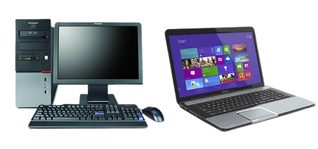
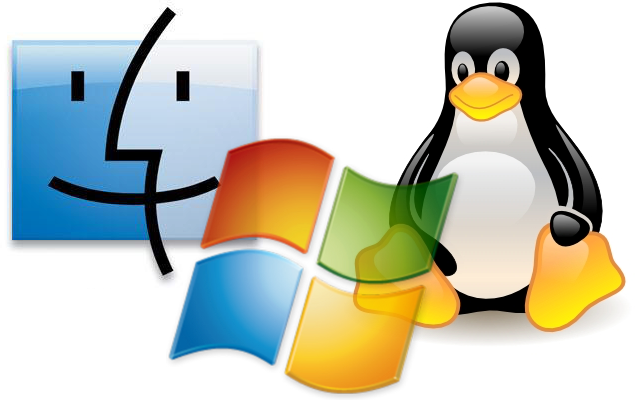
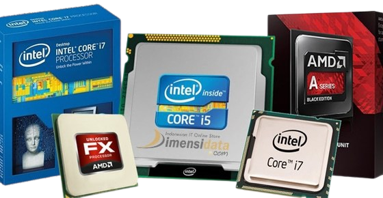
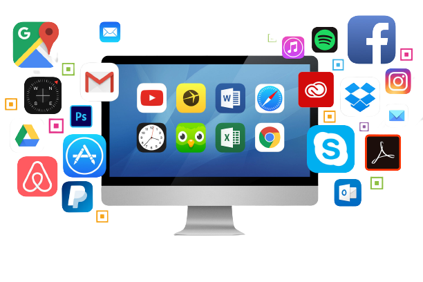
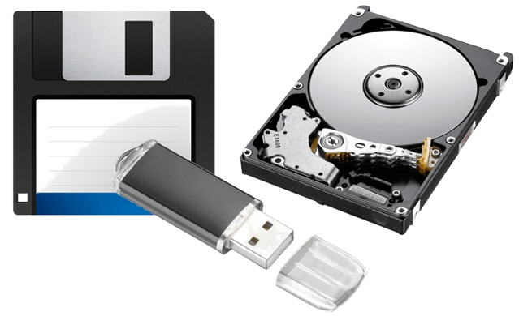
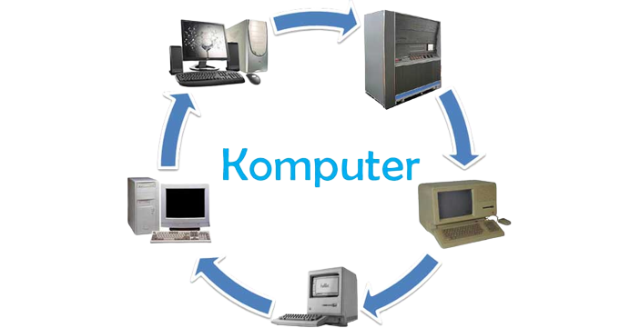

## Tugas Operasi Sistem :

1. Deskripsikan terkait benda-benda berikut yang ada pada PC/Laptop kalian, baik secara : __umum, spesifikasi, manfaat/kegunaan!__
    - PC/Laptop
    - Sistem Operasi
    - Prosesor
    - Software
    - Hardware
    - Penyimpanan (Primer/Sekunder)
2. Eksplorasi sejarah perkembangan komputer!
    - Tugas dikumpulkan melalui GITHUB.
    - Buat folder dengan nama Tugas_Sistem_Operasi
    - Isilah folder itu dengan tugas ini.
    - Format nama file : **tugas1_nim_nama.md**
    - Penilaian : Konten, Grafis, Kerapian.
    - Batas waktu : 3 September 2022 jam 23.59 WITA
---
>## PC / Laptop

**PC adalah Personal Computer**

Komputer pribadi atau PC adalah istilah umum yang merujuk pada komputer yang dapat digunakan dan diperoleh orang dengan mudah. Selain itu, PC adalah istilah umum yang merujuk kepada mikrokomputer yang sesuai dengan spesifikasi IBM.

**Apa fungsi PC?**

Fungsi utama dari PC adalah untuk mengolah data input dan menghasilkan output berupa data/informasi sesuai dengan keinginan user (pengguna).

**Apa PC sama dengan laptop?**

PC dimaksudkan untuk digunakan oleh end-user (masyarakat umum). Sementara menurut wikipedia bahasa indonesia, Pc (Personal Computer) meerupakan komputer yang banyak diketahui orang umum sehingga bentuknya akrab dengan orang-orang umum. Sedangkan LAPTOP di dalam bahasa indonesia, laptop berarti komputer jinjing.

**PC terdiri dari apa saja?**

- Motherboard.
- VGA Card.
- Lan Card.
- RAM.
- Harddisk
- Floppy Disk.
- CD-ROM Drive .dll.
---
**Laptop adalah**

Laptop, komputer jinjing, atau komputer pangku adalah komputer pribadi yang berukuran relatif kecil dan ringan. Beratnya berkisar dari 1–6 kg, tergantung pada ukuran, bahan, dan spesifikasi laptop tersebut. Sumber daya laptop berasal dari baterai atau adaptor A/C yang dapat digunakan untuk mengisi ulang baterai dan menyalakan laptop itu sendiri. Baterai laptop pada umumnya dapat bertahan kurang lebih 2 hingga 6 jam sebelum akhirnya habis. Habisnya baterai bergantung dari cara pemakaian, spesifikasi, dan ukuran baterai. Laptop terkadang disebut juga dengan komputer notebook atau notebook saja.

**Apa fungsi Laptop?**

Definisi laptop juga diartikan sebagai sebuah perangkat komputer yang berukuran kecil dan ringan dibandingkan dengan komputer. Laptop mempunyai fungsi yang sama dengan komputer, selain itu untuk melakukan pekerjaan yang ringan hingga berat tentu saja lebih mumpuni komputer dibandingkan dengan laptop.

**Pebedaan Laptop dan Komputer/PC**

Secara singkat, laptop atau komputer jinjing adalah sebuah komputer pribadi yang memiliki ukuran lebih kecil dan lebih ringan sehingga mudah untuk dipindahkan dan dibawa kemana saja. Sedangkan komputer adalah sebuah alat teknologi yang digunakan untuk mengolah data menurut prosedur yang sudah dirumuskan.

**Apa kelebihan dari laptop?**

Keunggulan dari laptop antara lain adalah karena portabilitasnya, desainnya yang kecil dan simpel sehingga dapat digunakan dimana saja. Laptop lebih praktis dan mudah saat digunakan, karena segala peralatannya sudah di rakit dalam satu perangkat yang kecil.

**Apa saja komponen pada laptop?**

- Processor
- Motherboard
- Hardisk
- Memory RAM
- Graphic Design
- CD-ROM atau DVD-ROM
- Baterai laptop
- Sound card
- Power AC atau DC adapter
- Touchpad dll.
---

>## Sistem Operasi

**Sistem operasi adalah?**

Perangkat lunak sistem yang mengatur sumber daya dari perangkat keras dan perangkat lunak, serta sebagai daemon untuk program komputer. Tanpa sistem operasi, pengguna tidak dapat menjalankan program aplikasi pada komputer mereka.

**Fungsi sistem operasi**

Fungsi utama sistem operasi adalah mengelola semua program dan aplikasi yang dapat dijalankan oleh komputer atau smartphone. Dilansir dari Wgu.edu, sistem operasi memiliki fungsi terperinci antara lain: Booting: sistem operasi berfungsi sebagai booting yaitu proses awal menyalakan sistem pada komputer.

**Manfaat sistem operasi**

Sistem Operasi mampu mengoptimalkan kinerja dari sebuah perangkat keras maupun lunak, Sistem tersebut mengatur serta mengendalikan hubungan antara perangkat keras dan lunak agar bisa saling bekerjasama dengan baik, Mengatur Sistem Kerja Perangkat.

**Kegunaan sistem operasi**

Sistem operasi berguna untuk menghubungkan perangkat lunak (software) dengan perangkat keras (hardware). Sistem operasi diperlukan agar kinerja komputer berjalan dengan baik. Sistem operasi akan memberikan perintah dan sebagai mediator antara manusia dan komputer.

**Jenis Sistem Operasi**

- Windows
    - Sistem operasi Windows merupakan pengembangan dari MS-DOS, sebuah sistem operasi berbasis modul teks dan command-line atau CLI (Command Line Interface). Windows merupakan sistem operasi yang menyediakan lingkungan berbasis grafis (Graphical User Interface (GUI)) dan kemampuan multitasking.

- Linux
    - Salah satu jenis sistem operasi yang populer selain Windows dan MacOS adalah Linux. Sistem yang satu ini pertama kali diperkenalkan oleh seorang programmer bernama Linus Torvalds pada 1991.

- MS DOS
    - MS DOS atau Disk Operating System (DOS) adalah pendahulu Microsoft Windows yang kita kenal saat ini. DOS merupakan awal mula metode sistem operasi komputer yang digunakan oleh IBM. DOS sudah ada sejak beberapa dekade yang lalu. Kemudian, jenis sistem operasi yang satu ini mengalami masa kejayaannya pada tahun 1980-an.

- Unix
    - Unix merupakan salah satu jenis sistem operasi yang sudah ada sejak lama, seperti DOS. Biasanya, Unix menggunakan sebuah komputer mini sebagai jaringan server. Pasalnya, Unix ringan dan sangat membantu dalam proses pemindahan kerja dari satu komputer ke komputer lain.

- Chrome OS
    - Chrome OS adalah salah satu jenis sistem operasi yang paling baru Sistem operasi yang dikembangkan oleh Google ini dirilis pada Juni 2011.

- MacOS
    - MacOS merupakan sistem operasi yang dikembangkan oleh Apple. Layaknya produk Apple lainnya, MacOS memiliki user interface yang sangat simpel dan mudah dijangkau. Sistem operasi ini dapat digunakan di semua perangkat keluaran Apple. Menariknya, semua terkoneksi dalam satu Apple ID yang sama.
---
>## Prosesor

**Prosesor adalah?**

Prosesor adalah sirkuit inti yang menjalankan seluruh operasi perangkat. Bisa dibilang, prosesor adalah otak dari perangkat. Setiap komputer memiliki prosesor, baik itu dengan efisiensi kecil maupaun kinerja besar. Tanpa prosesor, perangkat-perangkat ini tidak dapat berfungsi.

**Fungsi Prosesor**

Processor akan memproses segala bentuk informasi yang dimiliki oleh komputer, dan juga memproses informasi yang dimasukkan ke dalam komputer. Semua pekerjaan pemrosesan informasi tersebut akan ditangani oleh processor. Sebuah processor mampu mengintegrasikan keseluruhan komponen internal yang ada di dalam komputer.

**Apa perbedaan antara CPU dan prosesor?**

Cpu adalah procesor, tapi procesor tidak hanya CPU. CPU : central processing unit. Inti dari komputer yang memproses pengolahan data. Sedangkan Processor adalah semua chip yang memiliki processing unit.

**Jenis Prosesor**

- Intel Corporation
- Advanced Micro Devices (AMD)
- Advanced RISC Machine (ARM)
- Transmeta
- Prosesor Apple
- Cyrix
---

>## Software

**Software adalah?**

Software adalah data yang diprogram, disimpan, dan diformat secara digital dengan fungsi tertentu. Microsoft Excel yang merupakan salah satu produk dari software. Istilah software atau perangkat lunak tentu sudah menjadi sering didengar dalam kehidupan masyarakat.

**Fungsi Software**

Software memiliki fungsi dalam mengatur hardware/perangkat keras yang ada pada komputer. Dengan begitu, komputer yang digunakan dapat bekerja dengan baik sesuai pekerjaan apa yang dibutuhkan. 2. Software juga dapat digunakan sebagai penghubung antara beberapa software yang lain dengan hardware komputer.

**Manfaat Software**

Manfaat utama sebuah software adalah menyederhanakan sesuatu yang rumit. Sebut saja software akuntansi, perangkat lunak ini mencatat seluruh transaksi secara otomatis.

**Jenis Software**
- Firmware
    - Firmware adalah perangkat lunak yang hanya bisa dibaca. Pengguna memiliki level-kontrol yang rendah dalam firmware. Firmware umumnya berada dalam setiap aplikasi perangkat lunak dan sistem operasi sebagai jalur hubung aplikasi dengan perangkat keras.

- Freeware
    - Freeware adalah jenis aplikasi yang disediakan secara gratis oleh developernya. Artinya, untuk menggunakan perangkat lunak tersebut pengguna tidak perlu melakukan pembelian secara khusus. Namun, pada umumnya freeware memiliki fitur terbatas.

- Open source
    - Open source adalah jenis perangkat lunak gratis. Tidak hanya gratis namun, software open source juga memiliki keterbukaan akses atas sumber kode pemrogramannya. Software open source dikembangkan oleh banyak developer. Setiap developer mampu mengolah, merubah, hingga menyebarluaskan perangkat lunak tersebut. Salah satu tujuan dikembangkanya software open source adalah menyediakan software terbaik yang segala fiturnya sesuai dengan kebutuhan banyak user. Tidak hanya itu aksesnya yang gratis, juga dapat digunakan oleh user tanpa ketentuan tertentu yang menyulitkan penggunaan. Software open source memiliki kemungkinan besar untuk terus berkembang sesuai dengan keinginan para pemakainya. Contoh software aplikasi open source adalah:

        1. Blender: perangkat lunak aplikasi pengolah 3D
        1. Open Office: perangkat lunak aplikasi pengolahan kata dan data Contoh sistem operasi open source adalah:
        1. Linux
        1. Ubuntu
        1. Debian
        1. RedHat

- Adware
    - Perangkat lunak beriklan adalah perangkat lunak yang menghasilkan pendapatan bagi pengembangnya dengan secara otomatis menghasilkan iklan daring di antarmuka pengguna perangkat lunak atau pada layar yang disajikan kepada pengguna selama proses pemasangan.
---

>## Hardware

**Hardware adalah?**

Perangkat keras komputer adalah semua bagian fisik komputer, dan dibedakan dengan data yang berada di dalamnya atau yang beroperasi di dalamnya, dan dibedakan dengan perangkat lunak yang menyediakan instruksi untuk perangkat keras dalam menyelesaikan tugasnya.

**Fungsi Hardware**

Adapun fungsi hardware yaitu untuk mendukung kerja komputer, menampilkan atau menerima input (masukan) proses, mengolah data/informasi, memberikan output, serta menyimpan data/informasi yang terpasang di dalam maupun di luar komputer.

**Jenis Hardware**

- Mainboard atau Motherboard
    - Motherboard adalah bagian komputer yang paling utama karena berisi sistem BIOS (Basic input output system) , pengatur koneksi input-output(chipset), soket prosessor, soket memory (RAM), soket kartu grafis (VGA card) dan soket kartu tambahan (additional cards seperti PCI,
    ISA). BIOS adalah bagian utama yang mengatur sistem input output pada komputer. Bagian yang
    termasuk input seperti : Keyboard dan mouse. Bagian yang termasuk output seperti Monitor dan printer.

- Processor (CPU)
    - Prosessor adalah otak sentral dari sebuah komputer. Prosessor adalah yang mengerjakan semua
    perintah yang sudah terprogram dan disimpan dalam harddisk. Dalam prosessor dikenal istilah
    frekuensi clock, yaitu kecepatan sebuah prosessor untuk mengerjakan perintah program dalam
    satu detik. Satuan frekuensi Clock dinyatakan dalam Herts (Hz).

- Harddisk (HDD)
    - Harddisk adalah media penyimpanan data permanen, jadi data tidak hilang meskipun listrik
    sudah dimatikan. Harddisk berisi sebuah cakram magnetik yang mampu menyimpan data. Ukuran
    harddisk dinyatakan dalam Byte (B), contoh: 160GB (160 milyar byte). Harddisk
    ditemukan pertama kali oleh Reynold Johnson di tahun 1956. Harddisk pertama berukuran 4.4
    MB.

- RAM (Random Access Memory)
    - RAM adalah unit penyimpan data tidak permanen artinya data dalam RAM akan hilang jika listrik
    mati. Ukuran data RAM dinyatakan dengan Byte (B) dan kecepatan akses RAM dinyatakan dengan
    Hertz (Hz). Jadi dalam RAM tidak cuma data saja, namun ada parameter lain yaitu kecepatan
    RAM. Kecepatan RAM harus sesuai dengan spesifikasi soket RAM pada motherboard. Contoh: RAM
    512MB PC667 mempunyai ukuran data 512MB dengan kecepatan akses 667 MHz.

- Optical drive (CD / DVD)
    - Optical Drive adalah alat pembaca untuk media penyimpan data berupa disk DVD / CD. DVD/ CD berupa kepingan cakram optik yang berisi data.

- Floppy Disk
    - Floppy disk adalah media pembaca untuk disket.Saat ini mungkin disket sudah tidak populer.
    Namun diakui atau tidak disket turut memajukan dunia komputer selama beberapa dekade.

- VGA CARD (Kartu Grafis)
    - VGA adalah singkatan dari Video Graphics Array. VGA Card berfungsi mengeluarkan output grafis
    (gambar) untuk ditampilkan pada monitor. Ukuran VGA Card ditentukan dari ukuran RAM nya,
    semakin besar RAM sebuah VGA Card maka semakin halus gambar yang dihasilkan.

- Sound Card
     - Sound Card adalah bagian yang mendekode data data digital menjadi sinyal suara. Dengan penemuan soundcard maka perkembangan dunia multimedia pada komputer menjadi makin meluas.

- Keyboard
    - Keyboard adalah sebuah papan ketik yang berisi semua model huruf, angka, karakter dan tanda
    baca yang menjadi sarana bagi pengguna komputer dalam memasukkan data ke komputer.

- Mouse (Pointing Device)
    - Mouse adalah sebuah alat pointer untuk mengakses melalui layar monitor.
    Dengan mouse maka penggunaan komputer menjadi lebih interaktif dan Menggambar melalui komputer menjadi semakin mudah.

- Monitor
    - Monitor adalah media tampilan gambar haril output dari VGA Cards. Dahulu monitor komputer dimulai dengan monitor tabung hitam-putih, monitor warna CGA, VGA, dan SVGA.
---

>## Penyimpanan Primer dan Sekunder

**Penyimpanan Primer dan Sekunder adalah?**

Bentuk penyimpangan primer, apabila tokoh utama melakukan penyimpangan yang ringan dan tidak merugikan orang lain. Bentuk penyimpangan sekunder, apabila tokoh utama melakukan penyimpangan yang berat dapat merugikan orang lain dan sanksi yang didapatkan juga berat.

**Fungsi Primer dan Sekunder**

Memori primer adalah memori yang langsung diakses oleh CPU untuk menyimpan dan mengambil informasi, sedangkan memori sekunder tidak dapat diakses secara langsung oleh CPU. Memori primer diakses menggunakan bus alamat dan data oleh CPU, sedangkan memori sekunder diakses menggunakan saluran input / output.

**Kelebihan dan kekurangan Memori Primer**
- Kelebihan :
    - Memiliki kecepatan akses yang lebih cepat.
    - Penyimpanan terhubung langsung dengan processing device
    - Lebih cocok untuk pemrosesan data dari pada penyimpanan
- Kekurangan :
    - Memiliki harga yang lebih mahal daripada penyimpanan sekunder
    - Bukan penyimpanan portable yang bisa dibawa seperti sekunder (       flashdisk, harddisk eksternal dll. )
    - Kapasitas lebih terbatas dan cenderung kecil
    - Memiliki resiko lebih tinggi untuk terjadi kehilangan data jika terjadi situasi powercut mendadak

**Kelebihan dan kekurangan Memori Sekunder**
- Kelebihan :
    - Memiliki harga yang lebih terjangkau daripada penyimpanan primer.
    - Lebih aman dalam penyimpanan data jika terjadi situasi powercut
    - Sifatnya portable sehingga dapat dipindah - pindahkan.
    - Kapasitas besar dan beragam.
- Kekurangan :
    - Memiliki kecepatan akses data yang lambat
    - Penyimpanan tidak terkoneksi dengan pemroses
    - Hanya dapat berperan sebagai penyimpanan data saja.
---

>## Eksplorasi sejarah perkembangan komputer!

**1. Berdasarkan Data yang Diolah**

a.  Komputer Analog

Komputer analog berfungsi sebagai penyimpanan data yang bersifat kontinyu dan bukan data berupa angka melainkan phisik, misalnya temperature, tekanan, kecepatan, dan arus listrik. Komputer analog banyak digunakan dalam proses pengontrolan misalnya pembangkit tenaga listrik dan alat ukur denyut jantung di rumah sakit.

- Kelebihan :
    - Kemampuannya untuk menerima data dalam besaran phisik dan langsung mengukur data tersebut tanpa harus dikonversikan terlebih dahulu.

    - Kecocokan dalam pengukuran
    - Sangat berguna untuk pengontrolan yang bersifat otomatis

- Kekurangan :
    - Kurang tepat dalam mengukur data bila dibandingkan dengan komputer digital
    - Daya masuk lebih banyak, sedang output hanya beberapa saja
    - Pemakaian hardware yang banyak dan lebih rumit
    - Hanya bersifat khusus

b.  Komputer Digital

Komputer digital hanya menerima data dalam bentuk angka atau huruf. Komputer digital memiliki tingkat kinerja yang cepat dan ketelitian tinggi. Jenis data yang diolah komputer digital dapat berupa angka, huruf, gabungan angka dan huruf, dan karakter spesial.

- Kelebihan :
    - Memproses data lebih tepat dibandingkan dengan komputer analog
    - Dapat menyimpan data selama masih dibutuhkan oleh proses
    - Dapat melakukan operasi logika
    - Data yang telah dimasukan dapat dikoreksi atau dihapus
    - Output dari komputer digital dapat berupa angka, huruf, gambar, dan grafik

- Kekurangan :
    - Semakin besar kinerja maka semakin besar daya yang digunakan
    - Hanya mampu bekerja sesuai dengan perintah tombol (keyboard dan mouse)

c. Komputer Hybrid

Komputer hybrid merupakan kombinasi antara komputer analog dan komputer digital. Contoh penggunaan komputer hybrid adalah pada robot-robot yang digunakan oleh pabrik dan perangkat komputer yang biasa digunakan di rumah sakit untuk menampilkan grafik, gambar, dan tulisan tentang tubuh pasien.

- Kelebihan :
    - Sistem perhitungannya lebih tepat dibandingkan komputer digital
    - Lebih cepat memproses data
    - Dual fungsi, bisa untuk tujuan khusus atau tujuan umum

- Kekurangan :
    - Hardware lebih banyak, rumit, dan lebih mahal.

**2. Berdasarkan Generasinya**

Menurut Nasution (2001) dilihat dari ciri-ciri setiap generasi, lewat perkembangan komputer, terdapat lima generasi, sebagaimana dikemukakan berikut ini.

a. Generasi Pertama (1953-1958)

Generasi pertama dimana komponen perangkat keras komputer ketika itu adalah tabung elektronik dan memori magnetis. Pada masa itu aplikasi pengolahan data masih bersifat coba-coba. Ciri-ciri komputer generasi pertama adalah sebagai berikut: (a) menggunakan vacum tube sehingga komputer generasi pertama ini memiliki ukuran yang sangat besar; (b) menggunakan Bahasa mesin sehingga kecepatan kerjanya sangat lambat dan memiliki memori yang sangat kecil; dan (c) untuk menjalankannya membutuhkan panas yang sangat tinggi.

b. Generasi Kedua (1958-1966)

Generasi kedua ditandai dengan digantinya tabung elektronik dengan transistor. Selain itu, pada periode ini pula berhasil disempurnakan teknologi memories magnetik, sehingga daya simpannya menjadi lebih besar. Pada komputer generasi kedua juga mulai dikembangkan pengolah Bahasa dan system input output. Sedangkan aplikasi pengolahan data dikembangkan mencakup bidang kerja yang cukup luas. Ciri-ciri komputer generasi kedua meliputi: (a) sudah menggunakan alat yang disebut transistor; (b) memiliki memori yang rendah atau kecil; (c) pengolahan data sedikit lebih cepat dibandingkan dengan komputer generasi pertama; (d) kebutuhan panasnya tidak terlalu tinggi; dan (e) ukuran fisiknya lebih kecil dari ukuran komputer generasi pertama.

c. Generasi Ketiga (1966-1974)

Generasi ketiga mencatat digantikannya transistor oleh rangkaian elektronik berukuran besar (large scale integration/LSI). Pada masa ini memori elektronik berbasis rangkaian terpadu menggantikan komponen magnetis. Lalu muncul pula terminal dengan layar video. Mulai diterapkan system pengoperasian yang canggih dan perangkat lunak pengendali komunikasi antarkomputer mulai digunakan. Ciri-ciri komputer generasi ketiga meliputi: (a) menggunakan MIC atau Monolotic Iteret Circuit; (b) memiliki memori lebih besar dari generasi kedua; (c) memiliki kecepatan yang lebih besar; dan (d) memiliki ukuran fisik yang lebih kecil dari generasi kedua.

d. Generasi Keempat (1974-1982)

Generasi keempat menunjukkan pergantian dari LSI menjadi VLSI (Very Large Scale Integration) yang berukuran memori amat besar. Peralatan input output semakin canggih serta berkapasitas raksasa. Pada masa ini, satelit mulai digunakan untuk saluran komunikasi data. Ciri-ciri komputer generasi keempat meliputi: (a) menggunakan MOS (Methal Oxcide Semi Conductor); (b) memiliki memori yang sangat besar; (c) memiliki kecepatan dalam mengolah data; dan (d) Ukurannya menjadi sangat kecil.

e. Generasi Kelima (1982-Sekarang)

Meski belum konkrit sosoknya, perkembangan terus bertambah canggih dengan keandalan yang meningkat. Diperkirakan aplikasi komputer generasi ini adalah pengambilan keputusan langsung oleh komputer, pengolahan data yang terbesar langsung ke rumah-rumah, serta siste informasi yang berukuran raksasa.