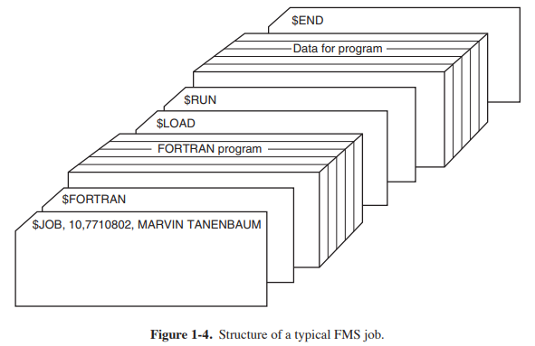
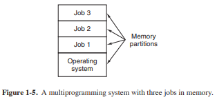
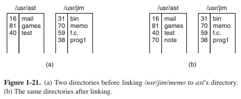

# Tugas sistem operasi chapter buku 1.1 - 1.12

## 1.1 APA ITU SISTEM OPERASI?

Sulit untuk menentukan apa itu sistem operasi selain mengatakan itu adalah
perangkat lunak yang berjalan dalam mode kernel — dan bahkan itu tidak selalu benar. Bagian dari
masalahnya adalah bahwa sistem operasi melakukan dua fungsi yang pada dasarnya tidak terkait:

menyediakan pemrogram aplikasi (dan program aplikasi, tentu saja) bersih
kumpulan sumber daya abstrak alih-alih sumber daya perangkat keras yang berantakan dan mengelolanya
sumber daya perangkat keras. Bergantung pada siapa yang berbicara, Anda mungkin mendengar sebagian besar
tentang satu fungsi atau yang lain. Sekarang mari kita lihat keduanya.

### 1.1.1 Sistem Operasi sebagai Mesin yang Diperluas

Arsitektur (set instruksi, organisasi memori, I / O, dan struktur bus mendatang) dari sebagian besar komputer di tingkat bahasa mesin primitif dan canggung untuk
program, terutama untuk input / output. Untuk membuat poin ini lebih konkret, pertimbangkan
hard disk SATA (Serial ATA) modern yang digunakan pada sebagian besar komputer. Sebuah buku (Ander son, 2007) yang menjelaskan versi awal antarmuka ke disk—apa yang harus diketahui oleh seorang pro grammer untuk menggunakan disk—berlari lebih dari 450 Halaman. Sejak itu, the
antarmuka telah direvisi beberapa kali dan lebih rumit daripada di
2007. Jelas, tidak ada programmer waras yang mau berurusan dengan disk ini di tingkat hard ware. Sebagai gantinya, perangkat lunak, yang disebut driver disk, berurusan dengan hard ware dan menyediakan antarmuka untuk membaca dan menulis blok disk, tanpa masuk ke
rincian. Sistem operasi berisi banyak Driver untuk mengendalikan perangkat I / O.
Tetapi bahkan level ini terlalu rendah untuk sebagian besar aplikasi. Untuk alasan ini, semua
sistem operasi menyediakan lapisan abstraksi lain untuk menggunakan disk: file.
Menggunakan abstraksi ini, program dapat membuat, menulis, dan membaca file, tanpa harus
berurusan dengan rincian berantakan tentang bagaimana perangkat keras benar-benar bekerja.
Abstraksi ini adalah kunci untuk mengelola semua kompleksitas ini. Abstraksi yang baik
Ubah tugas yang hampir mustahil menjadi dua tugas yang dapat dikelola. Yang pertama adalah mendefinisikan dan
implementasi abstraksi. Yang kedua adalah menggunakan abstraksi ini untuk memecahkan
masalah di tangan. Salah satu abstraksi yang hampir setiap pengguna komputer mengerti adalah
file, seperti yang disebutkan di atas. Ini adalah informasi yang berguna, seperti digital
foto, pesan email yang disimpan, Lagu, atau halaman web. Jauh lebih mudah untuk berurusan dengan pho tos, email, lagu, dan halaman web daripada dengan detail disk SATA (atau lainnya).
Tugas dari sistem operasi adalah untuk membuat abstraksi yang baik dan kemudian menerapkan
dan mengelola objek abstrak sehingga dibuat. Dalam buku ini, kita akan berbicara banyak tentang
abstraksi. Mereka adalah salah satu kunci untuk memahami sistem operasi.
Poin ini sangat penting sehingga perlu diulang dengan kata-kata yang berbeda. Dengan semua
karena menghormati para insinyur industri yang dengan hati-hati merancang Macintosh,
hardware itu jelek. Prosesor nyata, memori, disk, dan perangkat lain sangat
rumit dan hadir sulit, canggung, istimewa, dan tidak konsisten antar wajah kepada orang-orang yang harus menulis perangkat lunak untuk menggunakannya. Terkadang hal ini disebabkan
untuk kebutuhan kompatibilitas dengan hardware yang lebih tua. Lain kali itu adalah
mencoba untuk menghemat uang. Seringkali, bagaimanapun, perancang perangkat keras tidak menyadari (atau
peduli) berapa banyak masalah yang mereka sebabkan untuk perangkat lunak. Salah satu tugas utama
dari sistem operasi adalah untuk menyembunyikan perangkat keras dan program ini (dan mereka
programmer) dengan abstraksi yang bagus, bersih, elegan, konsisten, untuk digunakan sebagai gantinya. Sistem operasi mengubah yang jelek menjadi indah, seperti yang ditunjukkan pada gambar. 1-2

Perlu dicatat bahwa pelanggan nyata sistem operasi adalah program aplikasi (melalui programmer aplikasi, tentu saja). Mereka adalah orang-orang
yang berhubungan langsung dengan sistem operasi dan abstraksi nya. Sebaliknya, akhir
pengguna berurusan dengan abstraksi yang disediakan oleh antarmuka pengguna, baik Shell com mand-line atau antarmuka grafis. Sedangkan abstraksi pada user interface
mungkin mirip dengan yang disediakan oleh sistem operasi, ini tidak selalu
kasus. Untuk membuat poin ini lebih jelas, pertimbangkan desktop Windows normal dan
prompt perintah berorientasi baris. Keduanya adalah program yang berjalan pada sistem operasi Windows dan menggunakan abstraksi yang disediakan Windows, tetapi mereka menawarkan antarmuka pengguna yang sangat berbeda. Demikian pula, Pengguna Linux yang menjalankan Gnome atau KDE melihat sangat
antarmuka yang berbeda dari pengguna Linux yang bekerja langsung di atas X yang mendasarinya
Sistem jendela, tetapi abstraksi sistem operasi yang mendasari adalah sama dalam
kedua kasus.
Dalam buku ini, kita akan mempelajari abstraksi yang disediakan untuk program aplikasi di
sangat detail, tetapi katakan sedikit tentang antarmuka pengguna. Itu adalah besar dan penting
subjek, tetapi satu hanya perifer terkait dengan sistem operasi

### 1.1.2 sistem operasi sebagai Manajer Sumber Daya

Konsep sistem operasi sebagai terutama menyediakan abstraksi untuk program AP plication adalah pandangan top-down. Sebuah alternatif, bottom-up, pandangan menyatakan bahwa
sistem operasi ada untuk mengelola semua bagian dari sistem yang kompleks. Komputer ern Mod terdiri dari prosesor, kenangan, timer, disk, tikus, jaringan antar wajah, printer, dan berbagai perangkat lain. Dalam pandangan bottom-up, pekerjaan
dari sistem operasi adalah untuk menyediakan alokasi yang teratur dan terkontrol dari
prosesor, memori, dan perangkat I/O di antara berbagai program yang menginginkannya.
Sistem operasi Modern memungkinkan banyak program berada di memori dan dijalankan
pada saat bersamaan. Bayangkan apa yang akan terjadi jika tiga program berjalan pada beberapa
komputer semua mencoba untuk mencetak output mereka secara bersamaan pada printer yang sama. Yang pertama beberapa baris cetakan mungkin dari program 1, Beberapa berikutnya dari program 2, lalu
beberapa dari program 3, dan sebagainya. Hasilnya akan menjadi kekacauan total. Operasi
sistem dapat membawa untuk kekacauan potensial dengan buffering semua output ditakdirkan
untuk printer pada disk. Ketika satu program selesai, sistem operasi dapat
kemudian salin outputnya dari file disk yang telah disimpan untuk printer,
sementara pada saat yang sama program lain dapat terus menghasilkan lebih banyak output,
menyadari fakta bahwa output tidak benar-benar pergi ke printer (belum).
Ketika komputer (atau jaringan) memiliki lebih dari satu pengguna, kebutuhan untuk mengelola
dan melindungi memori, perangkat I / O, dan sumber daya lainnya bahkan lebih sejak
pengguna mungkin mengganggu satu sama lain. Selain itu, pengguna sering perlu
Bagikan tidak hanya perangkat keras, tetapi informasi (file, database, dll.) juga. Singkatnya,
pandangan sistem operasi ini menyatakan bahwa tugas utamanya adalah melacak
program mana yang menggunakan sumber daya mana, untuk memberikan permintaan sumber daya, untuk memperhitungkan
untuk penggunaan, dan untuk menengahi permintaan yang bertentangan dari berbagai program dan pengguna.
Manajemen sumber daya mencakup multiplexing (berbagi) sumber daya dalam dua cara berbeda: dalam waktu dan dalam ruang. Ketika sumber daya adalah waktu multiplexing, berbeda
program atau pengguna bergiliran menggunakannya. Pertama salah satu dari mereka mendapat untuk menggunakan sumber daya,
lalu yang lain, dan seterusnya. Misalnya, dengan hanya satu CPU dan beberapa program
yang ingin berjalan di atasnya, sistem operasi pertama mengalokasikan CPU untuk satu program,
kemudian, setelah berjalan cukup lama, program lain dapat menggunakan CPU, lalu yang lain, dan akhirnya yang pertama lagi. Menentukan bagaimana sumber daya adalah waktu
multiplexing-siapa yang pergi berikutnya dan untuk berapa lama—adalah tugas dari sistem operasi. Contoh lain dari multiplexing waktu adalah berbagi printer. Ketika beberapa
pekerjaan cetak antri untuk mencetak pada satu printer, keputusan harus dibuat
tentang mana yang akan dicetak selanjutnya.
Jenis lain dari multiplexing adalah ruang multiplexing. Alih-alih pelanggan
bergiliran, masing-masing mendapat bagian dari sumber daya. Sebagai contoh, memori utama adalah nor mally dibagi di antara beberapa program yang berjalan, sehingga masing-masing dapat menjadi penduduk di
waktu yang sama (misalnya, untuk bergiliran menggunakan CPU). Dengan asumsi ada
apakah memori yang cukup untuk menampung beberapa program, lebih efisien untuk menampung beberapa
program dalam memori sekaligus daripada memberikan salah satu dari mereka semua itu, terutama jika
hanya membutuhkan sebagian kecil dari total. Tentu saja, ini menimbulkan masalah keadilan,
perlindungan, dan sebagainya, dan terserah sistem operasi untuk menyelesaikannya. Lain
sumber daya yang Ruang multiplexing adalah disk. Dalam banyak sistem satu disk dapat
simpan file dari banyak pengguna secara bersamaan. Mengalokasikan ruang disk dan menjaga
melacak siapa yang menggunakan blok disk mana yang merupakan tugas sistem operasi yang khas.

## 1.2 SEJARAH SISTEM OPERASI 

Sistem operasi telah berkembang selama bertahun-tahun. Pada bagian berikut kita akan melihat secara singkat beberapa highlights. Karena sistem operasi memiliki
secara historis terkait erat dengan arsitektur komputer di mana mereka.
jalankan, kita akan melihat generasi komputer berturut-turut untuk melihat seperti apa sistem operasi mereka. Pemetaan ini dari generasi sistem operasi ke komputer
generations kasar, tetapi menyediakan beberapa struktur di mana tidak akan ada.
Perkembangan yang diberikan di bawah ini sebagian besar kronologis, tetapi telah bergelombang
naik. Setiap pengembangan tidak menunggu sampai yang sebelumnya selesai dengan baik sebelumnya
memulai. Ada banyak tumpang tindih, belum lagi Banyak awal yang salah dan
jalan buntu. Anggap ini sebagai panduan, bukan sebagai kata terakhir.
Komputer digital sejati pertama dirancang oleh ahli matematika Inggris
Charles Babbage (1792-1871). Meskipun Babbage menghabiskan sebagian besar hidupnya dan keberuntungan mencoba untuk membangun nya " analytical engine," ia NEV er mendapatkannya bekerja dengan baik karena itu murni mekanik, dan teknologi zamannya tidak bisa menghasilkan
roda, roda gigi, dan roda gigi yang dibutuhkan dengan presisi tinggi yang dia butuhkan. Tak perlu
untuk mengatakan, analytical engine tidak memiliki sistem operasi.
Selain sejarah yang menarik, Babbage menyadari bahwa dia akan membutuhkan perangkat lunak untuk mesin analitisnya, jadi dia menyewa seorang wanita muda bernama Ada Lovelace,
yang merupakan putri dari penyair terkenal Inggris Lord Byron, sebagai yang pertama di dunia
programmer. Bahasa pemrograman ada menggigitnya.

### 1.2.1 Generasi Pertama (1945-55): Tabung Vakum

Setelah upaya Babbage yang gagal, sedikit kemajuan dibuat dalam membangun
komputer digital sampai periode Perang Dunia II, yang merangsang ledakan
aktivitas. Profesor John Atanasoff dan mahasiswa pascasarjana nya Clifford Berry dibangun
apa yang sekarang reg arded sebagai komputer digital pertama yang berfungsi di Iowa State University. Ini digunakan 300 tabung vakum. Pada waktu yang hampir bersamaan, Konrad Zuse di Berlin
membangun komputer Z3 dari relay elektromekanis. Pada tahun 1944, Colossus adalah
dibangun dan diprogram oleh sekelompok ilmuwan (termasuk Alan Turing) di Bletchley
Park, Inggris, Mark I dibangun oleh Howard Aiken di Harvard, dan ENIAC
dibangun oleh William Mauchley dan mahasiswa pascasarjana J. Presper Eckert di
Universitas Pennsylvania. Beberapa biner, beberapa tabung vakum yang digunakan, beberapa
yang diprogram, tapi semua yang sangat primitif dan mengambil detik untuk melakukan bahkan
perhitungan paling sederhana.
Pada hari-hari awal ini, sekelompok orang (biasanya insinyur) merancang,
dibangun, diprogram, dioperasikan, dan dipelihara setiap mesin. Semua pemrograman adalah
dilakukan dalam bahasa mesin absolut, atau bahkan lebih buruk lagi, dengan memasang sirkuit listrik dengan menghubungkan ribuan kabel ke plugboards untuk mengendalikan mesin
fungsi dasar. Bahasa pemrograman tidak diketahui (bahkan bahasa assembly
tidak diketahui). Sistem operasi tidak pernah terdengar. Mode operasi yang biasa
adalah untuk programmer untuk mendaftar untuk blok waktu menggunakan lembar pendaftaran di
dinding, kemudian turun ke ruang mesin, masukkan plugboard nya ke dalam
berharap bahwa tidak ada 20.000 atau lebih tabung vakum akan terbakar selama menjalankan. Hampir semua masalah yang sederhana perhitungan matematis dan numerik langsung, seperti menggiling
tabel sinus, cosinus, dan logaritma, atau lintasan artileri komputasi.
Pada awal 1950-an, rutinitas agak membaik dengan diperkenalkannya
dari kartu berlubang. Sekarang mungkin untuk menulis program pada kartu dan membacanya di
alih-alih menggunakan plugboards; jika tidak, prosedurnya sama.

### 1.2.2 generasi kedua (1955-65): transistor dan sistem Batch

Pengenalan transistor pada pertengahan 1950-an mengubah gambar secara radikal. Komputer menjadi cukup andal sehingga dapat diproduksi dan dijual
untuk membayar pelanggan dengan harapan bahwa mereka akan terus berfungsi lama
cukup untuk mendapatkan beberapa pekerjaan yang berguna dilakukan. Untuk pertama kalinya, ada pemisahan yang jelas antara desainer, pembangun, operator, programmer, dan personel pemeliharaan.
Mesin-mesin ini, sekarang disebut mainframe, dikunci dalam jumlah besar, khususnya
ruang komputer ber-AC, dengan staf operator profesional untuk menjalankannya.
Hanya perusahaan besar atau lembaga pemerintah besar atau universitas yang mampu
label harga jutaan dolar. Untuk menjalankan pekerjaan (yaitu, program atau serangkaian program),
seorang programmer pertama-tama akan menulis program di atas kertas (dalam FORTRAN atau assembler), lalu memukulnya di kartu. Dia kemudian akan membawa dek kartu ke input
kamar dan menyerahkannya ke salah satu operator dan pergi minum kopi sampai output
siap.
Ketika komputer selesai pekerjaan apa pun itu sedang berjalan, operator
akan pergi ke printer dan merobek output dan membawanya ke output
ruangan, sehingga programmer bisa mengumpulkannya nanti. Kemudian ia akan mengambil salah satu
deck kartu yang telah dibawa dari ruang input dan membacanya di. Jika kompiler FORTRAN diperlukan, operator harus mendapatkannya dari lemari arsip
dan membacanya. Banyak waktu komputer yang terbuang sementara operator sedang berjalan
di sekitar ruang mesin.
Mengingat tingginya biaya peralatan, tidak mengherankan bahwa orang dengan cepat
mencari cara untuk mengurangi waktu yang terbuang. Solusi yang umumnya diadopsi adalah
sistem batch. Ide di balik itu adalah untuk mengumpulkan nampan penuh pekerjaan di input
ke pita magnetik menggunakan komputer kecil (relatif) murah, seperti IBM 1401, yang cukup pandai membaca kartu,
menyalin kaset, dan mencetak output, tetapi sama sekali tidak bagus dalam perhitungan numerik.
Mesin lain yang jauh lebih mahal, seperti IBM 7094, digunakan untuk
komputasi nyata. Situasi ini ditunjukkan pada gambar. 1-3.
Setelah sekitar satu jam mengumpulkan batch pekerjaan, kartu dibacakan ke
pita magnetik, yang dibawa ke ruang mesin, di mana ia dipasang pada
sebuah tape drive. Operator kemudian dimuat program khusus (nenek moyang hari ini
sistem operasi), yang membaca pekerjaan pertama dari tape dan menjalankannya. Output adalah
ditulis ke kaset kedua, bukannya dicetak. Setelah setiap pekerjaan selesai, maka
sistem operasi secara otomatis membaca pekerjaan berikutnya dari rekaman itu dan mulai berjalan.

itu. Ketika seluruh batch dilakukan, operator dihapus input dan output
kaset, mengganti pita input dengan batch berikutnya, dan membawa pita output ke a
1401 untuk mencetak off line (yaitu, tidak terhubung ke komputer utama).
Struktur Pekerjaan input khas ditunjukkan pada gambar. 1-4. Ini dimulai dengan
$ Kartu pekerjaan, menentukan waktu berjalan maksimum dalam menit, nomor rekening yang akan
dibebankan, dan nama programmer. Kemudian datang Kartu $ FORTRAN, mengatakan
sistem operasi untuk memuat kompiler FORTRAN dari pita sistem. Itu langsung diikuti oleh program yang akan dikompilasi, dan kemudian kartu $ LOAD, mengarahkan
sistem operasi untuk memuat program objek hanya dikompilasi. (Program yang dikompilasi sering ditulis pada kaset awal dan harus dimuat secara eksplisit.) Berikutnya
datang Kartu $ RUN, memberitahu sistem operasi untuk menjalankan program dengan data
mengikutinya. Akhirnya, kartu $ END menandai akhir dari pekerjaan. Primitif ini
kartu kendali adalah cikal bakal cangkang modern dan penerjemah baris perintah.
Komputer generasi kedua yang besar sebagian besar digunakan untuk perhitungan ilmiah dan teknik, seperti memecahkan persamaan diferensial parsial yang sering terjadi dalam fisika dan teknik. Mereka sebagian besar diprogram di FORTRAN dan
bahasa assembly. Sistem operasi yang khas adalah FMS (Monitor Fortran
Sistem) dan IBSYS, sistem operasi IBM untuk 7094.

### 1.2.3 generasi ketiga (1965-1980): ICs dan Multiprogramming

Pada awal 1960-an, sebagian besar produsen komputer memiliki dua lini produk yang berbeda dan tidak kompatibel. Di satu sisi, ada komputer ilmiah skala besar yang berorientasi kata, seperti 7094, yang digunakan untuk perhitungan numerik kekuatan industri dalam sains dan teknik. Di sisi lain, ada

berorientasi Karakter, komputer komersial, seperti 1401, yang secara luas
digunakan untuk penyortiran dan pencetakan pita oleh bank dan perusahaan asuransi.
Mengembangkan dan memelihara dua lini produk yang sama sekali berbeda adalah proposisi yang mahal bagi produsen. Selain itu, banyak pelanggan komputer baru awalnya membutuhkan mesin kecil tetapi kemudian tumbuh lebih besar dan menginginkan yang lebih besar
mesin yang akan menjalankan semua program lama mereka, tapi lebih cepat.
IBM berusaha untuk memecahkan kedua masalah ini pada satu stroke dengan memperkenalkan System/360. 360 adalah serangkaian mesin yang kompatibel dengan perangkat lunak mulai dari model berukuran 1401 hingga yang jauh lebih besar, lebih kuat daripada yang perkasa
7094. Mesin hanya berbeda dalam harga dan kinerja (memori maksimum,
kecepatan prosesor, jumlah perangkat I / O yang diizinkan, dan sebagainya). Karena mereka semua memiliki
arsitektur dan set instruksi yang sama, program yang ditulis untuk satu mesin bisa
jalankan pada semua yang lain-setidaknya dalam teori. (Tapi seperti Yogi Berra konon mengatakan: "dalam
teori, teori dan praktek adalah sama; dalam prakteknya, mereka tidak.") Sejak 360
dirancang untuk menangani kedua ilmiah (yaitu, numerik) dan komputasi komersial,
satu keluarga mesin dapat memenuhi kebutuhan semua pelanggan. Selanjutnya
tahun, IBM keluar dengan penerus kompatibel ke garis 360, menggunakan
teknologi yang lebih modern, yang dikenal sebagai 370, 4300, 3080, dan 3090. ZSeries adalah
keturunan terbaru dari garis ini, meskipun telah menyimpang jauh dari
yang asli.
IBM 360 adalah lini komputer besar pertama yang menggunakan IC (sirkuit terpadu) (skala kecil), sehingga memberikan keunggulan harga/kinerja utama dibandingkan
mesin generasi kedua, yang dibangun dari transistor individu. Ini.

adalah sukses langsung, dan gagasan tentang keluarga komputer yang kompatibel adalah
segera diadopsi oleh semua produsen besar lainnya. Keturunan mesin ini masih digunakan di pusat komputer saat ini. Sekarang adays mereka sering digunakan untuk
mengelola database besar (misalnya, untuk sistem reservasi maskapai) atau sebagai server untuk
Situs World Wide Web yang harus memproses ribuan permintaan per detik.
Kekuatan terbesar dari ide" keluarga tunggal " secara bersamaan adalah kelemahan terbesarnya. Maksud awalnya adalah bahwa semua perangkat lunak, termasuk operasi
sistem, OS/360, harus bekerja pada semua model. Itu harus berjalan pada sistem kecil, yang
sering hanya diganti 1401s untuk menyalin kartu ke tape, dan pada sistem yang sangat besar,
yang sering menggantikan 7094 untuk melakukan peramalan cuaca dan komputasi berat lainnya. Itu harus bagus pada sistem dengan sedikit periferal dan pada sistem dengan banyak
periferal. Itu harus bekerja di lingkungan komersial dan di lingkungan ilmiah. Di atas segalanya, itu harus efisien untuk semua penggunaan yang berbeda ini.
Tidak ada cara bahwa IBM (atau orang lain dalam hal ini) bisa menulis
perangkat lunak untuk memenuhi semua persyaratan yang saling bertentangan. Hasilnya adalah
sistem operasi yang sangat besar dan luar biasa kompleks, mungkin dua hingga tiga
lipat lebih besar dari FMS. Itu terdiri dari jutaan jalur perakitan
bahasa yang ditulis oleh ribuan programmer, dan berisi ribuan
ribuan bug, yang mengharuskan aliran terus menerus rilis baru dalam
cobalah untuk memperbaikinya. Setiap rilis baru Tetap beberapa bug dan memperkenalkan baru
ones, sehingga jumlah bug mungkin tetap konstan dari waktu ke waktu.
Salah satu desainer OS/360, Fred Brooks, kemudian menulis jenaka dan
buku tajam (Brooks, 1995) menggambarkan pengalamannya dengan OS/360. Sementara itu
tidak mungkin untuk meringkas buku di sini, cukup untuk mengatakan bahwa penutup
menunjukkan kawanan binatang prasejarah terjebak dalam lubang tar. Sampul Silberschatz dkk.
(2012) membuat poin serupa tentang sistem operasi menjadi dinosaurus.
Terlepas dari ukuran dan masalahnya yang sangat besar, OS/360 dan sistem operasi generasi ketiga serupa yang diproduksi oleh produsen komputer lain benar-benar memuaskan sebagian besar pelanggan mereka dengan cukup baik. Mereka juga mempopulerkan beberapa kunci
teknik tidak ada dalam sistem operasi generasi kedua. Mungkin yang paling penting dari ini adalah multiprogramming. Pada 7094, ketika pekerjaan saat ini
berhenti untuk menunggu tape atau operasi I / O lainnya untuk menyelesaikan, CPU hanya duduk
diam sampai I / O selesai. Dengan perhitungan ilmiah yang sangat terikat CPU, I / O adalah
jarang, jadi waktu yang terbuang ini tidak signifikan. Dengan pengolahan data komersial,
waktu tunggu I / O seringkali bisa 80 atau 90% dari total waktu, jadi harus ada sesuatu
dilakukan untuk menghindari CPU (mahal) menganggur begitu banyak.
Solusi yang berkembang adalah untuk partisi memori menjadi beberapa bagian, dengan
pekerjaan yang berbeda di setiap partisi, seperti yang ditunjukkan pada gambar. 1-5. Sementara satu pekerjaan sedang menunggu
I / O untuk menyelesaikan, pekerjaan lain bisa menggunakan CPU. Jika pekerjaan yang cukup bisa diadakan
dalam memori utama sekaligus, CPU bisa tetap sibuk hampir 100% dari waktu.
Memiliki beberapa pekerjaan dengan aman di memori sekaligus memerlukan perangkat keras khusus untuk melindungi
setiap pekerjaan terhadap mengintip dan kerusakan oleh yang lain, tetapi 360 dan lainnya
sistem generasi ketiga dilengkapi dengan perangkat keras ini.

Fitur utama lain yang hadir dalam sistem operasi generasi ketiga adalah
kemampuan untuk membaca pekerjaan dari kartu ke disk segera setelah mereka dibawa ke
ruang komputer. Kemudian, setiap kali pekerjaan berjalan selesai, sistem operasi bisa
muat pekerjaan baru dari disk ke partisi yang sekarang kosong dan jalankan. Teknik ini disebut spooling (dari operasi periferal simultan on Line) dan
juga digunakan untuk output. Dengan spooling, 1401 tidak lagi dibutuhkan, dan
banyak membawa kaset menghilang.
Meskipun sistem operasi generasi ketiga sangat cocok untuk ilmu pengetahuan besar
perhitungan dan pengolahan data komersial besar-besaran berjalan, mereka masih pada dasarnya
sistem batch. Banyak programmer merindukan hari-hari generasi pertama ketika mereka
memiliki mesin semua untuk diri mereka sendiri selama beberapa jam, sehingga mereka bisa debug program mereka dengan cepat. Dengan sistem generasi ketiga, waktu antara mengirimkan pekerjaan
dan mendapatkan kembali output sering beberapa jam, sehingga koma salah tempat tunggal
dapat menyebabkan kompilasi gagal, dan programmer menyia-nyiakan setengah hari. Programmer tidak terlalu menyukainya.
Keinginan untuk waktu respons yang cepat ini membuka jalan bagi pembagian waktu, sebuah varian
multiprogramming, di mana setiap pengguna memiliki terminal online. Dalam pembagian waktu
sistem, jika 20 pengguna login dan 17 dari mereka berpikir atau berbicara atau minum
kopi, CPU dapat dialokasikan pada gilirannya untuk tiga pekerjaan yang ingin layanan. Sejak
orang-orang debugging program biasanya mengeluarkan perintah pendek (misalnya, mengkompilasi sebuah FIV epage prosedur trojans) daripada yang panjang (misalnya, semacam file juta-record), komputer dapat menyediakan cepat, layanan interaktif untuk sejumlah pengguna dan mungkin juga
bekerja pada pekerjaan batch besar di latar belakang ketika CPU dinyatakan menganggur. The
sistem pembagian waktu tujuan umum pertama, CTSS (Compatible Time Sharing System), dikembangkan di M. I. T. Pada 7094 yang dimodifikasi secara khusus (Corbato et al., 1962).
Namun, pembagian waktu tidak benar-benar menjadi populer sampai perlindungan yang diperlukan
perangkat keras menjadi tersebar luas selama generasi ketiga.
Setelah keberhasilan sistem CTSS, mit, Bell Labs, dan General Electric
(pada saat itu produsen komputer besar) memutuskan untuk memulai pengembangan "utilitas komputer," yaitu, mesin yang akan mendukung beberapa ratus pengguna timesharing simultan. Model mereka adalah sistem kelistrikan-ketika
Anda membutuhkan tenaga listrik, Anda hanya menempel steker di dinding, dan dalam alasan, seperti
banyak kekuatan yang Anda butuhkan akan ada di sana. Para perancang sistem ini, yang dikenal sebagai
MULTICS (Layanan Informasi dan Komputasi multipleks), dibayangkan
satu mesin besar yang menyediakan daya komputasi untuk semua orang di wilayah Boston.
Gagasan bahwa mesin 10.000 kali lebih cepat dari mainframe GE-645 mereka adalah
dijual (untuk baik di bawah $1000) oleh jutaan hanya 40 tahun kemudian adalah ilmu murni
fiksi. Semacam gagasan tentang kereta bawah laut trans-Atlantik supersonik sekarang.
MULTICS sukses beragam. Ini dirancang untuk mendukung ratusan pengguna
pada mesin hanya sedikit lebih kuat daripada PC berbasis Intel 386, meskipun
memiliki lebih banyak kapasitas I/O. Hal ini tidak cukup gila seperti kedengarannya, karena pada mereka
hari orang tahu bagaimana menulis kecil, program yang efisien, keterampilan yang kemudian telah benar-benar hilang. Ada banyak alasan mengapa MULTICS tidak
mengambil alih dunia, tidak sedikit yang ditulis dalam bahasa pemrograman PL/I, dan kompiler PL / I terlambat bertahun-tahun dan hampir tidak bekerja sama sekali
ketika akhirnya tiba. Selain itu, MULTICS sangat ambisius untuk
waktu, seperti mesin analitik Charles Babbage di abad kesembilan belas.
Untuk membuat cerita panjang pendek, MULTICS memperkenalkan banyak ide mani ke dalam
literatur komputer, tetapi mengubahnya menjadi produk yang serius dan komersial besar
sukses jauh lebih sulit dari yang diharapkan siapa pun. Bell Labs keluar dari
proyek, dan General Electric keluar dari bisnis komputer sama sekali. Howev er,
M. I. T. bertahan dan akhirnya membuat MULTICS bekerja. Akhirnya dijual sebagai
produk komersial oleh perusahaan (Honeywell) yang membeli bisnis komputer GE dan dipasang oleh sekitar 80 perusahaan besar dan universitas di seluruh dunia.
Sementara jumlah mereka kecil, pengguna MULTICS sangat setia. Umum
Motor, Ford, dan Badan Keamanan Nasional AS, misalnya, menutup mereka
Sistem MULTICS hanya pada akhir 1990-an, 30 tahun setelah MULTICS dirilis,
setelah bertahun-tahun mencoba membuat Honeywell memperbarui perangkat kerasnya.
Pada akhir abad ke-20, konsep utilitas komputer telah gagal
di mana komputer yang relatif kecil (termasuk smartphone, tablet, dan sejenisnya) terhubung ke server di pusat data yang luas dan jauh di mana semua komputasi dilakukan,
dengan komputer lokal hanya menangani antarmuka pengguna. Motivasi di sini adalah
bahwa kebanyakan orang tidak ingin administrasi yang semakin kompleks dan rewel
sistem komputer dan akan lebih memilih untuk memiliki pekerjaan yang dilakukan oleh tim profesional, misalnya, orang yang bekerja untuk perusahaan yang menjalankan pusat data. E-commerce sudah berkembang ke arah ini, dengan berbagai perusahaan menjalankan email
pada server multiprosesor yang terhubung dengan mesin klien sederhana, sangat banyak
semangat desain MULTICS.
Meskipun kurangnya keberhasilan komersial, MULTICS memiliki pengaruh besar pada
sistem operasi selanjutnya (terutama UNIX dan turunannya, FreeBSD,
Linux, iOS, dan Android). Hal ini dijelaskan dalam beberapa makalah dan buku (Corbato et
al., 1972; Corbato dan Vyssotsky, 1965; Daley dan Dennis, 1968; Organick, 1972; 
dan Saltzer, 1974). Ini juga memiliki situs web aktif, yang terletak di www.multicians.org,
dengan banyak informasi tentang sistem, perancangnya, dan penggunanya.
Perkembangan besar lainnya selama generasi ketiga adalah fenomenal
pertumbuhan komputer mini, dimulai dengan Dec PDP-1 pada tahun 1961. PDP-1 memiliki
Hanya 4k dari kata-kata 18-bit, tetapi pada $120.000 per mesin (kurang dari 5% dari harga
a 7094), itu dijual seperti kacang goreng. Untuk jenis pekerjaan nonnumerik tertentu, hampir secepat 7094 dan melahirkan industri yang sama sekali baru. Dengan cepat diikuti oleh serangkaian PDP lain (tidak seperti keluarga IBM, semuanya tidak kompatibel) yang berpuncak pada PDP-11.
Salah satu ilmuwan komputer di Bell Labs yang telah bekerja pada MULTICS
proyek, Ken Thompson, kemudian menemukan komputer mini PDP-7 kecil yang tidak
salah satunya menggunakan dan mulai menulis MULTICS versi satu pengguna yang dipreteli.
Karya ini kemudian berkembang menjadi sistem operasi UNIX, yang menjadi populer
di dunia akademis, dengan instansi pemerintah, dan dengan banyak perusahaan.
Sejarah UNIX telah diceritakan di tempat lain (misalnya, Salus, 1994). Bagian dari itu
cerita akan diberikan dalam Chap. 10. Untuk saat ini, cukup untuk mengatakan bahwa karena sumber
kode tersedia secara luas, berbagai organisasi mengembangkan versi mereka sendiri (tidak kompatibel), yang menyebabkan kekacauan. Dua versi utama dikembangkan, sistem V, dari
AT & T, dan BSD (Berkeley Software Distribution) dari Universitas California di Berkeley. Ini memiliki varian kecil juga. Untuk memungkinkan untuk menulis
program yang dapat berjalan pada sistem UNIX apapun, IEEE mengembangkan standar untuk
UNIX, disebut POSIX, bahwa sebagian besar versi UNIX sekarang mendukung. POSIX mendefinisikan a
antarmuka panggilan sistem minimal yang harus didukung oleh sistem UNIX yang sesuai. Di
bahkan, beberapa sistem operasi lain sekarang juga mendukung antarmuka POSIX.
Sebagai samping, perlu disebutkan bahwa pada tahun 1987, penulis merilis kecil
clone dari UNIX, disebut MINIX, untuk tujuan pendidikan. Secara fungsional, MINIX adalah
sangat mirip dengan UNIX, termasuk dukungan POSIX. Sejak saat itu, versi asli telah berkembang menjadi MINIX 3, yang sangat modular dan fokus pada sangat tinggi
keandalan. Ini memiliki kemampuan untuk mendeteksi dan mengganti modul yang rusak atau bahkan jatuh
(seperti I/O device drivers) dengan cepat tanpa reboot dan tanpa mengganggu program yang sedang berjalan. Fokusnya adalah pada penyediaan ketergantungan dan ketersediaan yang sangat tinggi.
Sebuah buku yang menjelaskan operasi internal dan daftar kode sumber dalam lampiran
juga tersedia (Tanenbaum dan Woodhull, 2006). Sistem MINIX 3 tersedia secara gratis (termasuk semua kode sumber) melalui Internet di www.minix3.org.
Keinginan untuk produksi GRATIS (sebagai lawan dari Pendidikan) versi MINIX
memimpin seorang mahasiswa Finlandia, Linus Torvalds, untuk menulis Linux. Sistem ini secara langsung
terinspirasi oleh dan dikembangkan pada MINIX dan awalnya didukung berbagai fitur MINIX (misalnya, sistem file MINIX). Sejak itu telah diperpanjang dalam banyak cara oleh
banyak orang tetapi masih mempertahankan beberapa struktur dasar yang umum untuk MINIX dan
UNIX. Pembaca tertarik dalam sejarah rinci Linux dan open source
gerakan mungkin ingin membaca buku Glyn Moody (2001). Sebagian besar dari apa yang akan
dikatakan tentang UNIX dalam buku ini sehingga berlaku untuk System V, MINIX, Linux, dan lainnya
versi dan klon dari UNIX juga. 

### 1.2.4 The Fourth Generation (1980–Present): Personal Computers

Dengan perkembangan LSI (Integrasi skala besar) sirkuit-chip yang mengandung ribuan Transistor pada sentimeter persegi silikon-usia
komputer pribadi sadar. Dalam hal arsitektur, komputer pribadi (awalnya
disebut mikrokomputer) tidak semua yang berbeda dari minicomputer dari
PDP-11 kelas, tetapi dari segi harga mereka pasti berbeda. Dimana
komputer mini memungkinkan suatu departemen di suatu perusahaan atau universitas untuk memiliki
komputernya sendiri, chip mikroprosesor memungkinkan untuk satu individu
untuk memiliki komputer pribadinya sendiri.
Pada tahun 1974, ketika Intel keluar dengan 8080, tujuan umum pertama 8-bit
CPU, ia menginginkan sistem operasi untuk 8080, sebagian untuk dapat mengujinya. Intel
meminta salah satu konsultannya, Gary Kildall, untuk menulis satu. Kildall dan teman pertama
dibangun controller untuk baru dirilis Shugart Associates 8-inch floppy disk dan
menghubungkan floppy disk hingga 8080, sehingga menghasilkan komputer mikro pertama dengan
sebuah disk. Kildall kemudian menulis sistem operasi berbasis disk yang disebut CP / M (Control
Program untuk mikrokomputer) untuk itu. Sejak Intel tidak berpikir bahwa disk berbasis
mikrokomputer memiliki banyak masa depan, ketika Kildall meminta hak untuk CP / M,
Intel mengabulkan permintaannya. Kildall kemudian membentuk perusahaan, Digital Research, untuk lebih mengembangkan dan menjual CP / M.
Pada tahun 1977, penelitian Digital menulis ulang CP / M untuk membuatnya cocok untuk berjalan di
banyak mikrokomputer menggunakan 8080, Zilog Z80, dan chip CPU lainnya. Banyak program aplikasi ditulis untuk dijalankan pada CP / M, memungkinkannya untuk sepenuhnya mendominasi dunia mikrokomputer selama sekitar 5 tahun.
Pada awal 1980-an, IBM merancang IBM PC dan mencari-cari perangkat lunak
untuk menjalankannya. Orang-orang dari IBM menghubungi Bill Gates untuk melisensikan penerjemah BASIC-nya. Mereka juga bertanya apakah dia tahu sistem operasi untuk dijalankan di PC.
Gates menyarankan agar IBM menghubungi Digital Research, maka perusahaan sistem operasi yang dominan di dunia. Membuat apa yang pasti keputusan bisnis terburuk di
tercatat sejarah, Kildall menolak untuk bertemu dengan IBM, mengirim bawahan sebagai gantinya.
Untuk membuat keadaan menjadi lebih buruk, pengacaranya bahkan menolak untuk menandatangani kerahasiaan IBM
perjanjian yang mencakup PC yang belum diumumkan. Akibatnya, IBM kembali ke
Gates bertanya apakah dia bisa memberi mereka sistem operasi.
Ketika IBM kembali, Gates menyadari bahwa produsen komputer lokal,
Produk komputer Seattle, memiliki sistem operasi yang cocok, DOS (Disk Operating System). Dia mendekati mereka dan meminta untuk membelinya (diduga seharga $75.000),
yang mereka terima dengan mudah. Gates kemudian menawarkan IBM paket DOS / BASIC,
yang diterima IBM. IBM menginginkan modifikasi tertentu, jadi Gates mempekerjakan orang yang menulis DOS, Tim Paterson, sebagai karyawan perusahaan pemula Gates,
Microsoft, untuk membuatnya. Sistem yang direvisi berganti nama menjadi MS-DOS (MicroSoft
Sistem operasi Disk) dan dengan cepat mendominasi pasar PC IBM. A
faktor kunci di sini adalah Gates ' (dalam retrospeksi, sangat bijaksana) keputusan untuk menjual MS-DOS
untuk perusahaan komputer untuk bundling dengan perangkat keras mereka, dibandingkan dengan Kildall
16 INTRO mencoba menjual CP / M ke Pengguna Akhir satu per satu (setidaknya pada awalnya). Setelah semua ini
terjadi, Kildall meninggal mendadak dan tak terduga akibat sebab-sebab yang belum
sepenuhnya diungkapkan.
Pada saat penerus IBM PC, IBM PC / AT, keluar pada tahun 1983
dengan CPU Intel 80286, MS-DOS tertanam kuat dan CP / M ada di dalamnya
kaki terakhir. MS-DOS kemudian banyak digunakan pada 80386 dan 80486. Meskipun
versi awal dari MS-DOS cukup primitif, versi berikutnya termasuk lebih
fitur-fitur canggih, termasuk banyak yang diambil dari UNIX. (Microsoft sangat menyadari
UNIX, bahkan menjual versi komputer mikro itu disebut XENIX selama
tahun-tahun awal perusahaan.)
CP / M, MS-DOS, dan sistem operasi lain untuk mikrokomputer awal adalah
semua berdasarkan pengguna mengetik perintah dari keyboard. Yang akhirnya berubah karena penelitian yang dilakukan oleh Doug Engelbart di Stanford Research Institute di
1960-an. Engelbart menemukan antarmuka pengguna grafis, lengkap dengan windows,
ikon, menu, dan mouse. Ide-ide ini diadopsi oleh para peneliti di Xerox PARC
dan dimasukkan ke dalam mesin yang mereka bangun.
Suatu hari, Steve Jobs, yang ikut menemukan komputer Apple di garasinya, mengunjungi PARC, melihat GUI, dan langsung menyadari nilai potensinya, sesuatu Xerox
manajemen terkenal tidak. Ini kesalahan strategis proporsi raksasa
menyebabkan sebuah buku berjudul meraba-raba masa depan (Smith dan Alexander, 1988). Jobs kemudian
memulai membangun sebuah apel dengan GUI. Proyek ini menyebabkan Lisa, yang
terlalu mahal dan gagal secara komersial. Upaya kedua Jobs, Apple Macintosh, sukses besar, bukan hanya karena jauh lebih murah daripada Lisa,
tetapi juga karena itu user friendly, yang berarti bahwa itu ditujukan untuk pengguna yang
tidak hanya tahu apa-apa tentang komputer tetapi juga sama sekali tidak berniat belajar. Dalam dunia kreatif desain grafis, profesional
fotografi digital, dan produksi video digital profesional, Macintoshes adalah
sangat banyak digunakan dan pengguna mereka sangat antusias tentang mereka. Pada Tahun 1999, Apple
mengadopsi kernel yang berasal dari Mach microkernel Carnegie Mellon University
yang pada awalnya dikembangkan untuk menggantikan kernel BSD UNIX. Dengan Demikian, Mac
OS X adalah sistem operasi berbasis UNIX, meskipun dengan antarmuka yang sangat khas.
Ketika Microsoft memutuskan untuk membangun penerus MS-DOS, itu sangat
dipengaruhi oleh keberhasilan Macintosh. Ini menghasilkan sistem berbasis GUI yang disebut Windows, yang awalnya berjalan di atas MS-DOS (yaitu, itu lebih seperti shell
dari sistem operasi yang benar). Selama sekitar 10 tahun, dari tahun 1985 hingga 1995, Windows
hanya lingkungan grafis di atas MS-DOS. Namun, mulai tahun 1995 a
versi Berdiri Bebas, Windows 95, dirilis yang menggabungkan banyak operasi
fitur sistem ke dalamnya, menggunakan sistem MS-DOS yang mendasari hanya untuk boot dan
menjalankan program MS-DOS lama. Pada tahun 1998, versi yang sedikit dimodifikasi dari sistem ini, yang disebut Windows 98 dirilis. Namun demikian, baik Windows 95 dan Windows 98 masih mengandung sejumlah besar Bahasa Rakitan Intel 16-bit.
Sistem operasi Microsoft lainnya, Windows NT (di mana NT adalah singkatan dari
Teknologi baru), yang kompatibel dengan Windows 95 pada tingkat tertentu, tetapi tulis ulang lengkap dari awal secara internal. Itu adalah sistem 32-bit penuh. Desainer utama untuk Windows NT adalah David Cutler, yang juga salah satu desainer dari
VAX VMS sistem operasi, sehingga beberapa ide dari VMS yang hadir di NT. Bahkan,
begitu banyak ide dari VM hadir di dalamnya sehingga pemilik VM, DEC, menggugat
Microsoft. Kasus ini diselesaikan di luar pengadilan untuk sejumlah uang yang membutuhkan
banyak digit untuk mengekspresikan. Microsoft berharap bahwa versi pertama NT akan membunuh
off MS-DOS dan semua versi lain dari Windows karena itu adalah sistem yang jauh lebih unggul, tetapi gagal. Hanya dengan Windows NT 4.0 akhirnya berhasil menangkap secara besar-besaran,
terutama pada jaringan perusahaan. Versi 5 dari Windows NT berganti nama menjadi Windows 2000 pada awal 1999. Itu dimaksudkan untuk menjadi penerus Windows 98
dan Windows NT 4.0.
Itu juga tidak berhasil, jadi Microsoft keluar dengan versi lain dari Windows 98 yang disebut Windows Me (Edisi Milenium). Pada tahun 2001, a
versi Windows 2000 yang sedikit ditingkatkan, yang disebut Windows XP dirilis.
Versi itu berjalan lebih lama (6 tahun), pada dasarnya menggantikan semua versi Windows sebelumnya.
Masih pemijahan versi terus berlanjut. Setelah Windows 2000,
Microsoft memecah keluarga Windows menjadi klien dan saluran server. Klien
baris didasarkan pada XP dan penerusnya, sedangkan baris server termasuk Windows
Server 2003 dan Windows 2008. Baris ketiga, untuk dunia tertanam, muncul
sedikit kemudian. Semua versi Windows ini bercabang dari variasinya dalam bentuk
paket layanan. Itu sudah cukup untuk mendorong beberapa administrator (dan penulis buku teks sistem operasi) nyaman.
Kemudian pada Januari 2007, Microsoft akhirnya merilis penerus Windows
XP, yang disebut Vista. Itu datang dengan antarmuka grafis baru, peningkatan keamanan, dan
banyak program pengguna baru atau yang ditingkatkan. Microsoft berharap akan menggantikan Windows
XP sepenuhnya, tetapi tidak pernah melakukannya. Sebaliknya, ia menerima banyak kritik dan pers yang buruk,
sebagian besar karena persyaratan sistem yang tinggi, persyaratan lisensi yang ketat, dan dukungan untuk manajemen hak Digital, teknik yang mempersulit pengguna untuk
salin materi yang dilindungi.
Dengan kedatangan Windows 7, versi baru dan jauh lebih sedikit sumber daya lapar
dari sistem operasi, banyak orang memutuskan untuk melewatkan Vista sama sekali. Windows 7
tidak memperkenalkan terlalu banyak fitur baru, tetapi relatif kecil dan cukup stabil. Dalam waktu kurang dari tiga minggu, Windows 7 telah memperoleh pangsa pasar lebih dari
Vista dalam tujuh bulan. Pada tahun 2012, Microsoft meluncurkan penggantinya, Windows 8, sebuah
sistem operasi dengan tampilan dan nuansa yang benar-benar baru, ditujukan untuk layar sentuh.
Perusahaan berharap bahwa desain baru akan menjadi sistem operasi yang dominan pada berbagai perangkat yang jauh lebih luas: desktop, laptop, notebook, tablet,
telepon, dan PC home theater. Sejauh ini, bagaimanapun, penetrasi pasar lambat
dibandingkan dengan Windows 7.
Pesaing utama lainnya di dunia komputer pribadi adalah UNIX (dan
berbagai turunan). UNIX terkuat di jaringan dan server perusahaan tetapi
juga sering hadir di komputer desktop, notebook, tablet, dan smartphone. On komputer berbasis x86, Linux menjadi alternatif populer untuk Windows bagi siswa dan semakin banyak pengguna korporat.
Sebagai samping, di seluruh buku ini kita akan menggunakan istilah x86 untuk merujuk ke semua prosesor modern berdasarkan keluarga arsitektur set instruksi yang dimulai dengan
the 8086 pada 1970-an. ada banyak prosesor tersebut, yang diproduksi oleh perusahaan seperti AMD dan Intel, dan di bawah tenda mereka sering berbeda jauh:
prosesor mungkin 32 bit atau 64 bit dengan sedikit atau banyak core dan pipa yang mungkin
dalam atau dangkal, dan sebagainya. Namun demikian, untuk programmer, mereka semua terlihat cukup
serupa dan mereka semua masih dapat menjalankan kode 8086 yang ditulis 35 tahun yang lalu. Dimana
perbedaannya penting, kami akan merujuk ke model eksplisit sebagai gantinya-dan menggunakan
x86-32 dan x86-64 untuk menunjukkan varian 32-bit dan 64-bit.
FreeBSD juga merupakan turunan UNIX yang populer, yang berasal dari proyek BSD
di Berkeley. Semua Komputer Macintosh modern menjalankan versi modifikasi dari FreeBSD
(OS X). UNIX juga standar pada workstation didukung oleh kinerja tinggi
Chip RISC. Turunannya banyak digunakan pada perangkat seluler, seperti yang menjalankan iOS 7 atau Android.
Banyak pengguna UNIX, terutama programmer berpengalaman, lebih memilih antarmuka berbasis perintah daripada GUI, jadi hampir semua sistem UNIX mendukung sistem windowing
disebut sistem X Window (juga dikenal sebagai X11) diproduksi di MIT sistem ini menangani manajemen jendela dasar, yang memungkinkan pengguna untuk membuat, menghapus, memindahkan,
dan mengubah ukuran jendela menggunakan mouse. Sering GUI lengkap, seperti Gnome atau
KDE, tersedia untuk berjalan di atas X11, memberi UNIX tampilan dan nuansa sesuatu
seperti Macintosh atau Microsoft Windows, bagi pengguna UNIX yang menginginkan seperti
hal.
Perkembangan menarik yang mulai terjadi pada pertengahan 1980-an adalah
pertumbuhan jaringan komputer pribadi yang menjalankan sistem operasi jaringan dan sistem operasi terdistribusi (Tanenbaum dan Van Steen, 2007). Dalam
sistem operasi jaringan, Pengguna menyadari keberadaan banyak komputer dan dapat masuk ke mesin jarak jauh dan menyalin file dari satu mesin ke mesin lainnya. Setiap mesin menjalankan sistem operasi lokalnya sendiri dan memiliki pengguna lokalnya sendiri
(atau pengguna).
Sistem operasi jaringan pada dasarnya tidak berbeda dari sistem operasi prosesor tunggal. Mereka jelas membutuhkan pengontrol antarmuka jaringan dan
beberapa perangkat lunak tingkat rendah untuk mengendarainya, serta program untuk mencapai remote login
dan akses file jarak jauh, tetapi penambahan ini tidak mengubah struktur penting dari
sistem operasi.
Sebuah sistem operasi terdistribusi, sebaliknya, adalah salah satu yang tampaknya penggunanya sebagai
sistem uniprocessor tradisional, meskipun sebenarnya terdiri dari beberapa
prosesor. Pengguna tidak harus menyadari di mana program mereka sedang dijalankan atau
di mana file mereka berada; itu semua harus ditangani secara otomatis dan efisien oleh sistem operasi.
Sistem operasi terdistribusi sejati membutuhkan lebih dari sekadar menambahkan sedikit kode
ke sistem operasi uniprocessor, karena sistem terdistribusi dan terpusat berbeda dalam cara kritis tertentu. Sistem terdistribusi, misalnya, sering memungkinkan aplikasi untuk berjalan pada beberapa prosesor pada saat yang sama, sehingga membutuhkan lebih kompleks
algoritma penjadwalan prosesor untuk mengoptimalkan jumlah paralelisme.
Keterlambatan komunikasi dalam jaringan sering berarti bahwa ini (dan lainnya)
algoritma harus dijalankan dengan informasi yang tidak lengkap, usang, atau bahkan salah. Ini
situasi berbeda secara radikal dari yang dalam sistem prosesor tunggal di mana sistem operasi memiliki informasi lengkap tentang keadaan sistem. 

### 1.2.5 Generasi Kelima (1990-Sekarang–: Komputer Seluler

Sejak detektif Dick Tracy mulai berbicara dengan " dua arah radio pergelangan tangan
watch " pada tahun 1940-an komik strip, orang telah mendambakan perangkat komunikasi mereka
bisa membawa kemana pun mereka pergi. Ponsel nyata pertama muncul di
1946 dan beratnya sekitar 40 kilogram. Anda bisa membawanya ke mana pun Anda pergi selama
Anda memiliki mobil untuk membawanya.
Ponsel genggam sejati pertama kali muncul pada tahun 1970-an dan, kira-kira satu kilogram, memiliki bobot bulu yang positif. Itu dikenal sebagai "batu bata.’’
Segera semua orang ingin satu. Saat ini, penetrasi ponsel dekat dengan
90% dari populasi global. Kita dapat melakukan panggilan tidak hanya dengan telepon portabel kita
dan jam tangan, tapi segera dengan kacamata dan barang-barang dpt dipakai lainnya. Apalagi,
bagian telepon tidak lagi menarik. Kami menerima email, surfing Web, teks
teman-teman kita, bermain game, menavigasi sekitar lalu lintas berat-dan bahkan tidak berpikir
dua kali tentang hal itu.
Sedangkan gagasan menggabungkan telepon dan komputasi dalam perangkat seperti telepon
telah ada sejak tahun 1970-an juga, smartphone nyata pertama tidak muncul sampai
pertengahan 1990-an ketika Nokia merilis N9000, yang secara harfiah menggabungkan dua,
sebagian besar perangkat terpisah: telepon dan PDA (Personal Digital Assistant). Pada tahun 1997,
Ericsson menciptakan istilah smartphone untuk Gs88-nya " Penelope.’’
Sekarang smartphone telah menjadi mana-mana, persaingan antara
berbagai sistem operasi sengit dan hasilnya bahkan kurang jelas daripada di
Dunia PC. Pada saat penulisan, Google Android adalah sistem operasi yang dominan dengan iOS Apple yang jelas kedua, tetapi ini tidak selalu terjadi dan semua mungkin
jadilah berbeda lagi hanya dalam beberapa tahun. Jika ada yang jelas di dunia smartphone, tidak mudah untuk tetap menjadi raja gunung dalam waktu lama.
Bagaimanapun, sebagian besar smartphone dalam dekade pertama setelah awal mereka menjalankan OS Symbian. Itu adalah sistem operasi pilihan untuk merek populer seperti
Samsung, Sony Ericsson, Motorola, dan terutama Nokia. Namun, sistem operasi lain seperti RIM Blackberry OS (diperkenalkan untuk smartphone pada tahun 2002) dan
Apple iOS (dirilis untuk iPhone pertama pada tahun 2007) mulai makan ke Symbian
pangsa pasar. Banyak yang berharap bahwa RIM akan mendominasi pasar bisnis, sementara
iOS akan menjadi raja perangkat konsumen. Pangsa pasar Symbian anjlok. Pada tahun 2011, Nokia membuang Symbian dan mengumumkan akan fokus pada Windows Phone sebagai platform utamanya. Untuk beberapa waktu, Apple dan RIM adalah roti panggang kota (meskipun tidak hampir dominan seperti Symbian telah), tetapi tidak
butuh waktu lama untuk Android, sistem operasi berbasis Linux yang dirilis oleh Google di
2008, untuk menyalip semua pesaingnya.
Untuk produsen ponsel, Android memiliki keuntungan bahwa itu adalah open source
dan tersedia di bawah lisensi permisif. Akibatnya, mereka bisa bermain-main dengan itu dan
beradaptasi dengan hardware mereka sendiri dengan mudah. Selain itu, ia memiliki komunitas besar pengembang yang menulis aplikasi, sebagian besar dalam bahasa pemrograman Java yang sudah dikenal. Meski begitu,
beberapa tahun terakhir telah menunjukkan bahwa dominasi mungkin tidak bertahan lama, dan pesaing Android sangat ingin merebut kembali sebagian pangsa pasarnya. Kita akan melihat Android di
detail dalam sec. 10.8. 

## 1.3 TINJAUAN PERANGKAT KERAS KOMPUTER

Sistem operasi terkait erat dengan perangkat keras komputer yang dijalankannya
on. Ini memperluas set instruksi komputer dan mengelola sumber dayanya. Untuk bekerja,
ini harus tahu banyak tentang perangkat keras, setidaknya tentang bagaimana perangkat keras muncul untuk programmer. Untuk alasan ini, mari kita tinjau secara singkat Perangkat Keras Komputer
seperti yang ditemukan di komputer pribadi modern. Setelah itu, kita dapat mulai masuk ke detail tentang apa yang dilakukan sistem operasi dan cara kerjanya.
Secara konseptual, komputer pribadi sederhana dapat disarikan ke model yang menyerupai gambar. 1-6. CPU, memori, dan I/O Perangkat semua terhubung oleh
sistem bus dan berkomunikasi satu sama lain di atasnya. Komputer pribadi Modern
memiliki struktur yang lebih rumit, yang melibatkan beberapa bus, yang akan kita lihat
nanti. Untuk saat ini, model ini sudah cukup. Pada bagian berikut,
kami akan meninjau secara singkat komponen-komponen ini dan memeriksa beberapa masalah perangkat keras
itu menjadi perhatian para perancang sistem operasi. Tak perlu dikatakan, ini akan menjadi
ringkasan yang sangat ringkas. Banyak buku telah ditulis tentang masalah komputer
perangkat keras dan organisasi komputer. Dua yang terkenal adalah oleh Tanenbaum
dan Austin (2012) dan Patterson dan Hennessy (2013).

### 1.3.1 prosesor

"Otak" komputer adalah CPU. Ini mengambil instruksi dari memori
dan mengeksekusi mereka. Siklus dasar setiap CPU adalah untuk mengambil instruksi pertama
dari memori, decode untuk menentukan jenis dan operan, jalankan, dan kemudian
ambil, dekode, dan jalankan instruksi selanjutnya. Siklus diulang sampai
program selesai. Dengan cara ini, program dilakukan.
Setiap CPU memiliki serangkaian instruksi khusus yang dapat dijalankan. Jadi x86
prosesor tidak dapat menjalankan program ARM dan prosesor ARM tidak dapat mengeksekusi
program x86. Karena mengakses memori untuk mendapatkan instruksi atau data Kata membutuhkan
jauh lebih lama daripada menjalankan instruksi, Semua CPU berisi beberapa register di dalamnya
untuk menahan variabel kunci dan hasil sementara. Jadi set instruksi umumnya berisi instruksi untuk memuat kata dari memori ke dalam register, dan menyimpan kata
dari register ke memori. Instruksi lain menggabungkan dua operan dari register, memori, atau keduanya menjadi hasil, seperti menambahkan dua kata dan menyimpan hasilnya
dalam register atau dalam memori.
Selain register umum yang digunakan untuk menyimpan variabel dan hasil sementara, kebanyakan komputer memiliki beberapa register khusus yang terlihat oleh programmer. Salah satunya adalah penghitung program, yang berisi alamat memori dari instruksi berikutnya yang akan diambil. Setelah instruksi yang telah diambil,
penghitung program diperbarui untuk menunjuk ke penggantinya.
Register lain adalah pointer stack, yang menunjuk ke atas arus
tumpukan dalam memori. Tumpukan berisi satu frame untuk setiap prosedur yang telah
masuk tetapi belum keluar. Bingkai tumpukan prosedur menyimpan parameter input tersebut,
variabel lokal, dan variabel sementara yang tidak disimpan dalam register.
Namun register lain adalah PSW (Kata Status Program). Register ini berisi bit kode kondisi, yang ditetapkan oleh instruksi perbandingan, CPU
prioritas, mode (pengguna atau kernel), dan berbagai bit kontrol lainnya. Program pengguna
biasanya dapat membaca seluruh PSW tetapi biasanya dapat menulis hanya beberapa bidangnya.
PSW memainkan peran penting dalam panggilan sistem dan I/O.
Sistem operasi harus sepenuhnya menyadari semua register. Ketika waktu multiplexing CPU, sistem operasi akan sering menghentikan program yang berjalan untuk
(re)mulai satu sama lain. Setiap kali menghentikan program yang sedang berjalan, sistem operasi
harus menyimpan semua register sehingga mereka dapat dikembalikan ketika program berjalan kemudian.
Untuk meningkatkan kinerja, desainer CPU telah lama meninggalkan yang sederhana
model mengambil, decoding, dan mengeksekusi satu instruksi pada suatu waktu. Banyak modern
CPU memiliki fasilitas untuk mengeksekusi lebih dari satu instruksi pada saat yang sama. Untuk
contoh, CPU mungkin memiliki unit fetch, decode, dan execute yang terpisah, sehingga saat
ini mengeksekusi instruksi n, bisa juga decoding instruksi n + 1 dan mengambil instruksi n + 2. Organisasi semacam itu disebut pipeline dan diilustrasikan dalam
GbR. 1-7 (a) untuk pipa dengan tiga tahap. Pipa yang lebih panjang adalah hal biasa. Di sebagian besar
desain pipa, setelah instruksi telah diambil ke dalam pipa, itu harus
dieksekusi, bahkan jika instruksi sebelumnya adalah cabang bersyarat yang diambil.

Pipelines cause compiler writers and operating system writers great headaches because they expose the complexities of the underlying machine to them and they
have to deal with them.

Bahkan lebih maju dari desain pipa adalah CPU superscalar, ditampilkan dalam
GbR. 1-7 (b). Dalam desain ini, beberapa unit eksekusi hadir, misalnya, satu
untuk aritmatika integer, satu untuk aritmatika floating-point, dan satu untuk operasi Boolean. Dua atau lebih instruksi diambil sekaligus, diterjemahkan, dan dibuang ke
memegang penyangga sampai mereka dapat dieksekusi. Segera setelah unit eksekusi menjadi
tersedia, terlihat di buffer penahan untuk melihat apakah ada instruksi yang dapat ditangani, dan jika demikian, ia menghapus instruksi dari buffer dan mengeksekusinya. Implikasi dari desain ini adalah bahwa instruksi program sering dieksekusi rusak. Untuk
sebagian besar, terserah perangkat keras untuk memastikan hasil yang dihasilkan sama
satu implementasi berurutan akan menghasilkan, tetapi jumlah yang mengganggu
kompleksitas disisipkan ke sistem operasi, seperti yang akan kita lihat.
Kebanyakan CPU, kecuali yang sangat sederhana yang digunakan dalam sistem embedded, memiliki dua
mode, mode kernel dan mode pengguna, seperti yang disebutkan sebelumnya. Biasanya, sedikit di PSW
mengontrol mode. Saat berjalan dalam mode kernel, CPU dapat menjalankan setiap instruksi dalam set instruksinya dan menggunakan setiap fitur perangkat keras. Di desktop
dan mesin server, sistem operasi biasanya berjalan dalam mode kernel, memberikannya
akses ke perangkat keras lengkap. Pada sebagian besar sistem tertanam, sepotong kecil berjalan
dalam mode kernel, dengan sisa sistem operasi berjalan dalam mode pengguna.
Program pengguna selalu berjalan dalam mode pengguna, yang memungkinkan hanya subset dari instruksi yang akan dieksekusi dan subset dari fitur yang akan diakses. Umumnya, semua
instruksi yang melibatkan I / O dan perlindungan memori tidak diizinkan dalam mode pengguna.
Mengatur bit mode PSW untuk masuk ke mode kernel juga dilarang, tentu saja.
Untuk mendapatkan layanan dari sistem operasi, program pengguna harus membuat panggilan sistem, yang menjebak ke dalam kernel dan memanggil sistem operasi. Perangkap
instruksi beralih dari mode pengguna ke mode kernel dan memulai sistem operasi. Ketika pekerjaan telah selesai, kontrol dikembalikan ke program pengguna di
instruksi mengikuti panggilan sistem. Kami akan menjelaskan detail sistem
mekanisme panggilan nanti dalam bab ini. Untuk saat ini, anggap saja sebagai jenis khusus panggilan prosedur yang memiliki properti tambahan untuk beralih dari mode pengguna ke
modus kernel. Sebagai catatan tentang tipografi, kita akan menggunakan font Helvetica huruf kecil
untuk menunjukkan panggilan sistem dalam running text, seperti ini: baca.
Perlu dicatat bahwa komputer memiliki jebakan selain instruksi untuk menjalankan panggilan sistem. Sebagian besar perangkap lainnya disebabkan oleh perangkat keras untuk memperingatkan
dari situasi luar biasa seperti upaya untuk membagi dengan 0 atau floating-point
underflow. Dalam semua kasus sistem operasi mendapat kontrol dan harus memutuskan apa yang harus
lakukan. Terkadang program harus diakhiri dengan kesalahan. Lain kali
kesalahan dapat diabaikan (nomor underflowed dapat diatur ke 0). Akhirnya, ketika
program telah mengumumkan sebelumnya bahwa ia ingin menangani beberapa jenis kondisi, kontrol dapat diteruskan kembali ke program untuk membiarkannya menangani masalah tersebut.

### Multithreaded and Multicore Chips

Hukum Moore menyatakan bahwa jumlah transistor pada sebuah chip berlipat ganda setiap 18
bulan. "Hukum" ini bukan semacam hukum fisika, seperti konservasi momentum, tetapi merupakan pengamatan oleh salah satu pendiri Intel Gordon Moore tentang seberapa cepat insinyur proses di Perusahaan Semikonduktor mampu mengecilkan transistor mereka.
Hukum Moore telah berlangsung selama lebih dari tiga dekade sekarang dan diharapkan untuk terus selama di
setidaknya satu lagi. Setelah itu, jumlah atom per transistor akan menjadi terlalu
mekanika kecil dan kuantum akan mulai memainkan peran besar, mencegah lebih lanjut
penyusutan ukuran transistor.
Kelimpahan transistor mengarah ke masalah: apa yang harus dilakukan dengan semua
mereka? Kami melihat satu pendekatan di atas: arsitektur superscalar, dengan beberapa unit fungsional. Tetapi ketika jumlah transistor meningkat, bahkan lebih mungkin. Satu
hal yang jelas untuk dilakukan adalah meletakkan cache yang lebih besar pada chip CPU. Itu pasti terjadi, tetapi akhirnya titik pengembalian yang semakin berkurang akan tercapai.
Langkah selanjutnya yang jelas adalah mereplikasi tidak hanya unit fungsional, tetapi juga
beberapa logika kontrol. Intel Pentium 4 Memperkenalkan properti ini, yang disebut
multithreading atau hyperthreading (nama Intel untuk itu), ke prosesor x86, dan
beberapa chip CPU lain juga memilikinya-termasuk SPARC, Power5, Intel
Xeon, dan keluarga Intel Core. Untuk pendekatan pertama, apa yang dilakukannya adalah memungkinkan
CPU untuk menahan keadaan dua benang yang berbeda dan kemudian beralih bolak-balik pada
skala waktu nanodetik. (Utas adalah semacam proses ringan, yang, pada gilirannya,
adalah program yang sedang berjalan; kita akan masuk ke Detail di Chap. 2.) Misalnya, jika salah satu
dari proses perlu membaca kata dari memori (yang membutuhkan banyak jam
siklus), CPU multithreaded hanya dapat beralih ke thread lain. Multithreading
tidak menawarkan paralelisme sejati. Hanya satu proses pada satu waktu yang berjalan, tetapi
waktu pengalihan utas dikurangi menjadi urutan nanodetik.
Multithreading berimplikasi pada sistem operasi karena setiap thread
muncul ke sistem operasi sebagai CPU terpisah. Pertimbangkan sistem dengan dua
CPU aktual, masing-masing dengan dua utas. Sistem operasi akan melihat ini sebagai empat
CPU. Jika hanya ada cukup pekerjaan untuk membuat dua CPU sibuk pada titik tertentu waktu, mungkin secara tidak sengaja menjadwalkan dua utas pada CPU yang sama, dengan yang lain
CPU benar-benar menganggur. Pilihan ini jauh lebih efisien daripada menggunakan satu utas pada masing-masing
CPU.
Selain multithreading, banyak chip CPU sekarang memiliki empat, delapan, atau lebih prosesor atau inti yang lengkap. Chip multicore dari gambar. 1-8 secara efektif membawa
empat minichips pada mereka, masing-masing dengan CPU independen sendiri. (Cache akan
dijelaskan di bawah ini.) Beberapa prosesor, seperti Intel Xeon Phi dan Tilera TilePro, sudah menggunakan lebih dari 60 core pada satu chip. Memanfaatkan multicore seperti itu
chip pasti akan membutuhkan sistem operasi multiprosesor.
Kebetulan, dalam hal jumlah yang jelas, tidak ada yang mengalahkan GPU modern (Graphics Processing Unit). GPU adalah prosesor dengan, secara harfiah, ribuan inti kecil.
Mereka sangat baik untuk banyak perhitungan kecil yang dilakukan secara paralel, seperti rendering
poligon dalam aplikasi grafis. Mereka tidak begitu pandai dalam tugas serial. Mereka adalah
juga sulit untuk program. Sementara GPU dapat berguna untuk sistem operasi (misalnya, enkripsi atau pengolahan lalu lintas jaringan), tidak mungkin bahwa banyak
sistem itu sendiri akan berjalan pada GPU.

### 1.3.2 Memori

Komponen utama kedua di komputer manapun adalah memori. Idealnya, memori harus sangat cepat (lebih cepat daripada menjalankan instruksi sehingga CPU
tidak ditahan oleh memori), berlimpah besar, dan kotoran murah. Tidak ada teknologi saat ini yang memenuhi semua tujuan ini, jadi pendekatan yang berbeda diambil. Sistem memori dibangun sebagai hierarki lapisan, seperti yang ditunjukkan pada gambar. 1-9. Lapisan atas
memiliki kecepatan yang lebih tinggi, kapasitas yang lebih kecil, dan biaya per bit yang lebih besar daripada yang lebih rendah,
seringkali dengan faktor satu miliar atau lebih.
Lapisan atas terdiri dari register internal ke CPU. Mereka terbuat dari
bahan yang sama seperti CPU dan dengan demikian hanya secepat CPU. Akibatnya,
tidak ada penundaan dalam mengaksesnya. Kapasitas penyimpanan yang tersedia di dalamnya adalah 

biasanya 32 52 bit pada CPU 32-bit dan 64 64 bit pada CPU 64-bit. Kurang dari
1 KB dalam kedua kasus. Program harus mengelola register (yaitu, memutuskan apa yang harus disimpan
di dalamnya) sendiri, dalam perangkat lunak.
Berikutnya adalah memori cache, yang sebagian besar dikendalikan oleh perangkat keras.
Memori utama dibagi menjadi baris cache, biasanya 64 byte, dengan alamat 0
ke 63 di baris cache 0, 64 hingga 127 di baris cache 1, dan seterusnya. Yang paling banyak digunakan
garis cache disimpan dalam cache berkecepatan tinggi yang terletak di dalam atau sangat dekat dengan CPU.
Ketika program perlu membaca kata memori, cek hardware cache untuk melihat
jika baris yang dibutuhkan ada di cache. Jika, disebut cache hit, permintaan puas
dari cache dan tidak ada permintaan memori dikirim melalui bus ke memori utama.
Cache hits biasanya memakan waktu sekitar dua siklus clock. Cache misses harus pergi ke
memori, dengan hukuman waktu yang cukup besar. Memori Cache terbatas dalam ukuran karena
biaya tinggi. Beberapa mesin memiliki dua atau bahkan tiga tingkat cache, masing - masing lebih lambat
dan lebih besar dari yang sebelumnya.
Caching memainkan peran utama dalam banyak bidang ilmu komputer, bukan hanya caching
garis RAM. Setiap kali Sumber Daya dapat dibagi menjadi beberapa bagian, beberapa di antaranya adalah
digunakan jauh lebih berat daripada yang lain, caching sering digunakan untuk meningkatkan kinerja. Sistem operasi menggunakannya sepanjang waktu. Misalnya, sebagian besar sistem operasi
Simpan (potongan) file yang banyak digunakan di memori utama untuk menghindari keharusan mengambilnya
dari disk berulang kali. Demikian pula, hasil konversi nama jalur panjang seperti
/rumah/ast/proyek / minix3 / src/kernel / jam.c
ke alamat disk tempat file berada Dapat di-cache untuk menghindari pengulangan
pencarian. Akhirnya, ketika alamat halaman Web (URL) dikonversi ke jaringan
alamat (alamat IP), hasilnya dapat di-cache untuk penggunaan masa depan. Ada banyak kegunaan lain.
Dalam sistem caching apa pun, beberapa pertanyaan segera muncul, termasuk:
1. Kapan harus memasukkan item baru ke dalam cache.
2. Baris cache mana untuk memasukkan item baru.
3. Item mana yang harus dihapus dari cache ketika slot diperlukan.
4. Dimana untuk menempatkan item baru diusir dalam memori yang lebih besar

Tidak setiap pertanyaan relevan dengan setiap situasi caching. Untuk caching baris utama
memori dalam cache CPU, item baru umumnya akan dimasukkan pada setiap cache
Nona. Baris cache untuk menggunakan umumnya dihitung dengan menggunakan beberapa high-order
bit dari alamat memori yang direferensikan. Misalnya, dengan 4096 baris cache 64
byte dan alamat 32 bit, Bit 6 hingga 17 dapat digunakan untuk menentukan cache
baris, dengan bit 0 sampai 5 byte dalam garis cache. Dalam hal ini, item yang akan dihapus
adalah sama dengan data baru masuk ke, tetapi dalam sistem lain mungkin tidak.
Akhirnya, ketika baris cache ditulis ulang ke memori utama (jika telah dimodifikasi
sejak di-cache), tempat di memori untuk menulis ulang ditentukan secara unik oleh
alamat yang dimaksud.
Cache adalah ide yang bagus sehingga CPU modern memiliki dua di antaranya. Yang pertama
tingkat atau L1 cache selalu di dalam CPU dan biasanya feed instruksi diterjemahkan
ke mesin eksekusi CPU. Kebanyakan chip memiliki cache L1 kedua untuk sangat
kata-kata data yang banyak digunakan. Cache L1 biasanya masing-masing 16 KB. Selain itu,
sering ada cache kedua, yang disebut cache L2, yang menampung beberapa megabyte
kata-kata memori yang baru-baru ini digunakan. Perbedaan antara cache L1 dan L2 terletak pada
waktunya. Akses ke cache L1 dilakukan tanpa penundaan, sedangkan akses ke
cache L2 melibatkan penundaan satu atau dua siklus clock.
Pada chip multicore, para desainer harus memutuskan di mana menempatkan cache. Di
GbR. 1-8 (a), cache L2 tunggal dibagi oleh semua core. Pendekatan ini digunakan dalam
Intel multicore chip. Sebaliknya, pada gambar. 1-8 (b), setiap inti memiliki cache L2 sendiri.
Pendekatan ini digunakan oleh AMD. Setiap strategi memiliki pro dan kontra. Misalnya,
Intel shared L2 cache membutuhkan pengontrol cache yang lebih rumit tetapi
Cara AMD membuat menjaga cache L2 konsisten lebih sulit.
Memori utama datang berikutnya dalam hirarki gambar. 1-9. Ini adalah pekerja keras
dari sistem memori. Memori utama biasanya disebut RAM (Random Access
Memori). Orang-orang tua kadang-kadang menyebutnya memori inti, karena komputer di
1950-an dan 1960-an menggunakan inti ferit kecil yang dapat dimagnetisasi untuk memori utama. Mereka memiliki
telah pergi selama beberapa dekade tetapi namanya tetap ada. Saat ini, kenangan ratusan
megabyte hingga beberapa gigabyte dan berkembang pesat. Semua permintaan CPU yang tidak bisa
puas keluar dari cache pergi ke memori utama.
Selain memori utama, banyak komputer memiliki sejumlah kecil memori akses acak nonvolatile. Tidak seperti RAM, memori nonvolatile tidak kehilangan
isinya ketika daya dimatikan. ROM (Read Only Memory) diprogram di pabrik dan tidak dapat diubah sesudahnya. Ini cepat dan murah. Pada beberapa komputer, Bootstrap loader yang digunakan untuk memulai komputer terdapat dalam ROM. Juga, beberapa kartu I / O dilengkapi dengan ROM untuk menangani kontrol perangkat tingkat rendah.
EEPROM (Electrically Erasable PROM) dan memori flash juga nonvolatile, tetapi berbeda dengan ROM dapat dihapus dan ditulis ulang. Namun, menulis
mereka mengambil urutan besarnya lebih banyak waktu daripada menulis RAM, sehingga mereka digunakan dalam
dengan cara yang sama ROM adalah, hanya dengan fitur tambahan yang sekarang mungkin untuk
Perbaiki bug dalam program yang mereka pegang dengan menulis ulang di lapangan.

Memori Flash juga biasa digunakan sebagai media penyimpanan pada perangkat elektronik portabel. Ini berfungsi sebagai film di kamera digital dan sebagai disk dalam musik portabel
pemain, untuk nama hanya dua kegunaan. Memori Flash adalah perantara dalam kecepatan antara
RAM dan disk. Juga, tidak seperti memori disk, jika dihapus terlalu banyak kali, itu memakai
keluar.
Namun jenis memori lain adalah CMOS, yang mudah menguap. Banyak komputer menggunakan
Memori CMOS untuk menahan waktu dan tanggal saat ini. Memori CMOS dan
sirkuit jam yang menambah waktu di dalamnya ditenagai oleh baterai kecil, sehingga
waktu diperbarui dengan benar, bahkan ketika komputer dicabut. Memori CMOS juga dapat menyimpan parameter konfigurasi, seperti disk mana yang akan di-boot.
CMOS digunakan karena menarik begitu sedikit daya yang asli pabrik-diinstal
baterai sering berlangsung selama beberapa tahun. Namun, ketika mulai gagal, komputer
dapat muncul untuk memiliki penyakit Alzheimer, melupakan hal - hal yang telah dikenal untuk
tahun, seperti yang hard disk untuk boot dari.

### 1.3.3 disk

Berikutnya dalam hierarki adalah disk magnetik (hard disk). Penyimpanan Disk adalah dua pesanan
besarnya lebih murah daripada RAM per bit dan seringkali dua kali lipat lebih besar
juga. Satu-satunya masalah adalah bahwa waktu untuk mengakses data secara acak dekat dengan
tiga kali lipat lebih lambat. Alasannya adalah bahwa disk adalah perangkat mekanis,
seperti yang ditunjukkan pada gambar. 1-10.

Disk terdiri dari satu atau lebih piring logam yang berputar pada 5400, 7200, 10.800
RPM atau lebih. Lengan mekanis berputar di atas piring-piring dari sudut, serupa
ke lengan pickup pada fonograf 33-RPM lama untuk memutar piringan hitam.

Informasi ditulis ke disk dalam serangkaian lingkaran konsentris. Pada setiap giv en
posisi lengan, masing-masing kepala dapat membaca Daerah annular yang disebut trek. Bersama-sama, semua trek untuk posisi lengan tertentu membentuk silinder.
Setiap trek dibagi menjadi beberapa sektor, biasanya 512 byte per sektor. Pada disk modern, silinder luar mengandung lebih banyak sektor daripada yang dalam.
Memindahkan lengan dari satu silinder ke silinder berikutnya membutuhkan waktu sekitar 1 msec. Memindahkannya ke a
silinder acak biasanya membutuhkan waktu 5 hingga 10 msec, tergantung pada drive. Setelah
arm berada di jalur yang benar, drive harus menunggu sektor yang dibutuhkan untuk berputar di bawah
kepala, penundaan tambahan 5 msec hingga 10 msec, tergantung pada RPM drive.
Setelah sektor berada di bawah kepala, membaca atau menulis terjadi pada tingkat 50 MB / detik
pada disk low-end hingga 160 MB/detik pada yang lebih cepat.
Kadang-kadang Anda akan mendengar orang berbicara tentang disk yang benar-benar tidak Disk sama sekali,
seperti SSD, (Solid State Disk). SSD tidak memiliki bagian yang bergerak, tidak mengandung
piring-piring dalam bentuk disk, dan menyimpan data dalam (Flash) memori. Satu-satunya cara dalam
yang mereka menyerupai disk adalah bahwa mereka juga menyimpan banyak data yang tidak hilang
ketika daya dimatikan.
Banyak komputer mendukung skema yang dikenal sebagai memori virtual, yang akan kita
diskusikan panjang lebar di Chap. 3. Skema ini memungkinkan untuk menjalankan program
lebih besar dari memori fisik dengan menempatkan mereka pada disk dan menggunakan memori utama
sebagai semacam cache untuk bagian yang paling banyak dieksekusi. Skema ini memerlukan pemetaan ulang alamat memori dengan cepat untuk mengonversi alamat yang dihasilkan program ke alamat fisik dalam RAM tempat kata tersebut berada. Pemetaan ini adalah
dilakukan oleh bagian dari CPU yang disebut MMU (Memory Management Unit), sebagai
ditunjukkan pada gambar. 1-6.
Kehadiran caching dan MMU dapat memiliki dampak besar pada kinerja. Dalam sistem multiprogramming, ketika beralih dari satu program ke
lain, kadang-kadang disebut saklar konteks, mungkin perlu untuk menyiram semua blok dimodifikasi dari cache dan mengubah register pemetaan di MMU. Kedua
ini adalah operasi yang mahal, dan programmer berusaha keras untuk menghindarinya. Kami akan
lihat beberapa implikasi dari taktik mereka nanti.

### 1.3.4 Perangkat I / O

CPU dan memori bukan satu-satunya sumber daya yang sistem operasi
harus mengelola. Perangkat I / O juga sangat berinteraksi dengan sistem operasi. Seperti yang kita
melihat pada gambar. 1-6, perangkat I / O umumnya terdiri dari dua bagian: pengontrol dan perangkat itu sendiri. Pengontrol adalah chip atau satu set chip yang secara fisik mengontrol perangkat. Ia menerima perintah dari sistem operasi, misalnya, untuk membaca data
dari perangkat, dan membawa mereka keluar.
Dalam banyak kasus, kontrol perangkat yang sebenarnya rumit dan terperinci, jadi
ini adalah tugas pengontrol untuk menghadirkan antarmuka yang lebih sederhana (tetapi masih sangat kompleks
ke sistem operasi. Misalnya, pengontrol disk mungkin menerima perintah untuk baca sektor 11.206 dari disk 2. Pengontrol kemudian harus mengubah sektor linier ini
nomor ke silinder, sektor, dan kepala. Konversi ini mungkin rumit oleh
fakta bahwa silinder luar memiliki lebih banyak sektor daripada yang dalam dan bahwa beberapa bad sector telah dipetakan ke yang lain. Maka controller harus menentukan
yang silinder lengan disk dan memberikan perintah untuk bergerak masuk atau keluar jumlah yang diperlukan silinder. Itu harus menunggu sampai sektor yang tepat telah diputar di bawah
kepala dan kemudian mulai membaca dan menyimpan bit karena mereka datang dari drive,
menghapus pembukaan dan menghitung checksum. Akhirnya, ia harus berkumpul
bit yang masuk ke dalam kata-kata dan menyimpannya dalam memori. Untuk melakukan semua pekerjaan ini, pengendali sering berisi komputer tertanam kecil yang diprogram untuk melakukan mereka
kerja.
Bagian lainnya adalah perangkat itu sendiri. Perangkat memiliki antarmuka yang cukup sederhana, baik karena mereka tidak dapat berbuat banyak dan menjadikannya standar. Yang terakhir adalah
diperlukan sehingga setiap SAT disk controller dapat menangani SAT disk, misalnya.
SATA adalah singkatan dari Serial ATA dan AT A pada gilirannya adalah singkatan dari at Attachment. Dalam kasus
Anda ingin tahu apa yang di singkatan, ini adalah generasi kedua IBM " pribadi
Teknologi canggih komputer " dibangun di sekitar 6-MHz yang sangat kuat
80286 prosesor bahwa perusahaan diperkenalkan pada tahun 1984. Apa yang kita pelajari dari ini adalah
bahwa industri komputer memiliki kebiasaan untuk terus meningkatkan akronim yang ada dengan awalan dan sufiks baru. Kami juga belajar bahwa kata sifat seperti "advanced" harus digunakan dengan hati-hati, atau Anda akan terlihat konyol tiga puluh tahun ke bawah
line.
SATA saat ini adalah jenis disk standar di banyak komputer. Karena antarmuka perangkat yang sebenarnya tersembunyi di balik controller, semua bahwa sistem operasi
melihat adalah antarmuka ke controller, yang mungkin sangat berbeda dari antarmuka ke perangkat.
Karena setiap jenis pengontrol berbeda, perangkat lunak yang berbeda diperlukan untuk
kontrol masing-masing. Perangkat lunak yang berbicara ke controller, memberikan perintah dan
menerima tanggapan, disebut driver perangkat. Setiap produsen pengontrol harus
menyediakan driver untuk setiap sistem operasi yang didukungnya. Dengan demikian scanner mungkin datang
dengan driver untuk OS X, Windows 7, Windows 8, dan Linux, misalnya.
Untuk digunakan, driver harus dimasukkan ke dalam sistem operasi sehingga dapat berjalan di
modus kernel. Driver sebenarnya dapat berjalan di luar kernel, dan sistem operasi
seperti Linux dan Windows saat ini menawarkan beberapa dukungan untuk melakukannya. The vast
sebagian besar Driver masih berjalan di bawah batas kernel. Hanya sangat sedikit saat ini
sistem, seperti MINIX 3, menjalankan semua driver di ruang pengguna. Driver di ruang pengguna harus
diizinkan untuk mengakses perangkat dengan cara yang terkontrol, yang tidak langsung.
Ada tiga cara driver dapat dimasukkan ke dalam kernel. Cara pertama adalah dengan
relink kernel dengan driver baru dan kemudian reboot sistem. Banyak UNIX yang lebih tua
sistem bekerja seperti ini. Cara kedua adalah membuat entri dalam sistem operasi
file mengatakan bahwa perlu driver dan kemudian reboot sistem. Pada saat boot, yang
sistem operasi pergi dan menemukan driver yang dibutuhkan dan beban mereka. Windows
bekerja dengan cara ini. Cara ketiga adalah agar sistem operasi dapat menerima yang baru Driver saat menjalankan dan menginstalnya dengan cepat tanpa perlu reboot. Ini
cara yang digunakan untuk menjadi langka tetapi menjadi jauh lebih umum sekarang. Hot-pluggable
perangkat, seperti perangkat USB dan IEEE 1394 (dibahas di bawah), selalu membutuhkan driver yang dimuat secara dinamis.
Setiap controller memiliki sejumlah kecil register yang digunakan untuk berkomunikasi
dengan itu. Misalnya, pengontrol disk minimal mungkin memiliki register untuk menentukan
alamat disk, alamat memori, jumlah sektor, dan arah (baca atau tulis). Untuk
mengaktifkan controller, driver mendapat perintah dari sistem operasi, kemudian
menerjemahkannya ke dalam nilai yang sesuai untuk ditulis ke dalam register perangkat. Koleksi semua register perangkat membentuk ruang port I / O, subjek kita akan datang
kembali ke dalam Chap. 5.
Pada beberapa komputer, register perangkat dipetakan ke dalam ruang alamat sistem operasi (alamat yang dapat digunakan), sehingga dapat dibaca dan ditulis seperti
kata-kata memori biasa. Pada komputer seperti itu, tidak ada instruksi I/O khusus yang diperlukan dan program pengguna dapat dijauhkan dari perangkat keras dengan tidak meletakkannya
alamat memori dalam jangkauan mereka (misalnya, dengan menggunakan basis dan batas register). On
komputer lain, register perangkat dimasukkan ke dalam ruang port I/O khusus, dengan masing-masing
daftar memiliki alamat port. Pada mesin ini, instruksi masuk dan keluar khusus
tersedia dalam mode kernel untuk memungkinkan driver membaca dan menulis register. The
skema sebelumnya menghilangkan kebutuhan akan instruksi I/O khusus tetapi menggunakan beberapa
ruang alamat. Yang terakhir tidak menggunakan ruang alamat tetapi membutuhkan instruksi khusus. Kedua sistem ini banyak digunakan.
Input dan output dapat dilakukan dengan tiga cara berbeda. Dalam metode yang paling sederhana, a
program pengguna mengeluarkan panggilan sistem, yang kemudian diterjemahkan kernel ke dalam prosedur
panggil ke driver yang sesuai. Pengemudi kemudian memulai I / O dan duduk dalam lingkaran yang rapat
terus polling perangkat untuk melihat apakah hal itu dilakukan (biasanya ada beberapa bit yang menunjukkan bahwa perangkat masih sibuk). Ketika I / O telah selesai, pengemudi menempatkan
data (jika ada) di mana mereka dibutuhkan dan kembali. Sistem operasi kemudian mengembalikan kontrol ke pemanggil. Metode ini disebut sibuk menunggu dan memiliki kelemahan mengikat CPU polling perangkat sampai selesai.
Metode kedua adalah bagi pengemudi untuk memulai perangkat dan memintanya untuk memberikan interupsi ketika selesai. Pada saat itu pengemudi kembali. Sistem operasi
kemudian blok pemanggil jika perlu dan mencari pekerjaan lain yang harus dilakukan. Ketika controller mendeteksi akhir transfer, itu menghasilkan interupsi untuk sinyal selesai.
Interupsi sangat penting dalam sistem operasi, jadi mari kita memeriksa ide
lebih dekat. Dalam Gambar. 1-11 (a) kita melihat proses tiga langkah untuk I/O. pada Langkah 1, proses
driver memberi tahu pengontrol apa yang harus dilakukan dengan menulis ke register perangkatnya. Pengontrol kemudian memulai perangkat. Ketika controller telah selesai membaca atau menulis
jumlah byte telah diberitahu untuk mentransfer, itu sinyal controller interrupt
chip menggunakan jalur bus tertentu pada Langkah 2. Jika pengontrol interupsi siap menerima
interupsi (yang mungkin tidak jika sibuk menangani yang prioritas lebih tinggi), ia menegaskan pin pada chip CPU yang menceritakannya, pada Langkah 3. Pada Langkah 4, interrupt controller perangkat ini memiliki slot memori standar (seperti SD atau slot kartu micro SD) sehingga Anda dapat memperpanjang penyimpanan internal dengan modul memori yang terjangkau atau Anda dapat mengambil data, seperti foto
perangkat baru saja selesai (banyak perangkat dapat berjalan pada waktu yang sama).

Setelah CPU memutuskan untuk mengambil interupsi, penghitung program dan PSW
biasanya kemudian didorong ke tumpukan saat ini dan CPU beralih ke kernel
mode. Nomor perangkat dapat digunakan sebagai indeks ke bagian memori untuk menemukan
alamat interrupt handler untuk perangkat ini. Bagian memori ini disebut
vektor interupsi. Setelah interrupt handler (bagian dari driver untuk menyela
perangkat) telah dimulai, menghilangkan counter program ditumpuk dan PSW dan menyimpan
mereka, lalu menanyakan perangkat untuk mempelajari statusnya. Ketika handler semua selesai, itu
kembali ke program pengguna yang sebelumnya berjalan ke instruksi pertama yang tidak
namun dieksekusi. Langkah-langkah ini ditunjukkan pada gambar. 1-11 (b).
Metode ketiga untuk melakukan I / O menggunakan perangkat keras khusus: DMA
(Direct Memory Access) chip yang dapat mengontrol aliran bit antar memori
dan beberapa kontroler tanpa intervensi CPU konstan. CPU mengatur
DMA chip, mengatakan itu berapa banyak byte untuk mentransfer, perangkat dan memori alamat
terlibat, dan arah, dan membiarkannya pergi. Ketika chip DMA selesai, itu menyebabkan
interupsi, yang ditangani seperti dijelaskan di atas. DMA dan i / o hardware secara umum akan dibahas secara lebih rinci dalam Chap. 5.
Interupsi dapat (dan sering terjadi) terjadi pada saat-saat yang sangat tidak nyaman, misalnya, sementara penangan interupsi lain sedang berjalan. Untuk alasan ini, CPU memiliki
cara untuk menonaktifkan interupsi dan kemudian mengaktifkan kembali nanti. Sementara interupsi dinonaktifkan, perangkat apa pun yang selesai terus menegaskan sinyal interupsi mereka, tetapi CPU
tidak terganggu sampai interupsi diaktifkan lagi. Jika beberapa perangkat selesai
sementara interupsi dinonaktifkan, interrupt controller memutuskan mana yang akan membiarkan
melalui pertama, biasanya didasarkan pada prioritas statis ditugaskan untuk masing-masing perangkat. The
perangkat prioritas tertinggi menang dan harus dilayani terlebih dahulu. Yang lain harus menunggu.

### 1.3.5 Bus

Organisasi Gambar. 1-6 digunakan pada minicomputer selama bertahun-tahun dan juga pada
PC IBM asli. Namun, sebagai prosesor dan kenangan mendapat lebih cepat, kemampuan
dari bus tunggal (dan tentu saja bus IBM PC) untuk menangani semua lalu lintas tegang
ke titik puncaknya. Sesuatu harus memberi. Akibatnya, bus tambahan
Ditambahkan, baik untuk Perangkat I/O yang lebih cepat dan untuk lalu lintas CPU-ke-memori. Sebagai konsekuensi dari evolusi ini, sistem x86 besar saat ini terlihat seperti
GbR. 1-12.

Sistem ini memiliki banyak bus (misalnya, cache, memori, PCIe, PCI, USB, SATA, dan
DMI), masing-masing dengan kecepatan transfer dan fungsi yang berbeda. Sistem operasi harus
menyadari semua dari mereka untuk konfigurasi dan manajemen. Bus utama adalah
PCIe (peripheral komponen interkoneksi Ekspres) bus.
Bus PCIe diciptakan oleh Intel sebagai penerus bus PCI yang lebih tua, yang
pada gilirannya adalah pengganti ISA asli (arsitektur standar industri)
bus. Mampu mentransfer puluhan gigabit per detik, PCIe jauh lebih cepat daripada
pendahulunya. Hal ini juga sangat berbeda di alam. Hingga didirikan pada tahun 2004, sebagian besar
bus paralel dan berbagi. Arsitektur bus bersama berarti bahwa beberapa perangkat menggunakan kabel yang sama untuk mentransfer data. Dengan demikian, ketika beberapa perangkat memiliki data untuk
kirim, Anda perlu arbiter untuk menentukan siapa yang dapat menggunakan bus. Sebaliknya, PCIe
memanfaatkan berdedikasi, koneksi point-to-point. Arsitektur bus paralel sebagai
digunakan dalam PCI tradisional berarti bahwa Anda mengirim setiap kata data melalui beberapa kabel.
Misalnya, dalam bus PCI biasa, satu nomor 32-bit dikirim melalui 32 paralel
kabel. Berbeda dengan ini, PCIe menggunakan arsitektur bus serial dan mengirimkan semua bit di pesan melalui koneksi tunggal, yang dikenal sebagai jalur, seperti jaringan
paket. Ini jauh lebih sederhana, karena Anda tidak perlu memastikan bahwa semua 32 bit
tiba di tujuan pada waktu yang sama. Paralelisme masih digunakan, karena
Anda dapat memiliki beberapa jalur secara paralel. Misalnya, kita dapat menggunakan 32 jalur untuk membawa
32 pesan secara paralel. Sebagai kecepatan perangkat periferal seperti kartu jaringan dan
adaptor grafis meningkat dengan cepat, standar PCIe ditingkatkan setiap 3-5 tahun.
Misalnya, 16 jalur PCIe 2.0 menawarkan 64 gigabit per detik. Upgrade ke PCIe
3.0 akan memberi Anda dua kali kecepatan itu dan PCIe 4.0 akan menggandakannya lagi.
Sementara itu, kami masih memiliki banyak perangkat acy kaki untuk standar PCI yang lebih tua. As
kita lihat pada gambar. 1-12, perangkat ini terhubung ke prosesor hub terpisah. Di
masa depan, ketika kita menganggap PCI tidak lagi hanya tua, tapi kuno, adalah mungkin
bahwa semua perangkat PCI akan melampirkan ke hub lain yang pada gilirannya menghubungkan mereka ke
hub utama, menciptakan pohon bus.
Dalam konfigurasi ini, CPU berbicara ke memori melalui bus DDR3 cepat, ke perangkat grafis eksternal melalui PCIe dan ke semua perangkat lain melalui hub melalui DMI
(Antarmuka media langsung) bus. Hub pada gilirannya menghubungkan semua perangkat lain,
menggunakan Universal Serial Bus untuk berbicara dengan perangkat USB, bus SATA untuk berinteraksi
dengan hard disk dan drive DVD, dan PCIe untuk mentransfer frame Ethernet. Kami telah menyebutkan perangkat PCI lama yang menggunakan bus PCI tradisional.
Selain itu, masing-masing inti memiliki cache khusus dan cache yang jauh lebih besar yang
dibagi di antara mereka. Masing-masing cache ini memperkenalkan bus lain.
USB (Universal Serial Bus) diciptakan untuk melampirkan semua perangkat I/O lambat, seperti keyboard dan mouse, ke komputer. Howev er, memanggil perangkat USB 3.0 modern bersenandung bersama di 5 Gbps "lambat" mungkin tidak datang secara alami untuk
generasi yang tumbuh dengan 8-Mbps ISA sebagai bus utama di PC IBM pertama.
USB menggunakan konektor kecil dengan empat hingga sebelas kabel (tergantung versinya),
beberapa di antaranya memasok daya listrik ke perangkat USB atau terhubung ke ground.
USB adalah bus terpusat di mana perangkat root melakukan polling Semua perangkat I / O setiap 1
msec untuk melihat apakah mereka memiliki lalu lintas. USB 1.0 dapat menangani beban agregat 12
Mbps, USB 2.0 meningkatkan kecepatan untuk 480 Mbps, dan USB 3.0 puncak tidak kurang dari
5 Gbps. Perangkat USB apa pun dapat dihubungkan ke komputer dan itu akan berfungsi segera, tanpa memerlukan reboot, sesuatu yang diperlukan perangkat pra-USB, banyak
untuk kekhawatiran generasi pengguna yang frustrasi.
Bus SCSI (Small Computer System Interface) adalah bus berkinerja tinggi
ditujukan untuk disk cepat, scanner, dan perangkat lain yang membutuhkan bandwidth yang cukup besar. Saat ini, kami menemukannya sebagian besar di server dan workstation. Mereka dapat menjalankan
hingga 640 MB / detik.
Untuk bekerja di lingkungan seperti gambar. 1-12, sistem operasi memiliki
untuk mengetahui perangkat periferal apa yang terhubung ke komputer dan mengkonfigurasi
mereka. Persyaratan ini membuat Intel dan Microsoft merancang sistem PC yang disebut plug
dan bermain, berdasarkan konsep serupa pertama kali diterapkan di Apple Macintosh.
Sebelum plug and play, setiap kartu I / O memiliki tingkat permintaan interupsi tetap dan alamat tetap untuk register I/O-nya. Misalnya, keyboard adalah interrupt 1 dan digunakan Alamat I / O 0x60 hingga 0x64, pengontrol floppy disk adalah interupsi 6 dan menggunakan I / O
alamat 0x3f0 ke 0x3F7, dan printer mengganggu 7 dan menggunakan alamat I / O
0x378 ke 0x37A, dan sebagainya.
Sejauh ini, sangat bagus. Masalah datang ketika pengguna membeli kartu suara dan
kartu modem dan keduanya terjadi untuk menggunakan, katakanlah, mengganggu 4. Mereka akan berkonflik dan
tidak akan bekerja sama. Solusinya adalah dengan memasukkan switch DIP atau jumper pada
ev ery I / O kartu dan menginstruksikan pengguna untuk menyenangkan mengatur mereka untuk memilih tingkat interupsi
dan I / O Alamat perangkat yang tidak bertentangan dengan orang lain dalam sistem pengguna.
Remaja yang mengabdikan hidup mereka untuk seluk-beluk perangkat keras PC bisa
terkadang lakukan ini tanpa membuat kesalahan. Sayangnya, tidak ada orang lain yang bisa, menyebabkan kekacauan.
Apa plug and play tidak adalah memiliki sistem secara otomatis mengumpulkan informasi
tentang perangkat I / O, Pusat menetapkan tingkat interupsi dan I/O alamat, dan kemudian
beri tahu setiap kartu apa nomornya. Pekerjaan ini terkait erat dengan booting
komputer, jadi mari kita lihat itu. Ini tidak sepenuhnya sepele.

### 1.3.6 mem-boot komputer

Sangat singkat, proses boot adalah sebagai berikut. Setiap PC berisi parentboard
(sebelumnya disebut motherboard sebelum kebenaran politik menghantam industri komputer). Pada parentboard adalah program yang disebut sistem BIOS (Basic Input Output System). BIOS berisi perangkat lunak I / O tingkat rendah, termasuk prosedur untuk
baca keyboard, tulis ke layar, dan lakukan disk I/O, antara lain. Saat ini, itu diadakan di flash RAM, yang nonvolatile tetapi yang dapat diperbarui oleh
sistem operasi ketika bug ditemukan di BIOS.
Saat komputer di-boot, BIOS dimulai. Ini pertama memeriksa untuk melihat bagaimana
banyak RAM diinstal dan apakah keyboard dan perangkat dasar lainnya diinstal dan merespons dengan benar. Ini dimulai dengan memindai PCIe dan PCI bus
untuk mendeteksi semua perangkat yang terpasang padanya. Jika perangkat yang ada berbeda dari
ketika sistem terakhir di-boot, perangkat baru dikonfigurasi.
BIOS kemudian menentukan perangkat boot dengan mencoba daftar perangkat yang disimpan di
memori CMOS. Pengguna dapat mengubah daftar ini dengan memasukkan konfigurasi BIOS
program hanya setelah boot. Biasanya, upaya dilakukan untuk boot dari CD-ROM
(atau kadang-kadang USB) drive, jika ada. Jika gagal, sistem boot dari
hard disk. Sektor pertama dari perangkat boot dibaca ke dalam memori dan dieksekusi.
Sektor ini berisi program yang biasanya memeriksa tabel partisi di
akhir sektor boot untuk menentukan partisi yang aktif. Kemudian boot sekunder
loader dibaca dari partisi itu. Loader ini membaca dalam sistem operasi
dari partisi aktif dan memulainya.
Sistem operasi kemudian menanyakan BIOS untuk mendapatkan informasi konfigurasi. Untuk setiap perangkat, Ia memeriksa untuk melihat apakah ia memiliki driver perangkat. Jika tidak, ia bertanya
pengguna untuk memasukkan CD-ROM yang berisi driver (disediakan oleh produsen perangkat) atau untuk men-download dari Internet. Setelah memiliki semua driver perangkat, file sistem operasi beban mereka ke dalam kernel. Kemudian menginisialisasi tabelnya, membuat
apapun proses latar belakang yang diperlukan, dan memulai program login atau GUI.

## 1.4 KEBUN BINATANG SISTEM OPERASI

Sistem operasi telah ada sekarang selama lebih dari setengah abad. Selama ini
waktu, cukup beragam dari mereka telah dikembangkan, tidak semuanya dikenal luas.
Pada bagian ini kita akan secara singkat menyentuh sembilan dari mereka. Kami akan kembali ke
beberapa dari berbagai jenis sistem kemudian dalam buku ini.

### 1.4.1 Sistem Operasi Mainframe

Pada high end adalah sistem operasi untuk mainframe, yang berukuran ruangan
komputer masih ditemukan di pusat data perusahaan besar. Komputer ini berbeda dari
komputer pribadi dalam hal kapasitas I / O mereka. Mainframe dengan 1000 disk
dan jutaan gigabyte data tidak biasa; komputer pribadi dengan ini
SPESIFIKASI akan membuat iri teman-temannya. Mainframe juga membuat sesuatu dari comeback sebagai server web high-end, server untuk skala besar elektronik
situs perdagangan, dan server untuk transaksi bisnis-ke-bisnis.
Sistem operasi untuk mainframe sangat berorientasi pada pemrosesan
banyak pekerjaan sekaligus, yang sebagian besar membutuhkan jumlah I / O. mereka biasanya
menawarkan tiga jenis layanan: batch, pemrosesan transaksi, dan timesharing. A
sistem batch adalah salah satu yang memproses pekerjaan rutin tanpa kehadiran pengguna interaktif.
Pemrosesan klaim di perusahaan asuransi atau pelaporan penjualan untuk rantai toko
biasanya dilakukan dalam mode batch. Sistem pemrosesan transaksi menangani sejumlah besar permintaan kecil, misalnya, memeriksa pemrosesan di bank atau reservasi maskapai penerbangan. Setiap unit kerja kecil, tetapi sistem harus menangani ratusan atau ribuan per detik. Sistem Timesharing memungkinkan beberapa pengguna jarak jauh untuk menjalankan pekerjaan di
komputer sekaligus, seperti query database besar. Fungsi-fungsi ini erat
terkait; sistem operasi mainframe sering melakukan semuanya. Contoh
sistem operasi mainframe adalah OS / 390, keturunan dari OS/360. Namun, sistem operasi mainframe secara bertahap digantikan oleh varian UNIX seperti
Linux.

### 1.4.2 Sistem Operasi Server

Satu tingkat ke bawah adalah sistem operasi server. Mereka berjalan di server, yang
apakah komputer pribadi yang sangat besar, workstation, atau bahkan mainframe. Mereka
melayani beberapa pengguna sekaligus melalui jaringan dan memungkinkan pengguna untuk berbagi perangkat keras
dan sumber daya perangkat lunak. Server dapat menyediakan layanan cetak, layanan file, atau Web
36 PENGENALAN CHAP. 1
layanan. Penyedia Internet menjalankan banyak mesin server untuk mendukung pelanggan mereka
dan situs web menggunakan server untuk menyimpan halaman Web dan menangani permintaan yang masuk.
Sistem operasi server yang umum adalah Solaris, FreeBSD, Linux dan Windows Server
201x.

### 1.4.3 Sistem Operasi Multiprosesor

Cara yang semakin umum untuk mendapatkan daya komputasi liga utama adalah dengan menghubungkan beberapa CPU ke dalam satu sistem. Tergantung pada bagaimana tepatnya mereka
terhubung dan apa yang dibagikan, sistem ini disebut komputer paralel, multikomputer, atau multiprosesor. Mereka membutuhkan sistem operasi khusus, tetapi sering
ini adalah variasi pada sistem operasi server, dengan fitur khusus untuk komunikasi, konektivitas, dan konsistensi.
Dengan munculnya chip multicore baru-baru ini untuk komputer pribadi, bahkan
sistem operasi desktop dan notebook konvensional mulai berurusan dengan di
multiprosesor skala kecil terkecil dan jumlah inti kemungkinan akan bertambah
waktu. Untungnya, cukup banyak yang diketahui tentang sistem operasi multiprosesor dari
tahun penelitian sebelumnya, sehingga menggunakan pengetahuan ini dalam sistem multicore harus
tidak sulit. Bagian yang sulit akan memiliki aplikasi memanfaatkan semua daya komputasi ini. Banyak sistem operasi populer, termasuk Windows dan Linux, menjalankan
pada multiprosesor.

### 1.4.4 Sistem Operasi Komputer Pribadi

Kategori berikutnya adalah sistem operasi komputer pribadi. Yang Modern semua
dukungan multiprogramming, sering dengan puluhan program dimulai pada saat boot.
Tugas mereka adalah memberikan dukungan yang baik kepada satu pengguna. Mereka banyak digunakan untuk
pengolah kata, spreadsheet, game, dan akses Internet. Contoh umum adalah
Linux, FreeBSD, Jendela 7, Jendela 8, dan Apple OS X. komputer pribadi
sistem operasi sangat dikenal luas sehingga mungkin diperlukan sedikit pengenalan.
Bahkan, banyak orang bahkan tidak menyadari bahwa ada jenis lain.

### 1.4.5 Sistem Operasi Komputer Genggam

Melanjutkan ke sistem yang lebih kecil dan lebih kecil, kami datang ke tablet,
smartphone dan komputer genggam lainnya. Komputer genggam, awalnya
dikenal sebagai PDA (Personal Digital Assistant), adalah komputer kecil yang dapat
dipegang di tangan Anda selama operasi. Smartphone dan tablet adalah yang paling terkenal
contoh. Seperti yang telah kita lihat, pasar ini saat ini didominasi oleh
Google Android dan iOS Apple, tetapi mereka memiliki banyak pesaing. Sebagian besar
perangkat membanggakan CPU multicore, GPS, kamera dan sensor lainnya, jumlah berlebihan
memori, dan sistem operasi yang canggih. Selain itu, mereka semua memiliki lebih banyak
aplikasi pihak ketiga ("apps") dari yang anda dapat goyang (USB) tongkat di.
SEC. 1.4 SISTEM OPERASI ZOO 37

### 1.4.6 Sistem Operasi Tertanam

Embedded system berjalan pada komputer yang mengontrol perangkat yang umumnya tidak dianggap sebagai komputer dan yang tidak menerima perangkat lunak yang diinstal pengguna.
Contoh umum adalah oven microwave, TV, mobil, perekam DVD, tradisional
telepon, dan pemutar MP3. Properti utama yang membedakan embedded system dari handheld adalah kepastian bahwa tidak ada perangkat lunak yang tidak tepercaya yang akan berjalan di atasnya.
Anda tidak dapat mengunduh aplikasi baru ke oven microwave Anda-Semua perangkat lunak
dalam ROM. Ini berarti bahwa tidak perlu perlindungan antar aplikasi,
mengarah ke penyederhanaan desain. Sistem seperti Linux tertanam, QNX dan
VxWorks populer di domain ini.

### 1.4.7 Sistem Operasi Sensor-Node

Jaringan node sensor kecil sedang digunakan untuk berbagai tujuan.
Node ini adalah komputer kecil yang berkomunikasi satu sama lain dan dengan basis
stasiun menggunakan komunikasi nirkabel. Jaringan Sensor digunakan untuk melindungi
perimeter bangunan, menjaga perbatasan nasional, mendeteksi kebakaran di hutan, mengukur
suhu dan curah hujan untuk peramalan cuaca, mengumpulkan informasi tentang
gerakan musuh di medan perang, dan banyak lagi.
Sensornya adalah komputer bertenaga baterai kecil dengan Radio built-in. Mereka
memiliki daya terbatas dan harus bekerja untuk jangka waktu yang lama di luar ruangan tanpa pengawasan,
seringkali dalam kondisi lingkungan yang keras. Jaringan harus kuat
cukup untuk mentolerir kegagalan node individu, yang terjadi dengan terus meningkat
frekuensi sebagai baterai mulai lari ke bawah.
Setiap node sensor adalah komputer nyata, dengan CPU, RAM, ROM, dan satu atau
lebih banyak sensor lingkungan. Ini menjalankan sistem operasi kecil, tapi nyata, biasanya satu
itu didorong oleh peristiwa, menanggapi peristiwa eksternal atau membuat pengukuran secara berkala berdasarkan jam internal. Sistem operasi harus kecil dan sederhana
karena node memiliki sedikit RAM dan masa pakai baterai adalah masalah besar. Juga, sebagai
dengan sistem tertanam, semua program dimuat terlebih dahulu; pengguna tidak tiba-tiba memulai program yang mereka Unduh Dari Internet, yang membuat desain
jauh lebih sederhana. TinyOS adalah sistem operasi terkenal untuk node sensor.

### 1.4.8 Sistem Operasi Waktu Nyata

Jenis lain dari sistem operasi adalah sistem real-time. Sistem ini adalah
ditandai dengan memiliki waktu sebagai parameter kunci. Misalnya, dalam sistem kontrol proses industri, komputer real-time harus mengumpulkan data tentang produksi
proses dan gunakan untuk mengontrol mesin di pabrik. Seringkali ada tenggat waktu yang sulit
itu harus dipenuhi. Misalnya, jika mobil bergerak ke bawah jalur perakitan, tertentu
tindakan harus dilakukan pada saat-saat tertentu. Jika, misalnya, robot las
lasan terlalu dini atau terlambat, mobil akan hancur. Jika tindakan benar-benar harus
38 PENGENALAN CHAP. 1
terjadi pada saat tertentu (atau dalam rentang tertentu), kita memiliki waktu nyata yang sulit
sistem. Banyak di antaranya ditemukan dalam kontrol proses industri, avionik, militer,
dan area aplikasi serupa. Sistem ini harus memberikan jaminan mutlak bahwa
suatu tindakan tertentu akan terjadi pada waktu tertentu.
Sebuah sistem real-time lembut, adalah salah satu di mana hilang tenggat waktu sesekali, sementara
tidak diinginkan, dapat diterima dan tidak menyebabkan kerusakan permanen. Digital
sistem audio atau multimedia termasuk dalam kategori ini. Smartphone juga sistem realtime lembut.
Karena memenuhi tenggat waktu sangat penting dalam sistem real-time (keras), terkadang
sistem operasi hanyalah sebuah perpustakaan yang terhubung dengan program aplikasi, dengan
ev semuanya erat digabungkan dan tidak ada perlindungan antara bagian-bagian dari sistem. Contoh dari jenis sistem real-time ini adalah eCos.
Kategori handheld, embedded system, dan sistem real-time tumpang tindih
jauh. Hampir semua dari mereka memiliki setidaknya beberapa aspek real-time yang lembut. Sistem tertanam dan real-time hanya menjalankan perangkat lunak yang dimasukkan oleh perancang sistem;
pengguna tidak dapat menambahkan perangkat lunak mereka sendiri, yang membuat perlindungan lebih mudah. The handheld
dan sistem embedded ditujukan untuk konsumen, sedangkan sistem real-time adalah
lebih untuk penggunaan industri. Namun demikian, mereka memiliki kesamaan dalam jumlah tertentu.

### 1.4.9 Sistem Operasi Kartu Pintar

Sistem operasi terkecil berjalan pada kartu pintar, yang berukuran kartu kredit
perangkat yang berisi chip CPU. Mereka memiliki kekuatan pemrosesan dan kendala memori yang sangat parah. Beberapa didukung oleh kontak di pembaca di mana mereka berada
dimasukkan, tetapi kartu pintar tanpa kontak diberi daya secara induktif, yang sangat membatasi
apa yang bisa mereka lakukan. Beberapa dari mereka hanya dapat menangani satu fungsi, seperti pembayaran elektronik, tetapi yang lain dapat menangani beberapa fungsi. Seringkali ini adalah sistem berpemilik.
Beberapa kartu pintar berorientasi Java. Ini berarti bahwa ROM pada smart
kartu memegang penerjemah untuk Java Virtual Machine (JVM). Java applet (kecil
program) diunduh ke kartu dan ditafsirkan oleh penerjemah JVM.
Beberapa kartu ini dapat menangani beberapa applet Java secara bersamaan, yang mengarah ke
multiprogramming dan kebutuhan untuk menjadwalkannya. Manajemen sumber daya dan perlindungan juga menjadi masalah ketika dua atau lebih applet hadir pada saat yang sama
waktu. Masalah-masalah ini harus ditangani oleh operasi (biasanya sangat primitif
sistem hadir pada kartu.

## 1.5 KONSEP SISTEM OPERASI

Sebagian besar sistem operasi menyediakan konsep dan abstraksi dasar tertentu seperti
proses, ruang alamat, dan file yang penting untuk memahaminya. Dalam
berikut bagian, kita akan melihat beberapa konsep-konsep dasar yang pernah begitu singkat, sebagai
SEC. 1.5 KONSEP SISTEM OPERASI 39
pengantar. Kami akan kembali ke masing-masing dengan sangat rinci nanti dalam hal ini
buku. Untuk mengilustrasikan konsep-konsep ini, kita akan, dari waktu ke waktu, menggunakan contoh, umumnya diambil dari UNIX. Contoh serupa biasanya ada di sistem lain juga,
namun, dan kami akan mempelajari beberapa di antaranya nanti.

### 1.5.1 proses

Konsep kunci dalam semua sistem operasi adalah proses. Suatu proses pada dasarnya adalah suatu
program dalam eksekusi. Terkait dengan setiap proses adalah ruang alamatnya, daftar
lokasi memori dari 0 sampai beberapa maksimum, yang proses dapat membaca dan menulis.
Ruang alamat berisi program yang dapat dieksekusi, data program, dan
stack. Juga terkait dengan setiap proses adalah seperangkat sumber daya, umumnya termasuk
register (termasuk program counter dan stack pointer), daftar file yang terbuka, alarm yang luar biasa, daftar proses terkait, dan semua informasi lain yang diperlukan untuk
jalankan programnya. Proses pada dasarnya adalah wadah yang menyimpan semua informasi yang diperlukan untuk menjalankan program.
Kami akan kembali ke konsep proses secara lebih rinci di Chap. 2. Untuk
saat ini, cara termudah untuk mendapatkan nuansa intuitif yang baik untuk suatu proses adalah dengan berpikir
tentang sistem multiprogramming. Pengguna mungkin telah memulai program pengeditan video dan menginstruksikannya untuk mengonversi video satu jam ke format tertentu (sesuatu
itu bisa memakan waktu berjam-jam) dan kemudian pergi untuk menjelajahi web. Sementara itu, latar belakang
proses yang bangun secara berkala untuk memeriksa email masuk mungkin sudah dimulai
berlari. Jadi kami memiliki (setidaknya) tiga proses aktif: editor video, web
browser, dan penerima email. Secara berkala, sistem operasi memutuskan untuk berhenti
menjalankan satu proses dan mulai menjalankan yang lain, mungkin karena yang pertama memiliki
digunakan lebih dari pangsa waktu CPU dalam satu atau dua detik terakhir.
Ketika suatu proses ditangguhkan sementara seperti ini, kemudian harus dimulai ulang di
persis negara yang sama itu ketika dihentikan. Ini berarti bahwa semua informasi
tentang proses harus secara eksplisit disimpan di suatu tempat selama suspensi. Untuk
contoh, proses mungkin memiliki beberapa file yang terbuka untuk dibaca sekaligus. Terkait
dengan masing-masing file ini adalah pointer memberikan posisi saat ini (yaitu, jumlah
byte atau catatan untuk dibaca berikutnya). Ketika suatu proses Dihentikan Sementara, Semua
pointer ini harus disimpan sehingga panggilan Baca dieksekusi setelah proses restart akan membaca data yang tepat. Dalam banyak sistem operasi, semua informasi tentang
setiap proses, Selain isi ruang alamatnya sendiri, disimpan dalam tabel sistem operasi yang disebut tabel proses, yang merupakan array struktur, satu untuk
setiap proses yang ada saat ini.
Dengan demikian, proses (ditangguhkan) terdiri dari ruang alamatnya, biasanya disebut
gambar inti (untuk menghormati memori inti magnetik yang digunakan pada zaman dahulu kala), dan
proses entri tabel, yang berisi isi register dan banyak lainnya
item yang diperlukan untuk memulai kembali proses nanti.
Proses kunci - panggilan sistem manajemen adalah mereka berurusan dengan penciptaan
dan penghentian proses. Pertimbangkan contoh yang khas. Suatu proses yang disebut
command interpreter atau shell membaca perintah dari terminal. Pengguna baru saja
mengetik perintah yang meminta program dikompilasi. Shell sekarang harus membuat proses baru yang akan menjalankan compiler. Setelah proses tersebut selesai
Kompilasi, itu mengeksekusi panggilan sistem untuk mengakhiri dirinya sendiri.
Jika suatu proses dapat membuat satu atau lebih Proses lain (disebut sebagai proses anak) dan proses ini pada gilirannya dapat membuat proses anak, kita dengan cepat sampai pada
struktur pohon proses Ara. 1-13. Proses terkait yang bekerja sama untuk
mendapatkan beberapa pekerjaan yang dilakukan sering perlu untuk berkomunikasi dengan satu sama lain dan sinkronisasi
kegiatan mereka. Komunikasi ini disebut komunikasi interprocess, dan
akan dibahas secara rinci dalam Chap. 2.

Panggilan sistem proses lainnya tersedia untuk meminta lebih banyak memori (atau rilis
memori yang tidak terpakai), menunggu proses anak untuk mengakhiri, dan overlay programnya
dengan yang berbeda.
Kadang-kadang, ada kebutuhan untuk menyampaikan informasi kepada proses yang sedang berjalan yaitu
tidak duduk-duduk menunggu informasi ini. Misalnya, proses yang berkomunikasi dengan proses lain di komputer yang berbeda melakukannya dengan mengirim pesan ke proses jarak jauh melalui jaringan komputer. Untuk mencegah kemungkinan pesan atau balasannya hilang, pengirim dapat meminta agar sistem operasinya sendiri memberi tahu setelah beberapa detik tertentu, sehingga dapat mengirim ulang
pesan jika belum ada pengakuan yang diterima. Setelah mengatur timer ini,
program dapat terus melakukan pekerjaan lain.
Ketika jumlah detik yang ditentukan telah berlalu, sistem operasi mengirim
sinyal alarm untuk proses. Sinyal menyebabkan proses untuk menangguhkan sementara apa pun yang dilakukannya, menyimpan registernya di tumpukan, dan mulai menjalankan prosedur penanganan sinyal khusus, misalnya, untuk mengirim ulang pesan yang mungkin hilang. Ketika penangan sinyal selesai, proses yang berjalan dimulai ulang dalam keadaan
itu tepat sebelum sinyal. Sinyal adalah analog perangkat lunak interupsi hardware dan dapat dihasilkan oleh berbagai penyebab selain timer berakhir.
Banyak perangkap terdeteksi oleh perangkat keras, seperti mengeksekusi instruksi ilegal atau menggunakan
alamat yang tidak valid, juga diubah menjadi sinyal untuk proses bersalah.
Setiap orang yang berwenang untuk menggunakan sistem diberi UID (identifikasi Pengguna) oleh administrator Sistem. Setiap proses yang dimulai Memiliki UID orang tersebut
siapa yang memulainya. Proses anak memiliki UID yang sama dengan induknya. Pengguna dapat menjadi anggota grup, yang masing-masing memiliki GID (identifikasi Grup).
Satu UID, disebut superuser (di UNIX), atau Administrator (di Windows),
memiliki kekuatan khusus dan dapat menimpa banyak aturan perlindungan. Dalam instalasi besar, hanya administrator sistem yang mengetahui kata sandi yang diperlukan untuk menjadi
superuser, tetapi banyak dari pengguna biasa (terutama siswa) mencurahkan cukup
upaya mencari kelemahan dalam sistem yang memungkinkan mereka untuk menjadi superuser tanpa
kata sandi.
Kami akan mempelajari proses dan komunikasi interprocess di 

### 1.5.2 Ruang Alamat

Setiap komputer memiliki beberapa memori utama yang digunakannya untuk menyimpan program eksekusi. Dalam sistem operasi yang sangat sederhana, hanya satu program pada satu waktu yang ada di memori. Untuk menjalankan program kedua, yang pertama harus dihapus dan yang kedua
ditempatkan dalam memori.
Sistem operasi yang lebih canggih memungkinkan beberapa program berada di memori pada saat yang bersamaan. Untuk menjaga mereka dari mengganggu satu sama lain (dan dengan
sistem operasi), beberapa jenis mekanisme perlindungan diperlukan. Meskipun mekanisme ini harus ada di perangkat keras, mekanisme ini dikendalikan oleh sistem operasi.
Sudut pandang di atas berkaitan dengan mengelola dan melindungi memori utama komputer. Masalah yang berbeda, tetapi sama pentingnya, terkait memori adalah
mengelola ruang alamat Proses. Biasanya, setiap proses memiliki beberapa set
dari alamat yang dapat digunakan, biasanya berjalan dari 0 hingga maksimum. Dalam kasus yang paling sederhana, jumlah maksimum ruang alamat Proses memiliki kurang dari
memori utama. Dengan cara ini, suatu proses dapat mengisi ruang alamatnya dan akan ada
cukup ruang di memori utama untuk menampung semuanya.
Namun, pada banyak Komputer alamat 32 atau 64 bit, memberikan alamat
ruang 232 atau 264 byte, masing-masing. Apa yang terjadi jika suatu proses memiliki lebih banyak alamat
ruang dari komputer memiliki memori utama dan proses ingin menggunakan itu semua? Di
komputer pertama, proses seperti itu hanya kurang beruntung. Saat ini, teknik yang disebut Memori virtual ada, seperti yang disebutkan sebelumnya, di mana sistem operasi
menyimpan bagian dari ruang alamat di memori utama dan bagian pada disk dan angkutan
potongan bolak-balik di antara mereka sesuai kebutuhan. Intinya, sistem operasi
menciptakan abstraksi dari ruang alamat sebagai set alamat Proses mungkin
referensi. Ruang alamat dipisahkan dari memori fisik mesin
dan mungkin lebih besar atau lebih kecil dari memori fisik. Manajemen ruang alamat dan memori fisik merupakan bagian penting dari apa yang operasi
sistem tidak, sehingga semua Chap. 3 dikhususkan untuk topik ini.

### 1.5.3 berkas

Konsep kunci lain yang didukung oleh hampir semua sistem operasi adalah file
sistem. Seperti disebutkan sebelumnya, fungsi utama dari sistem operasi adalah untuk menyembunyikan
keanehan dari disk dan perangkat I / O lainnya dan menyajikan programmer dengan
bagus, model abstrak bersih file perangkat-independen. Panggilan sistem jelas
diperlukan untuk membuat file, menghapus file, membaca file, dan menulis file. Sebelum file dapat
baca, itu harus terletak pada disk dan dibuka, dan setelah dibaca itu harus
ditutup, sehingga panggilan disediakan untuk melakukan hal-hal ini.
Untuk menyediakan tempat menyimpan file, sebagian besar sistem operasi PC memiliki konsep
direktori sebagai cara pengelompokan file bersama-sama. Seorang siswa, misalnya, mungkin
memiliki satu direktori untuk setiap kursus yang dia ambil (untuk program yang dibutuhkan untuk itu
tentu saja), direktori lain untuk surat elektronik, dan masih direktori lain untuk nya
World Wide Web halaman rumah. Panggilan sistem kemudian diperlukan untuk membuat dan menghapus
direktori. Panggilan juga disediakan untuk menempatkan file yang ada di direktori dan untuk menghapus file dari direktori. Entri direktori dapat berupa file atau direktori lain. Model ini juga menimbulkan hierarki-sistem file - seperti yang ditunjukkan pada
GbR. 1-14.

Proses dan hierarki file keduanya diatur sebagai pohon, tetapi kesamaannya
berhenti di situ. Hierarki proses Biasanya tidak terlalu dalam (lebih dari tiga tingkat adalah
tidak biasa), sedangkan hierarki file biasanya empat, lima, atau bahkan lebih banyak level
dalam. Hierarki proses biasanya berumur pendek, umumnya paling lama beberapa menit,
sedangkan hirarki direktori mungkin ada selama bertahun-tahun. Kepemilikan dan perlindungan juga
berbeda untuk proses dan file. Biasanya, hanya proses induk yang dapat mengontrol atau bahkan akses Proses anak, tetapi mekanisme hampir selalu ada untuk memungkinkan file dan direktori untuk dibaca oleh kelompok yang lebih luas daripada hanya pemilik.
Setiap file dalam hirarki direktori dapat ditentukan dengan memberikan jalurnya
nama dari atas hirarki direktori, direktori root. Mutlak seperti itu
nama jalur terdiri dari daftar direktori yang harus dilalui dari direktori root untuk sampai ke file, dengan garis miring yang memisahkan komponen. Dalam Gambar. 1-14, yang
path untuk file CS101 adalah / Fakultas / Prof. coklat / kursus / CS101. Garis miring terdepan menunjukkan bahwa jalurnya mutlak, yaitu mulai dari direktori root. Sebagai samping, di
Windows, karakter garis miring terbalik ( \ ) digunakan sebagai pemisah alih-alih garis miring ( / )
karakter (untuk alasan historis), sehingga path file yang diberikan di atas akan ditulis sebagai
\Fakultas \ Prof. Brown \ kursus \ CS101. Sepanjang buku ini kita umumnya akan menggunakan
Konvensi UNIX untuk jalur.
Pada setiap instan, setiap proses memiliki direktori kerja saat ini, di mana jalan
Nama yang tidak diawali dengan garis miring dicari. Misalnya, pada gambar. 1-14, jika
/Fakultas / Prof. Brown adalah direktori kerja, penggunaan jalur kursus / CS101
akan menghasilkan file yang sama dengan nama path absolut yang diberikan di atas. Proses dapat
ubah direktori kerja mereka dengan mengeluarkan panggilan sistem yang menentukan direktori kerja baru.
Sebelum file dapat dibaca atau ditulis, itu harus dibuka, pada saat izin diperiksa. Jika akses diizinkan, sistem mengembalikan bilangan bulat kecil
disebut deskriptor file untuk digunakan dalam operasi selanjutnya. Jika akses dilarang,
kode kesalahan dikembalikan.
Konsep penting lainnya dalam UNIX adalah sistem file yang dipasang. Kebanyakan desktop
komputer memiliki satu atau lebih drive optik di mana CD-ROM, DVD, dan cakram Bluray dapat dimasukkan. Mereka hampir selalu memiliki port USB, di mana USB
memory stick (benar-benar, solid state disk drive) dapat dipasang, dan beberapa komputer
memiliki floppy disk atau hard disk eksternal. Untuk memberikan cara yang elegan untuk menangani
Unix media yang dapat dilepas ini memungkinkan sistem file pada cakram optik untuk dilampirkan ke pohon utama. Pertimbangkan situasi gambar. 1-15 (a). Sebelum gunung
panggilan, sistem file root, pada hard disk, dan sistem file kedua, pada CDROM, terpisah dan tidak terkait.
Namun, sistem file pada CD-ROM tidak dapat digunakan, karena tidak ada
cara untuk menentukan nama jalur di atasnya. UNIX tidak mengizinkan nama jalur untuk diawali
dengan nama atau nomor drive; itu akan menjadi jenis ketergantungan perangkat
bahwa sistem operasi harus menghilangkan. Sebaliknya, panggilan sistem mount memungkinkan
sistem file pada CD-ROM harus terpasang ke sistem file root dimanapun
program menginginkannya. Dalam Gambar. 1-15 (b) sistem berkas pada CD-ROM telah
dipasang pada direktori b, sehingga memungkinkan akses ke file/b /X dan/b / y. jika direktori b
telah berisi file mereka tidak akan dapat diakses sementara CD-ROM adalah
mounted, karena / b akan merujuk ke direktori root dari CD-ROM. (Tidak menjadi
mampu mengakses file-file ini tidak seserius pada awalnya tampaknya: sistem file hampir
selalu dipasang pada direktori kosong.) Jika suatu sistem berisi beberapa hard disk,
mereka semua dapat dipasang menjadi satu pohon juga.

Konsep penting lainnya dalam UNIX adalah file khusus. File khusus disediakan untuk membuat perangkat I / O terlihat seperti file. Dengan begitu, mereka dapat dibaca dan
ditulis menggunakan panggilan sistem yang sama seperti yang digunakan untuk membaca dan menulis file. Dua
jenis file khusus ada: blok file khusus dan karakter file khusus. Blok
file khusus digunakan untuk memodelkan perangkat yang terdiri dari kumpulan blok yang dapat dialamatkan secara acak, seperti disk. Dengan membuka blok file khusus dan membaca, mengatakan,
blok 4, Sebuah program dapat langsung mengakses blok keempat pada perangkat, tanpa
berkenaan dengan struktur sistem file yang terdapat di atasnya. Demikian pula, file khusus karakter digunakan untuk memodelkan printer, modem, dan perangkat lain yang menerima atau mengeluarkan aliran karakter. Dengan konvensi, file khusus disimpan di direktori / dev. Misalnya, / dev / lp mungkin printer (pernah disebut printer line).
Fitur terakhir yang akan kita bahas dalam ikhtisar ini berkaitan dengan kedua proses dan
file: pipa. Pipa adalah sejenis pseudofile yang dapat digunakan untuk menghubungkan dua proses, seperti yang ditunjukkan pada gambar. 1-16. Jika proses A dan B ingin berbicara menggunakan pipa, mereka
harus mengaturnya terlebih dahulu. Ketika proses A ingin mengirim data ke proses B, ia menulis
pada pipa seolah-olah itu adalah file output. Bahkan, implementasi pipa adalah
sangat mirip dengan file. Proses B dapat membaca data dengan membaca dari pipa
seolah-olah itu adalah file input. Dengan demikian, komunikasi antar proses di UNIX
terlihat sangat banyak seperti file biasa membaca dan menulis. Lebih kuat lagi, satu-satunya cara
proses dapat menemukan bahwa file keluaran yang ditulisnya sebenarnya bukan file, tetapi
pipa, adalah dengan melakukan system call khusus. Sistem File sangat penting. Kami akan
memiliki lebih banyak untuk mengatakan tentang mereka di Chap. 4 dan juga dalam bab. 10 dan 11.

### 1.5.4 Masukan / Keluaran

Semua Komputer memiliki perangkat fisik untuk memperoleh input dan menghasilkan output.
Lagi pula, apa gunanya komputer jika pengguna tidak tahu apa yang harus dilakukan
dan tidak bisa mendapatkan hasil setelah melakukan pekerjaan yang diminta? Berbagai jenis input
dan perangkat output ada, termasuk keyboard, monitor, printer, dan sebagainya. Ini adalah
hingga sistem operasi untuk mengelola perangkat ini.
Akibatnya, setiap sistem operasi memiliki subsistem I/O untuk mengelola nya
Perangkat I / O. Beberapa perangkat lunak I / O adalah perangkat independen, yaitu berlaku untuk
banyak atau semua perangkat I / O sama baiknya. Bagian lain dari itu, seperti driver perangkat, adalah
khusus untuk Perangkat I / O tertentu. Dalam Chap. 5 kita akan melihat perangkat lunak I / O.

### 1.5.5 perlindungan

Komputer mengandung sejumlah besar informasi yang sering ingin dilindungi dan dijaga kerahasiaannya oleh pengguna. Informasi ini mungkin termasuk email, rencana bisnis, pajak
pengembalian, dan banyak lagi. Terserah sistem operasi untuk mengelola keamanan sistem sehingga file, misalnya, hanya dapat diakses oleh pengguna yang berwenang.
Sebagai contoh sederhana, hanya untuk mendapatkan gambaran tentang bagaimana keamanan dapat bekerja, pertimbangkan
UNIX. File di UNIX dilindungi dengan menetapkan masing-masing kode perlindungan biner 9-bit. Kode perlindungan terdiri dari tiga bidang 3-bit, satu untuk pemilik, satu
untuk anggota lain dari grup pemilik (pengguna dibagi menjadi beberapa grup oleh administrator sistem), dan satu untuk semua orang. Setiap bidang memiliki sedikit untuk akses baca,
sedikit untuk akses tulis, dan sedikit untuk akses eksekusi. 3 bit ini dikenal sebagai
rwx bit. Misalnya, kode perlindungan rwxr-x -- X berarti bahwa pemilik dapat
membaca, menulis, atau mengeksekusi file, anggota kelompok lain dapat membaca atau mengeksekusi (tapi tidak
menulis) file, dan orang lain dapat mengeksekusi (tetapi tidak membaca atau menulis) file. Untuk
direktori, x menunjukkan izin pencarian. Tanda hubung berarti izin yang sesuai tidak ada.
Selain perlindungan file, ada banyak masalah keamanan lainnya. Melindungi
sistem dari penyusup yang tidak diinginkan, baik manusia dan bukan manusia (misalnya, virus) adalah
salah satunya. Kita akan melihat berbagai masalah keamanan di Chap. 9.

### 1.5.6 Cangkang

Sistem operasi adalah kode yang melakukan panggilan sistem. Editor,
kompiler, perakit, penghubung, program utilitas, dan penerjemah perintah jelas bukan bagian dari sistem operasi, meskipun mereka penting dan berguna. Dengan risiko hal-hal yang membingungkan, di bagian ini kita akan melihat secara singkat
pada penerjemah perintah UNIX, shell. Meskipun bukan bagian dari sistem operasi, itu membuat penggunaan berat banyak fitur sistem operasi dan dengan demikian berfungsi
sebagai contoh yang baik tentang bagaimana panggilan sistem digunakan. Ini juga merupakan antarmuka utama
antara pengguna Duduk di terminal dan sistem operasi, kecuali Pengguna
menggunakan antarmuka pengguna grafis. Banyak kerang ada, termasuk sh, csh, ksh, dan bash.
Semuanya mendukung fungsionalitas yang dijelaskan di bawah ini, yang berasal dari shell asli (sh).
Ketika setiap pengguna log in, shell dimulai. Shell memiliki terminal sebagai input standar dan output standar. Ini dimulai dengan mengetik prompt, karakter
seperti tanda dolar, yang memberi tahu pengguna bahwa shell sedang menunggu untuk menerima perintah. Jika pengguna sekarang mengetik

        date
    for example, the shell creates a child process and runs the date program as the
    child. While the child process is running, the shell waits for it to terminate. When
    the child finishes, the shell types the prompt again and tries to read the next input
    line.
    The user can specify that standard output be redirected to a file, for example,
    date >file
    Similarly, standard input can be redirected, as in
    sor t <file1 >file2
    which invokes the sort program with input taken from file1 and output sent to file2.
    The output of one program can be used as the input for another program by
    connecting them with a pipe. Thus
    cat file1 file2 file3 | sort >/dev/lp

    invokes the cat program to concatenate three files and send the output to sort to
    arrange all the lines in alphabetical order. The output of sort is redirected to the file
    /dev/lp, typically the printer.
    If a user puts an ampersand after a command, the shell does not wait for it to
    complete. Instead it just gives a prompt immediately. Consequently,
    cat file1 file2 file3 | sort >/dev/lp &

    tanggal
    sebagai contoh, shell menciptakan proses anak dan menjalankan program Tanggal sebagai
    nak. Sementara proses anak berjalan, shell menunggu untuk itu untuk mengakhiri. Kapan
    anak selesai, shell mengetik prompt lagi dan mencoba membaca input berikutnya
    line.
    Pengguna dapat menentukan bahwa output standar diarahkan ke file, misalnya,
    tanggal > berkas
    Demikian pula, input standar dapat dialihkan, seperti dalam
    sor t < file1 > file2
    yang memanggil program sortir dengan input yang diambil dari file1 dan output dikirim ke file2.
    Output dari satu program dapat digunakan sebagai input untuk program lain dengan
    menghubungkan mereka dengan pipa. Jadi
    cat file1 file2 file3/urutkan > / dev / lp
    memanggil program cat untuk menggabungkan tiga file dan mengirim output ke sort to
    atur semua baris dalam urutan abjad. Output dari semacam diarahkan ke file
    /dev / lp, biasanya printer.
    Jika pengguna menempatkan ampersand setelah perintah, shell tidak menunggu untuk itu untuk
    lengkap. Sebaliknya itu hanya memberikan prompt segera. Akibatnya,
    cat file1 file2 file3/urutkan > / dev / lp &

memulai pengurutan sebagai pekerjaan latar belakang, memungkinkan pengguna untuk terus bekerja secara normal saat pengurutan sedang berlangsung. Shell memiliki sejumlah fitur menarik lainnya, yang tidak memiliki ruang untuk dibahas di sini. Sebagian besar buku tentang UNIX membahas
shell di beberapa panjang (misalnya, Kernighan dan Pike, 1984; Quigley, 2004; Robbins,
2005).
Sebagian besar komputer pribadi saat ini menggunakan GUI. Sebenarnya, GUI hanyalah sebuah program yang berjalan di atas sistem operasi, seperti shell. Dalam sistem Linux, ini
fakta dibuat jelas karena pengguna memiliki pilihan (setidaknya) dua GUI: Gnome
dan KDE atau tidak sama sekali (menggunakan jendela terminal pada X11). Di Windows, ini juga
mungkin untuk mengganti desktop GUI standar (Windows Explorer) dengan yang berbeda
program dengan mengubah beberapa nilai dalam registri, meskipun hanya sedikit orang yang melakukan ini.

### 1.5.7 Ontogeni Merekapitulasi Filogeni

Setelah buku Charles Darwin tentang asal usul spesies diterbitkan, the
Ahli zoologi Jerman Ernst Haeckel menyatakan bahwa " ontogeni merekapitulasi filogeni.’’
Dengan ini ia berarti bahwa perkembangan embrio (ontogeni) mengulangi (yaitu, rekapitulasi) evolusi spesies (filogeni). Dengan kata lain, setelah pembuahan, sel telur manusia melewati tahapan menjadi ikan, babi, dan sebagainya sebelum berubah menjadi bayi manusia. Ahli biologi Modern menganggap ini sebagai penyederhanaan kasar, tetapi
ia masih memiliki inti kebenaran di dalamnya.
Sesuatu yang samar-samar Analog telah terjadi di industri komputer. Masing-masing
spesies baru (mainframe, komputer mini, komputer pribadi, genggam, tertanam
komputer, kartu pintar, dll.) tampaknya melalui perkembangan yang nenek moyangnya
melakukan, baik dalam perangkat keras dan perangkat lunak. Kita sering lupa bahwa banyak dari apa yang terjadi
dalam bisnis komputer dan banyak bidang lainnya adalah teknologi didorong. Alasannya
Bangsa Romawi kuno tidak memiliki mobil tidak bahwa mereka suka berjalan begitu banyak. Hal ini karena mereka tidak tahu bagaimana membangun mobil. Komputer pribadi ada bukan karena
jutaan orang memiliki keinginan terpendam berabad-abad untuk memiliki komputer, tetapi karena sekarang mungkin untuk memproduksi mereka murah. Kita sering lupa berapa banyak
teknologi mempengaruhi pandangan kita tentang sistem dan perlu direnungkan hal ini dari
waktu ke waktu.
Secara khusus, sering terjadi bahwa perubahan teknologi membuat beberapa
ide usang dan dengan cepat menghilang. Namun, perubahan lain dalam teknologi
bisa menghidupkannya kembali. Hal ini terutama berlaku ketika perubahan berkaitan dengan
kinerja relatif dari berbagai bagian sistem. Misalnya, ketika CPU
menjadi jauh lebih cepat daripada kenangan, cache menjadi penting untuk mempercepat
memori "lambat". Jika teknologi memori baru Suatu hari nanti membuat kenangan banyak
lebih cepat dari CPU, cache akan lenyap. Dan jika teknologi CPU baru membuat mereka
lebih cepat dari memori lagi, cache akan muncul kembali. Dalam biologi, kepunahan selamanya,
namun dalam ilmu komputer, terkadang hanya untuk beberapa tahun.
Sebagai konsekuensi dari ketidakkekalan ini, dalam buku ini kita akan dari waktu ke
waktu melihat konsep "usang", yaitu ide yang tidak optimal dengan arus
teknologi. Howev er, perubahan teknologi dapat membawa kembali beberapa
apa yang disebut "konsep usang."Untuk alasan ini, penting untuk memahami mengapa a
Konsep sudah usang dan perubahan lingkungan apa yang mungkin membawanya kembali.
Untuk memperjelas poin ini, mari kita pertimbangkan contoh sederhana. Komputer awal
telah tertanam set instruksi. Instruksi dieksekusi langsung oleh perangkat keras dan tidak dapat diubah. Kemudian datang microprogramming (pertama kali diperkenalkan pada
skala besar dengan IBM 360), di mana penerjemah yang mendasari melakukan
"instruksi perangkat keras" dalam perangkat lunak. Eksekusi tertanam menjadi usang. Ini
tidak cukup fleksibel. Kemudian komputer RISC ditemukan, dan pemrograman Mikro (yaitu, eksekusi yang ditafsirkan) menjadi usang karena eksekusi langsung
lebih cepat. Sekarang kita melihat kebangkitan interpretasi dalam bentuk Jawa
applet yang dikirim melalui Internet dan ditafsirkan pada saat kedatangan. Kecepatan eksekusi

tidak selalu penting karena penundaan jaringan begitu besar sehingga mereka cenderung mendominasi. Dengan demikian pendulum telah mengayunkan beberapa siklus antara eksekusi langsung dan interpretasi dan mungkin akan berayun lagi di masa depan.
Kenangan Besar
Mari kita memeriksa beberapa perkembangan historis dalam perangkat keras dan bagaimana mereka
telah mempengaruhi perangkat lunak berulang kali. Mainframe pertama memiliki memori terbatas. A
IBM 7090 atau 7094 yang terisi penuh, yang berperan sebagai raja gunung dari akhir 1959
sampai tahun 1964, memiliki lebih dari 128 KB memori. Itu sebagian besar diprogram dalam bahasa assembly dan sistem operasinya ditulis dalam bahasa assembly untuk menyimpan
memori berharga.
Seiring berjalannya waktu, kompiler untuk bahasa seperti FORTRAN dan COBOL mendapat
cukup baik bahwa bahasa assembly dinyatakan mati. Tapi ketika pertama
komputer mini komersial (PDP-1) dirilis, hanya memiliki 4096 kata 18-bit
memori, dan bahasa assembly membuat comeback kejutan. Akhirnya, minicomputer memperoleh lebih banyak memori dan bahasa tingkat tinggi menjadi lazim di
mereka.
Ketika mikrokomputer melanda pada awal 1980-an, yang pertama memiliki memori 4-KB dan pemrograman bahasa assembly bangkit dari kematian. Komputer tertanam sering menggunakan chip CPU yang sama dengan mikrokomputer (8080s, Z80s, dan
kemudian 8086-an) dan juga diprogram dalam assembler pada awalnya. Sekarang keturunan mereka, Komputer Pribadi, memiliki banyak memori dan diprogram dalam C,
C++, Java, dan bahasa tingkat tinggi lainnya. Kartu pintar sedang menjalani serupa
pengembangan, meskipun di luar ukuran tertentu, kartu pintar sering memiliki Java
interpreter dan mengeksekusi program Java secara interpretatif, daripada memiliki Java menjadi
dikompilasi ke bahasa mesin kartu pintar.
Perangkat Keras Perlindungan
Mainframe awal, seperti IBM 7090/7094, tidak memiliki perangkat keras perlindungan, jadi
mereka hanya menjalankan satu program pada satu waktu. Program buggy dapat menghapus sistem operasi dan dengan mudah merusak mesin. Dengan diperkenalkannya IBM 360, a
bentuk primitif perlindungan perangkat keras menjadi tersedia. Mesin ini bisa
kemudian tahan beberapa program dalam memori pada saat yang sama dan biarkan mereka bergiliran
menjalankan (multiprogramming). Monoprogramming dinyatakan usang.
Setidaknya sampai komputer mini pertama muncul—tanpa perangkat keras perlindungan—jadi multiprogramming tidak mungkin dilakukan. Sedangkan PDP-1 dan PDP-8
tidak memiliki perangkat keras perlindungan, akhirnya PDP-11 melakukannya, dan fitur ini menyebabkan multiprogramming dan akhirnya ke UNIX.
Ketika mikrokomputer pertama dibangun, mereka menggunakan chip CPU Intel 8080,
yang tidak memiliki perlindungan perangkat keras, jadi kami kembali ke monoprogramming-satu
program dalam memori pada suatu waktu. Itu tidak sampai Intel 80286 chip yang perlindungan
SEC. 1.5 KONSEP SISTEM OPERASI 49
perangkat keras ditambahkan dan multiprogramming menjadi mungkin. Sampai hari ini, banyak
sistem tertanam tidak memiliki perangkat keras perlindungan dan hanya menjalankan satu program.
Sekarang mari kita lihat sistem operasi. Mainframe pertama awalnya tidak memiliki
perangkat keras perlindungan dan tidak ada dukungan untuk multiprogramming, sehingga mereka menjalankan sistem operasi sederhana yang menangani satu program yang dimuat secara manual pada satu waktu. Kemudian mereka memperoleh dukungan perangkat keras dan sistem operasi untuk menangani beberapa program di
sekali, dan kemudian kemampuan timesharing penuh.
Ketika minicomputer pertama kali muncul, mereka juga tidak memiliki perangkat keras perlindungan dan
menjalankan satu program yang dimuat secara manual pada satu waktu, meskipun multiprogramming
mapan di dunia mainframe saat itu. Secara bertahap, mereka memperoleh Perangkat Keras perlindungan dan kemampuan untuk menjalankan dua atau lebih program sekaligus. Yang pertama
mikrokomputer juga mampu menjalankan hanya satu program pada satu waktu, tetapi kemudian
memperoleh kemampuan untuk multiprogram. Komputer genggam dan kartu pintar pergi
rute yang sama.
Dalam semua kasus, pengembangan perangkat lunak ditentukan oleh teknologi. Yang pertama
mikrokomputer, misalnya, memiliki memori seperti 4 KB dan tidak ada perangkat keras perlindungan. Bahasa tingkat tinggi dan multiprogramming terlalu banyak
untuk seperti sistem kecil untuk menangani. Ketika mikrokomputer berevolusi menjadi komputer pribadi modern, mereka memperoleh Perangkat Keras yang diperlukan dan kemudian perangkat lunak yang diperlukan untuk menangani fitur yang lebih canggih. Kemungkinan perkembangan ini akan berlanjut selama bertahun-tahun yang akan datang. Bidang lain mungkin juga memiliki roda reinkarnasi ini, tetapi
dalam industri komputer tampaknya berputar lebih cepat.
Disk
Mainframe awal sebagian besar berbasis pita magnetik. Mereka akan membaca dalam sebuah program dari tape, Kompilasi, menjalankannya, dan menulis hasilnya kembali ke tape lain. Ada
tidak ada disk dan tidak ada konsep sistem file. Yang mulai berubah ketika IBM
memperkenalkan hard disk pertama-RAMAC (Akses Acak) pada tahun 1956. Ini menempati sekitar 4 meter persegi ruang lantai dan dapat menyimpan 5 juta karakter 7-bit, cukup untuk satu foto digital resolusi menengah. Tetapi dengan biaya sewa tahunan
dari $ 35.000, perakitan cukup dari mereka untuk menyimpan setara dengan gulungan film mendapat
mahal cukup cepat. Tapi akhirnya harga turun dan sistem file primitif
dikembangkan.
Khas dari Dev elopments baru ini adalah CDC 6600, diperkenalkan pada tahun 1964 dan
selama bertahun-tahun sejauh ini komputer tercepat di dunia. Pengguna dapat membuat apa yang disebut
"file permanen" dengan memberi mereka nama dan berharap bahwa tidak ada pengguna lain juga
memutuskan bahwa, katakanlah," data " adalah nama yang cocok untuk sebuah file. Ini adalah Direktori satu tingkat. Akhirnya, mainframe mengembangkan sistem file hierarkis yang kompleks, mungkin berpuncak pada sistem file MULTICS.
Saat minicomputer mulai digunakan, mereka akhirnya juga memiliki hard disk. The
disk standar pada PDP - 11 ketika diperkenalkan pada tahun 1970 adalah disk RK05,
dengan kapasitas 2, 5 MB, sekitar setengah dari IBM RAMAC, tetapi hanya sekitar

Diameter 40 cm dan tinggi 5 cm. Tapi itu juga memiliki direktori satu tingkat pada awalnya.
Ketika mikrokomputer keluar, CP/M pada awalnya adalah sistem operasi yang dominan, dan juga hanya mendukung satu direktori pada disk (floppy).
Memori Virtual
Memori Virtual (dibahas dalam bab. 3) memberikan kemampuan untuk menjalankan program yang lebih besar
dari memori fisik mesin dengan cepat bergerak potongan bolak - balik antara RAM dan disk. Ini mengalami perkembangan serupa, pertama kali muncul di
mainframe, kemudian pindah ke mini dan mikro. Memori Virtual juga memungkinkan memiliki program yang ditautkan secara dinamis di perpustakaan pada waktu berjalan alih-alih memilikinya
disusun dalam. MULTICS adalah sistem pertama yang memungkinkan ini. Pada akhirnya, ide
disebarkan ke bawah garis dan sekarang banyak digunakan pada kebanyakan UNIX dan Windows
sistem.
Dalam semua perkembangan ini, kita melihat ide-ide diciptakan dalam satu konteks dan kemudian
dibuang ketika konteks berubah (pemrograman bahasa assembly, monoprogramming, direktori tingkat tunggal, dll.) hanya untuk muncul kembali dalam konteks yang berbeda

Setelah buku Charles Darwin tentang asal usul spesies diterbitkan, the
Ahli zoologi Jerman Ernst Haeckel menyatakan bahwa " ontogeni merekapitulasi filogeni.’’
Dengan ini ia berarti bahwa perkembangan embrio (ontogeni) mengulangi (yaitu, rekapitulasi) evolusi spesies (filogeni). Dengan kata lain, setelah pembuahan, sel telur manusia melewati tahapan menjadi ikan, babi, dan sebagainya sebelum berubah menjadi bayi manusia. Ahli biologi Modern menganggap ini sebagai penyederhanaan kasar, tetapi
ia masih memiliki inti kebenaran di dalamnya.
Sesuatu yang samar-samar Analog telah terjadi di industri komputer. Masing-masing
spesies baru (mainframe, komputer mini, komputer pribadi, genggam, tertanam
komputer, kartu pintar, dll.) tampaknya melalui perkembangan yang nenek moyangnya
melakukan, baik dalam perangkat keras dan perangkat lunak. Kita sering lupa bahwa banyak dari apa yang terjadi
dalam bisnis komputer dan banyak bidang lainnya adalah teknologi didorong. Alasannya
Bangsa Romawi kuno tidak memiliki mobil tidak bahwa mereka suka berjalan begitu banyak. Hal ini karena mereka tidak tahu bagaimana membangun mobil. Komputer pribadi ada bukan karena
jutaan orang memiliki keinginan terpendam berabad-abad untuk memiliki komputer, tetapi karena sekarang mungkin untuk memproduksi mereka murah. Kita sering lupa berapa banyak
teknologi mempengaruhi pandangan kita tentang sistem dan perlu direnungkan hal ini dari
waktu ke waktu.
Secara khusus, sering terjadi bahwa perubahan teknologi membuat beberapa
ide usang dan dengan cepat menghilang. Namun, perubahan lain dalam teknologi
bisa menghidupkannya kembali. Hal ini terutama berlaku ketika perubahan berkaitan dengan
kinerja relatif dari berbagai bagian sistem. Misalnya, ketika CPU
menjadi jauh lebih cepat daripada kenangan, cache menjadi penting untuk mempercepat
memori "lambat". Jika teknologi memori baru Suatu hari nanti membuat kenangan banyak
lebih cepat dari CPU, cache akan lenyap. Dan jika teknologi CPU baru membuat mereka
lebih cepat dari memori lagi, cache akan muncul kembali. Dalam biologi, kepunahan selamanya,
namun dalam ilmu komputer, terkadang hanya untuk beberapa tahun.
Sebagai konsekuensi dari ketidakkekalan ini, dalam buku ini kita akan dari waktu ke
waktu melihat konsep "usang", yaitu ide yang tidak optimal dengan arus
teknologi. Howev er, perubahan teknologi dapat membawa kembali beberapa
apa yang disebut "konsep usang."Untuk alasan ini, penting untuk memahami mengapa a
Konsep sudah usang dan perubahan lingkungan apa yang mungkin membawanya kembali.
Untuk memperjelas poin ini, mari kita pertimbangkan contoh sederhana. Komputer awal
telah tertanam set instruksi. Instruksi dieksekusi langsung oleh perangkat keras dan tidak dapat diubah. Kemudian datang microprogramming (pertama kali diperkenalkan pada
skala besar dengan IBM 360), di mana penerjemah yang mendasari melakukan
"instruksi perangkat keras" dalam perangkat lunak. Eksekusi tertanam menjadi usang. Ini
tidak cukup fleksibel. Kemudian komputer RISC ditemukan, dan pemrograman Mikro (yaitu, eksekusi yang ditafsirkan) menjadi usang karena eksekusi langsung
lebih cepat. Sekarang kita melihat kebangkitan interpretasi dalam bentuk Jawa
applet yang dikirim melalui Internet dan ditafsirkan pada saat kedatangan. Kecepatan eksekusi

tidak selalu penting karena penundaan jaringan begitu besar sehingga mereka cenderung mendominasi. Dengan demikian pendulum telah mengayunkan beberapa siklus antara eksekusi langsung dan interpretasi dan mungkin akan berayun lagi di masa depan.

### Kenangan Besar

Mari kita memeriksa beberapa perkembangan historis dalam perangkat keras dan bagaimana mereka
telah mempengaruhi perangkat lunak berulang kali. Mainframe pertama memiliki memori terbatas. A
IBM 7090 atau 7094 yang terisi penuh, yang berperan sebagai raja gunung dari akhir 1959
sampai tahun 1964, memiliki lebih dari 128 KB memori. Itu sebagian besar diprogram dalam bahasa assembly dan sistem operasinya ditulis dalam bahasa assembly untuk menyimpan
memori berharga.
Seiring berjalannya waktu, kompiler untuk bahasa seperti FORTRAN dan COBOL mendapat
cukup baik bahwa bahasa assembly dinyatakan mati. Tapi ketika pertama
komputer mini komersial (PDP-1) dirilis, hanya memiliki 4096 kata 18-bit
memori, dan bahasa assembly membuat comeback kejutan. Akhirnya, minicomputer memperoleh lebih banyak memori dan bahasa tingkat tinggi menjadi lazim di
mereka.
Ketika mikrokomputer melanda pada awal 1980-an, yang pertama memiliki memori 4-KB dan pemrograman bahasa assembly bangkit dari kematian. Komputer tertanam sering menggunakan chip CPU yang sama dengan mikrokomputer (8080s, Z80s, dan
kemudian 8086-an) dan juga diprogram dalam assembler pada awalnya. Sekarang keturunan mereka, Komputer Pribadi, memiliki banyak memori dan diprogram dalam C,
C++, Java, dan bahasa tingkat tinggi lainnya. Kartu pintar sedang menjalani serupa
pengembangan, meskipun di luar ukuran tertentu, kartu pintar sering memiliki Java
interpreter dan mengeksekusi program Java secara interpretatif, daripada memiliki Java menjadi
dikompilasi ke bahasa mesin kartu pintar.

### Perangkat Keras Perlindungan

Mainframe awal, seperti IBM 7090/7094, tidak memiliki perangkat keras perlindungan, jadi
mereka hanya menjalankan satu program pada satu waktu. Program buggy dapat menghapus sistem operasi dan dengan mudah merusak mesin. Dengan diperkenalkannya IBM 360, a
bentuk primitif perlindungan perangkat keras menjadi tersedia. Mesin ini bisa
kemudian tahan beberapa program dalam memori pada saat yang sama dan biarkan mereka bergiliran
menjalankan (multiprogramming). Monoprogramming dinyatakan usang.
Setidaknya sampai komputer mini pertama muncul—tanpa perangkat keras perlindungan—jadi multiprogramming tidak mungkin dilakukan. Sedangkan PDP-1 dan PDP-8
tidak memiliki perangkat keras perlindungan, akhirnya PDP-11 melakukannya, dan fitur ini menyebabkan multiprogramming dan akhirnya ke UNIX.
Ketika mikrokomputer pertama dibangun, mereka menggunakan chip CPU Intel 8080,
yang tidak memiliki perlindungan perangkat keras, jadi kami kembali ke monoprogramming-satu
program dalam memori pada suatu waktu. Itu tidak sampai Intel 80286 chip yang perlindungan

perangkat keras ditambahkan dan multiprogramming menjadi mungkin. Sampai hari ini, banyak
sistem tertanam tidak memiliki perangkat keras perlindungan dan hanya menjalankan satu program.
Sekarang mari kita lihat sistem operasi. Mainframe pertama awalnya tidak memiliki
perangkat keras perlindungan dan tidak ada dukungan untuk multiprogramming, sehingga mereka menjalankan sistem operasi sederhana yang menangani satu program yang dimuat secara manual pada satu waktu. Kemudian mereka memperoleh dukungan perangkat keras dan sistem operasi untuk menangani beberapa program di
sekali, dan kemudian kemampuan timesharing penuh.
Ketika minicomputer pertama kali muncul, mereka juga tidak memiliki perangkat keras perlindungan dan
menjalankan satu program yang dimuat secara manual pada satu waktu, meskipun multiprogramming
mapan di dunia mainframe saat itu. Secara bertahap, mereka memperoleh Perangkat Keras perlindungan dan kemampuan untuk menjalankan dua atau lebih program sekaligus. Yang pertama
mikrokomputer juga mampu menjalankan hanya satu program pada satu waktu, tetapi kemudian
memperoleh kemampuan untuk multiprogram. Komputer genggam dan kartu pintar pergi
rute yang sama.
Dalam semua kasus, pengembangan perangkat lunak ditentukan oleh teknologi. Yang pertama
mikrokomputer, misalnya, memiliki memori seperti 4 KB dan tidak ada perangkat keras perlindungan. Bahasa tingkat tinggi dan multiprogramming terlalu banyak
untuk seperti sistem kecil untuk menangani. Ketika mikrokomputer berevolusi menjadi komputer pribadi modern, mereka memperoleh Perangkat Keras yang diperlukan dan kemudian perangkat lunak yang diperlukan untuk menangani fitur yang lebih canggih. Kemungkinan perkembangan ini akan berlanjut selama bertahun-tahun yang akan datang. Bidang lain mungkin juga memiliki roda reinkarnasi ini, tetapi
dalam industri komputer tampaknya berputar lebih cepat.

### Disk

Mainframe awal sebagian besar berbasis pita magnetik. Mereka akan membaca dalam sebuah program dari tape, Kompilasi, menjalankannya, dan menulis hasilnya kembali ke tape lain. Ada
tidak ada disk dan tidak ada konsep sistem file. Yang mulai berubah ketika IBM
memperkenalkan hard disk pertama-RAMAC (Akses Acak) pada tahun 1956. Ini menempati sekitar 4 meter persegi ruang lantai dan dapat menyimpan 5 juta karakter 7-bit, cukup untuk satu foto digital resolusi menengah. Tetapi dengan biaya sewa tahunan
dari $ 35.000, perakitan cukup dari mereka untuk menyimpan setara dengan gulungan film mendapat
mahal cukup cepat. Tapi akhirnya harga turun dan sistem file primitif
dikembangkan.
Khas dari Dev elopments baru ini adalah CDC 6600, diperkenalkan pada tahun 1964 dan
selama bertahun-tahun sejauh ini komputer tercepat di dunia. Pengguna dapat membuat apa yang disebut
"file permanen" dengan memberi mereka nama dan berharap bahwa tidak ada pengguna lain juga
memutuskan bahwa, katakanlah," data " adalah nama yang cocok untuk sebuah file. Ini adalah Direktori satu tingkat. Akhirnya, mainframe mengembangkan sistem file hierarkis yang kompleks, mungkin berpuncak pada sistem file MULTICS.
Saat minicomputer mulai digunakan, mereka akhirnya juga memiliki hard disk. The
disk standar pada PDP - 11 ketika diperkenalkan pada tahun 1970 adalah disk RK05,
dengan kapasitas 2, 5 MB, sekitar setengah dari IBM RAMAC, tetapi hanya sekitar

Diameter 40 cm dan tinggi 5 cm. Tapi itu juga memiliki direktori satu tingkat pada awalnya.
Ketika mikrokomputer keluar, CP/M pada awalnya adalah sistem operasi yang dominan, dan juga hanya mendukung satu direktori pada disk (floppy).

### Memori Virtual

Memori Virtual (dibahas dalam bab. 3) memberikan kemampuan untuk menjalankan program yang lebih besar
dari memori fisik mesin dengan cepat bergerak potongan bolak - balik antara RAM dan disk. Ini mengalami perkembangan serupa, pertama kali muncul di
mainframe, kemudian pindah ke mini dan mikro. Memori Virtual juga memungkinkan memiliki program yang ditautkan secara dinamis di perpustakaan pada waktu berjalan alih-alih memilikinya
disusun dalam. MULTICS adalah sistem pertama yang memungkinkan ini. Pada akhirnya, ide
disebarkan ke bawah garis dan sekarang banyak digunakan pada kebanyakan UNIX dan Windows
sistem.
Dalam semua perkembangan ini, kita melihat ide-ide diciptakan dalam satu konteks dan kemudian
dibuang ketika konteks berubah (pemrograman bahasa assembly, monoprogramming, direktori tingkat tunggal, dll.) hanya untuk muncul kembali dalam konteks yang berbeda
seringkali satu dekade kemudian. Untuk alasan ini dalam buku ini kita kadang-kadang akan melihat ide-ide

## 1.6 PANGGILAN SISTEM

Kami telah melihat bahwa sistem operasi memiliki dua fungsi utama: menyediakan
abstraksi untuk program pengguna dan mengelola sumber daya komputer. Untuk yang paling
bagian, interaksi antara program pengguna dan sistem operasi berkaitan dengan
mantan; misalnya, membuat, menulis, membaca, dan menghapus file. Bagian Manajemen Sumber Daya sebagian besar transparan kepada pengguna dan dilakukan secara otomatis.
Dengan demikian, antarmuka antara program pengguna dan sistem operasi terutama
tentang berurusan dengan Abstraksi. Untuk benar-benar memahami apa sistem operasi
apakah, kita harus memeriksa antarmuka ini erat. Panggilan sistem yang tersedia di antarmuka bervariasi dari satu sistem operasi ke sistem operasi lainnya (meskipun konsep yang mendasarinya
cenderung serupa).
Dengan demikian kita dipaksa untuk membuat pilihan antara (1) generalisasi yang tidak jelas ("sistem operasi memiliki panggilan sistem untuk membaca file") dan (2) beberapa sistem tertentu
("UNIX memiliki panggilan sistem baca dengan tiga parameter: satu untuk menentukan file, satu
untuk memberitahu di mana data yang akan dimasukkan, dan satu untuk memberitahu berapa banyak byte untuk membaca").
Kami telah memilih pendekatan yang terakhir. Ini lebih banyak pekerjaan seperti itu, tetapi memberi lebih banyak
wawasan tentang apa yang sebenarnya dilakukan sistem operasi. Meskipun diskusi ini secara khusus
mengacu pada POSIX (standar internasional 9945-1), maka juga untuk UNIX, sistem V,
BSD, Linux, MINIX 3, dan seterusnya, sebagian besar sistem operasi modern lainnya memiliki panggilan sistem yang melakukan fungsi yang sama, meskipun detailnya berbeda. Karena sebenarnya

mekanisme mengeluarkan panggilan sistem sangat bergantung pada mesin dan seringkali harus
dinyatakan dalam kode perakitan, Perpustakaan prosedur disediakan untuk memungkinkan
untuk membuat panggilan sistem dari Program C dan sering dari bahasa lain juga.
Hal ini berguna untuk mengingat hal-hal berikut. Setiap komputer CPU tunggal dapat mengeksekusi hanya satu instruksi pada satu waktu. Jika suatu proses menjalankan program pengguna di pengguna
modus dan kebutuhan layanan sistem, seperti membaca data dari file, itu harus mengeksekusi
instruksi perangkap untuk mentransfer kontrol ke sistem operasi. Sistem operasi
kemudian mencari tahu apa yang diinginkan proses pemanggilan dengan memeriksa parameter. Kemudian
ini melakukan panggilan sistem dan mengembalikan kontrol ke instruksi mengikuti
panggilan sistem. Dalam arti tertentu, membuat panggilan sistem seperti membuat jenis panggilan prosedur khusus, hanya panggilan sistem yang masuk ke kernel dan panggilan prosedur tidak.
Untuk Membuat mekanisme sistem-panggilan yang lebih jelas, mari kita cepat melihat membaca
panggilan sistem. Seperti disebutkan di atas, ia memiliki tiga parameter: yang pertama menentukan
file, yang kedua menunjuk ke buffer, dan yang ketiga memberikan nomor
byte untuk dibaca. Seperti hampir semua panggilan sistem, itu dipanggil dari Program C dengan memanggil prosedur perpustakaan dengan nama yang sama dengan panggilan sistem: baca. Panggilan dari a
Program C mungkin terlihat seperti ini:
hitung = baca (FD, buffer, nbytes) ;
Panggilan sistem (dan prosedur Perpustakaan) mengembalikan jumlah byte sebenarnya
baca dalam hitungan. Nilai ini biasanya sama dengan nbytes, tetapi mungkin lebih kecil, jika,
misalnya, akhir file ditemui saat membaca.
Jika panggilan sistem tidak dapat dilakukan karena parameter yang tidak valid atau disk
kesalahan, count diatur ke -1, dan nomor kesalahan dimasukkan ke dalam variabel global, errno.
Program harus selalu memeriksa hasil panggilan sistem untuk melihat apakah terjadi kesalahan.
Panggilan sistem dilakukan dalam serangkaian langkah. Untuk membuat konsep ini lebih jelas,
mari kita periksa panggilan Baca yang dibahas di atas. Dalam persiapan untuk memanggil prosedur Perpustakaan baca, yang sebenarnya membuat panggilan sistem baca, program panggilan
pertama-tama dorong parameter ke tumpukan, seperti yang ditunjukkan pada langkah 1-3 pada gambar. 1-17.
Kompiler C dan C ++ mendorong parameter ke tumpukan dalam urutan terbalik untuk
alasan historis (berkaitan dengan membuat parameter pertama ke printf, string format, muncul di atas tumpukan). Parameter pertama dan ketiga disebut dengan
nilai, tetapi parameter kedua dilewatkan oleh referensi, artinya alamat dari
buffer (ditunjukkan oleh&) dilewatkan, bukan isi buffer. Kemudian datang
panggilan aktual ke prosedur Perpustakaan (Langkah 4). Instruksi ini adalah instruksi panggilan prosedur normal yang digunakan untuk memanggil semua prosedur.
Prosedur Perpustakaan, mungkin ditulis dalam bahasa assembly, biasanya menempatkan
sistem-nomor panggilan di tempat di mana sistem operasi mengharapkan itu, seperti
daftar (Langkah 5). Kemudian mengeksekusi instruksi perangkap untuk beralih dari mode pengguna ke
mode kernel dan mulai eksekusi pada alamat tetap di dalam kernel (Langkah 6). The
Instruksi TRAP sebenarnya cukup mirip dengan instruksi panggilan prosedur di

arti bahwa instruksi berikut ini diambil dari lokasi yang jauh dan kembali
alamat disimpan di tumpukan untuk digunakan nanti.
Namun demikian, instruksi perangkap juga berbeda dari instruksi panggilan prosedur dalam dua cara mendasar. Pertama, sebagai efek samping, ia beralih ke mode kernel.
Instruksi panggilan prosedur tidak mengubah mode. Kedua, daripada memberikan alamat relatif atau absolut di mana prosedur berada, instruksi TRAP tidak dapat melompat ke alamat arbitrer. Tergantung pada arsitektur, baik itu
melompat ke satu lokasi tetap atau ada bidang 8-bit dalam pemberian instruksi
indeks ke dalam tabel di memori yang berisi alamat melompat, atau setara.
Kode kernel yang mulai mengikuti TRAP memeriksa nomor panggilan sistem dan kemudian mengirim ke penangan panggilan sistem yang benar, biasanya melalui tabel
pointer ke penangan panggilan sistem diindeks pada nomor panggilan sistem (Langkah 7). Pada saat itu
arahkan penangan panggilan sistem berjalan (Langkah 8). Setelah menyelesaikan pekerjaannya, kontrol
dapat dikembalikan ke prosedur user-space library pada instruksi berikut
Instruksi perangkap (langkah 9). Prosedur ini kemudian kembali ke program pengguna di
prosedur cara biasa memanggil kembali (langkah 10).
Untuk menyelesaikan pekerjaan, Program Pengguna harus membersihkan tumpukan, seperti halnya setelah
setiap panggilan prosedur (langkah 11). Dengan asumsi tumpukan tumbuh ke bawah, seperti yang sering terjadi 

apakah, kode yang dikompilasi menambah penunjuk tumpukan cukup tepat untuk menghapus
parameter mendorong sebelum panggilan untuk membaca. Program ini sekarang bebas untuk melakukan apa pun
ia ingin lakukan selanjutnya.
Pada Langkah 9 di atas, kami mengatakan "dapat dikembalikan ke prosedur perpustakaan ruang pengguna"
untuk alasan yang bagus. Panggilan sistem dapat memblokir penelepon, mencegahnya melanjutkan. Misalnya, jika mencoba untuk membaca dari keyboard dan tidak ada yang telah
diketik belum, pemanggil harus diblokir. Dalam hal ini, sistem operasi akan terlihat
sekitar untuk melihat apakah beberapa proses lain dapat dijalankan selanjutnya. Kemudian, ketika input yang diinginkan
tersedia, proses ini akan mendapatkan perhatian dari sistem dan menjalankan langkah 9-11.
Pada bagian berikut, kita akan memeriksa beberapa yang paling banyak digunakan
POSIX sistem panggilan, atau lebih khusus, prosedur perpustakaan yang membuat mereka
panggilan sistem. POSIX memiliki sekitar 100 panggilan prosedur. Beberapa yang paling penting
yang tercantum dalam gambar. 1-18, dikelompokkan untuk kenyamanan dalam empat kategori. Dalam teks
kami akan memeriksa secara singkat setiap panggilan untuk melihat apa yang dilakukannya.
Untuk sebagian besar, layanan yang ditawarkan oleh panggilan ini menentukan sebagian besar dari apa
sistem operasi harus dilakukan, karena manajemen sumber daya pada komputer pribadi minimal (setidaknya dibandingkan dengan mesin besar dengan banyak pengguna). The
layanan mencakup hal-hal seperti membuat dan mengakhiri proses, membuat, menghapus,
membaca, dan menulis file, Mengelola direktori, dan melakukan input dan output.
Sebagai samping, perlu menunjukkan bahwa pemetaan prosedur POSIX
panggilan ke panggilan sistem tidak satu-ke-satu. Standar POSIX menentukan angka
prosedur yang harus disediakan oleh sistem konforman, tetapi tidak menentukan apakah itu panggilan sistem, panggilan perpustakaan, atau yang lainnya. Jika suatu prosedur dapat dilakukan tanpa memanggil panggilan sistem (yaitu, tanpa menjebak ke kernel), itu akan
biasanya dilakukan di ruang pengguna karena alasan kinerja. Namun, sebagian besar
Prosedur POSIX melakukan panggilan sistem, biasanya dengan satu prosedur pemetaan langsung ke satu panggilan sistem. Dalam beberapa kasus, terutama di mana beberapa prosedur yang diperlukan hanya variasi kecil satu sama lain, satu panggilan sistem menangani lebih banyak
dari satu panggilan Perpustakaan.

### 1.6.1 Panggilan Sistem untuk manajemen proses

Kelompok pertama panggilan pada gambar. 1-18 berkaitan dengan manajemen proses. Fork adalah
tempat yang baik untuk memulai diskusi. Fork adalah satu-satunya cara untuk membuat proses baru dalam
POSIX. Ini menciptakan duplikat yang tepat dari proses asli, termasuk semua file
deskriptor, register-semuanya. Setelah garpu, proses asli dan salinan
(orang tua dan anak) berpisah. Semua variabel memiliki nilai yang identik pada saat garpu, tetapi karena data induk disalin untuk membuat anak,
perubahan selanjutnya pada salah satunya tidak mempengaruhi yang lain. (Teks program,
yang tidak dapat diubah, dibagi antara orang tua dan anak.) Panggilan garpu mengembalikan a
nilai, yaitu nol pada anak dan sama dengan PID anak (pengenal proses)
pada orang tua. Dengan menggunakan PID yang dikembalikan, kedua proses dapat melihat mana yang
proses induk dan mana yang merupakan proses anak.

Dalam kebanyakan kasus, setelah garpu, anak perlu mengeksekusi kode yang berbeda dari
orang tua. Pertimbangkan kasus cangkangnya. Ini membaca perintah dari terminal,
garpu dari proses anak, menunggu anak untuk menjalankan perintah, dan kemudian
membaca perintah berikutnya ketika anak berakhir. Untuk menunggu anak selesai, orang tua mengeksekusi panggilan sistem waitpid, yang hanya menunggu sampai anak berakhir
(setiap anak jika ada lebih dari satu). Waitpid bisa menunggu anak tertentu, atau untuk setiap
anak tua dengan mengatur parameter pertama ke -1. Ketika waitpid selesai, alamat
ditunjuk oleh parameter kedua, statloc, akan diatur ke proses anak ' keluar
status (penghentian normal atau abnormal dan nilai keluar). Berbagai pilihan juga
disediakan, ditentukan oleh parameter ketiga. Misalnya, segera kembali jika
belum ada anak yang keluar.
Sekarang pertimbangkan bagaimana garpu digunakan oleh shell. Ketika perintah diketik, yang
shell garpu dari proses baru. Proses anak ini harus menjalankan perintah pengguna.
Ini dilakukan dengan menggunakan panggilan sistem execve, yang menyebabkan seluruh gambar intinya
diganti dengan file bernama dalam parameter pertama. (Sebenarnya, sistem menyebut dirinya sendiri
adalah exec, tetapi beberapa prosedur Perpustakaan menyebutnya dengan parameter yang berbeda dan sedikit
Nama yang berbeda. Kami akan memperlakukan ini sebagai panggilan sistem di sini.) Shell yang sangat disederhanakan
mengilustrasikan penggunaan fork, waitpid, dan execve ditunjukkan pada gambar. 1-19.

Dalam kasus yang paling umum, execve memiliki tiga parameter: nama file ke
dieksekusi, pointer ke array argumen, dan pointer ke lingkungan
array. Ini akan dijelaskan segera. Berbagai rutinitas perpustakaan, termasuk excel,
execv, execle, dan execve, disediakan untuk memungkinkan parameter dihilangkan atau
ditentukan dengan berbagai cara. Sepanjang buku ini kita akan menggunakan nama exec untuk
mewakili panggilan sistem yang dipanggil oleh semua ini.
Mari kita pertimbangkan kasus perintah seperti
cp file1 file2
digunakan untuk menyalin file1 ke file2. Setelah shell telah memaksa, proses anak menempatkan dan
mengeksekusi file cp dan melewati untuk itu nama-nama sumber dan target file.

Program utama cp (dan program utama sebagian besar program C lainnya) berisi deklarasi
utama (argc, argv, envp) 
di mana argc adalah hitungan jumlah item pada baris perintah, termasuk
nama program. Untuk contoh di atas, argc adalah 3.
Parameter kedua, argv, adalah pointer ke array. Elemen i dari array itu adalah
pointer ke string ith pada baris perintah. Dalam contoh kita, argv [0] akan menunjuk
ke string "cp", argv[1] akan menunjuk ke string "file1", dan argv[2] akan
arahkan ke string "file2".
Parameter ketiga utama, envp, adalah pointer ke lingkungan, array
string yang berisi tugas dari nama bentuk = nilai yang digunakan untuk menyampaikan informasi
seperti jenis terminal dan nama direktori home untuk program. Ada perpustakaan
prosedur yang program dapat memanggil untuk mendapatkan variabel lingkungan, yang sering
digunakan untuk menyesuaikan bagaimana pengguna ingin melakukan tugas-tugas tertentu (misalnya, printer default untuk menggunakan). Dalam Gambar. 1-19, tidak ada lingkungan yang diteruskan ke anak, jadi parameter ketiga execve adalah nol.
Jika exec tampak rumit, jangan putus asa; itu (secara semantik) yang paling kompleks dari semua panggilan sistem POSIX. Semua yang lain jauh lebih sederhana. Sebagai contoh yang sederhana, pertimbangkan exit, proses mana yang harus digunakan ketika mereka
selesai mengeksekusi. Ini memiliki satu parameter, status keluar (0 hingga 255), yang dikembalikan ke induk melalui statloc dalam panggilan sistem waitpid.
Proses di UNIX memiliki memori mereka dibagi menjadi tiga segmen: teks
segmen (yaitu, kode program), segmen data (yaitu, variabel), dan
segmen tumpukan. Segmen data tumbuh ke atas dan tumpukan tumbuh ke bawah,
seperti yang ditunjukkan pada gambar. 1-20. Di antara mereka ada celah ruang alamat yang tidak digunakan. The stack
tumbuh ke dalam celah secara otomatis, sesuai kebutuhan, tetapi perluasan segmen data
dilakukan secara eksplisit dengan menggunakan system call, br k, yang menentukan alamat baru dimana
segmen data akan berakhir. Panggilan ini, bagaimanapun, tidak didefinisikan oleh standar POSIX, karena programmer didorong untuk menggunakan prosedur Perpustakaan malloc untuk
mengalokasikan penyimpanan secara dinamis, dan implementasi yang mendasari malloc adalah
tidak dianggap sebagai subjek yang cocok untuk Standardisasi karena beberapa programmer menggunakan
secara langsung dan diragukan bahwa siapa pun bahkan pemberitahuan bahwa br k tidak di POSIX.

### 1.6.2 Panggilan Sistem untuk manajemen File

Banyak panggilan sistem berhubungan dengan sistem file. Pada bagian ini kita akan melihat panggilan
yang beroperasi pada file individual; dalam yang berikutnya kita akan memeriksa orang-orang yang melibatkan
direktori atau sistem file secara keseluruhan.
Untuk membaca atau menulis file, pertama-tama harus dibuka. Panggilan ini menentukan nama file
untuk dibuka, baik sebagai nama path absolut atau relatif terhadap direktori kerja,
serta kode O RDONLY, O WRONLY, atau O RDWR, yang berarti terbuka untuk
membaca, menulis, atau keduanya. Untuk membuat file baru, parameter O CREAT digunakan.

Deskriptor file yang dikembalikan kemudian dapat digunakan untuk membaca atau menulis. Setelah itu
file dapat ditutup oleh dekat, yang membuat deskriptor file yang tersedia untuk digunakan kembali pada
selanjutnya terbuka.
Panggilan yang paling banyak digunakan tidak diragukan lagi dibaca dan wr ite. Kami melihat baca sebelumnya. Wr ite memiliki parameter yang sama.
Meskipun sebagian besar program membaca dan menulis file secara berurutan, untuk beberapa program aplikasi harus dapat mengakses bagian mana pun dari file secara acak. Terkait
dengan setiap file adalah pointer yang menunjukkan posisi saat ini dalam file. Saat membaca (menulis) secara berurutan, biasanya menunjuk ke byte Berikutnya untuk dibaca (ditulis).
Panggilan lseek mengubah nilai penunjuk posisi, sehingga panggilan berikutnya ke
baca atau wr ite dapat dimulai di mana saja dalam file.
Lseek memiliki tiga parameter: yang pertama adalah deskriptor file untuk file, yang kedua adalah posisi file, dan yang ketiga memberi tahu apakah posisi file relatif terhadap
awal file, posisi saat ini, atau akhir file. Nilai yang dikembalikan
dengan lseek adalah posisi absolut dalam file (dalam byte) setelah mengubah pointer.
Untuk setiap file, UNIX melacak Mode file (file biasa, file khusus, direktori, dan sebagainya), ukuran, waktu modifikasi terakhir, dan informasi lainnya. Program dapat meminta untuk melihat informasi ini melalui panggilan sistem stat. Parameter pertama
menentukan file yang akan diperiksa; yang kedua adalah pointer ke struktur di mana
informasi ini harus dimasukkan. Panggilan fstat melakukan hal yang sama untuk file yang terbuka.

### 1.6.3 sistem panggilan untuk Manajemen Direktori

Di bagian ini kita akan melihat beberapa panggilan sistem yang lebih berhubungan dengan direktori
atau sistem file secara keseluruhan, bukan hanya untuk satu file tertentu seperti pada sebelumnya
bagian. Dua panggilan pertama, mkdir dan rmdir, membuat dan menghapus direktori kosong,
masing-masing. Panggilan berikutnya adalah link. Tujuannya adalah untuk memungkinkan file yang sama muncul
di bawah dua atau lebih nama, seringkali di direktori yang berbeda. Penggunaan yang khas adalah untuk memungkinkan
beberapa anggota tim pemrograman yang sama untuk berbagi file umum, dengan masing-masing
dari mereka memiliki file muncul di direktori sendiri, mungkin dengan nama yang berbeda.
Berbagi file tidak sama dengan memberikan salinan pribadi kepada setiap anggota tim; hav

file bersama berarti bahwa perubahan yang dibuat oleh anggota tim mana pun secara instan
terlihat oleh anggota lain—hanya ada satu file. Ketika salinan dibuat dari
file, perubahan selanjutnya yang dilakukan pada satu salinan tidak mempengaruhi yang lain.
Untuk melihat cara kerja tautan, pertimbangkan situasi gambar. 1-21 (a). Berikut adalah dua
pengguna, ast dan jim, masing-masing memiliki direktori sendiri dengan beberapa file. Jika ast sekarang mengeksekusi program yang berisi panggilan sistem
tautan ("/usr / jim / memo", "/ usr / ast / catatan");
memo file dalam direktori jim sekarang dimasukkan ke dalam direktori ast di bawah nama
catatan. Setelah itu,/usr/jim /memo dan/usr/ast / note merujuk ke file yang sama. Sebagai
selain itu, apakah direktori pengguna disimpan di / usr, / user, / home, atau di tempat lain
hanya keputusan yang dibuat oleh administrator sistem lokal.

Memahami cara kerja tautan mungkin akan memperjelas apa yang dilakukannya.
Setiap file di UNIX memiliki Nomor Unik, Nomor-i-nya, yang mengidentifikasinya. Ini
I-number adalah indeks ke dalam tabel i-node, satu per file, memberi tahu siapa yang memiliki file tersebut,
di mana blok disknya berada, dan sebagainya. Direktori hanyalah sebuah file yang berisi satu set
(I-Nomor, Nama ASCII) pasangan. Dalam versi pertama UNIX, setiap entri direktori
adalah 16 byte - 2 byte untuk i-nomor dan 14 byte untuk nama. Sekarang lebih
struktur yang rumit diperlukan untuk mendukung nama file yang panjang, tetapi secara konseptual direktori masih merupakan kumpulan pasangan (I-number, ASCII name). Dalam Gambar. 1-21, mail memiliki i-Nomor 16, dan sebagainya. Apa yang dilakukan tautan hanyalah membuat entri direktori baru dengan
nama (mungkin baru), menggunakan I-number dari file yang ada. Dalam Gambar. 1-21 (b), dua
entri memiliki I-number yang sama (70) dan dengan demikian merujuk ke file yang sama. Jika salah satunya adalah
kemudian dihapus, menggunakan panggilan sistem unlink, yang lain tetap. Jika keduanya dihapus, UNIX melihat bahwa tidak ada entri ke file yang ada (bidang di i-node terus melacak
dari jumlah entri direktori yang menunjuk ke file), sehingga file tersebut dihapus dari
disk.
Seperti yang telah kami sebutkan sebelumnya, panggilan sistem mount memungkinkan dua sistem file untuk
digabung menjadi satu. Situasi umum adalah memiliki sistem file root, yang berisi
biner (executable) versi perintah umum dan lainnya banyak digunakan
file, pada partisi hard disk (sub)dan file pengguna pada partisi (sub)lain. Selanjutnya,
pengguna kemudian dapat memasukkan disk USB dengan file untuk dibaca.

Dengan menjalankan panggilan sistem mount, sistem file USB dapat dilampirkan ke
sistem file root, seperti yang ditunjukkan pada gambar. 1-22. Pernyataan khas dalam C untuk me-mount adalah
gunung ("/dev / sdb0"," / mnt", 0);
di mana parameter pertama adalah nama file khusus blok untuk drive USB 0, file
parameter kedua adalah tempat di pohon di mana ia akan dipasang, dan yang ketiga
parameter memberitahu Apakah sistem file yang akan dipasang baca-tulis atau read-only

Setelah panggilan mount, file pada drive 0 dapat diakses hanya dengan menggunakan jalurnya
dari direktori root atau direktori kerja, tanpa memperhatikan drive mana itu
on. Bahkan, drive kedua, ketiga, dan keempat juga dapat dipasang di mana saja di
pohon. Panggilan mount memungkinkan untuk mengintegrasikan media yang dapat dilepas ke dalam satu
hirarki file terintegrasi, tanpa harus khawatir tentang perangkat mana file aktif.
Meskipun contoh ini melibatkan CD-ROM, bagian dari hard disk (sering disebut
partisi atau perangkat kecil) juga dapat dipasang dengan cara ini, serta eksternal
hard disk dan stik USB. Ketika sistem file tidak lagi diperlukan, itu bisa
unmount dengan panggilan sistem umount.

## 1.6.4 Panggilan Sistem Lain-Lain

Berbagai panggilan sistem lain juga ada. Kita akan melihat hanya empat dari mereka
ini. Panggilan chdir mengubah direktori kerja saat ini. Setelah panggilan
chdir ("/usr / AST / test");
yang terbuka pada file xyz akan terbuka / usr/ast/test / xyz. Konsep direktori kerja menghilangkan kebutuhan untuk mengetik (panjang) nama jalur absolut sepanjang waktu.
Di UNIX setiap file memiliki mode yang digunakan untuk perlindungan. Mode ini mencakup
baca-tulis-jalankan bit untuk pemilik, grup, dan lainnya. Chmod system call
memungkinkan untuk mengubah mode file. Misalnya, untuk membuat file hanya dibaca oleh semua orang kecuali pemiliknya, seseorang dapat mengeksekusi
chmod ("berkas", 0644);
Panggilan sistem kill adalah cara pengguna dan proses pengguna mengirim sinyal. Jika suatu proses disiapkan untuk menangkap sinyal tertentu, maka ketika tiba, penangan sinyal adalah

lari. Jika proses tidak siap untuk menangani sinyal, maka kedatangannya membunuh proses (maka nama panggilan).
POSIX mendefinisikan sejumlah prosedur untuk menangani waktu. Misalnya,
waktu hanya mengembalikan waktu saat ini dalam hitungan detik, dengan 0 Sesuai Dengan Jan. 1, 1970
pada tengah malam (seperti hari mulai, tidak berakhir). Pada komputer menggunakan 32-bit
kata − kata, waktu nilai maksimum dapat kembali adalah 232-1 detik (dengan asumsi integer unsigned digunakan). Nilai ini sesuai dengan sedikit lebih dari 136 tahun. Dengan demikian dalam
tahun 2106, sistem UNIX 32-bit akan mengamuk, tidak berbeda dengan masalah Y2K yang terkenal yang akan mendatangkan malapetaka dengan komputer dunia pada tahun 2000, apakah itu
bukan untuk upaya besar-besaran yang dilakukan industri TI untuk memperbaiki masalah. Jika saat ini Anda memiliki sistem UNIX 32-bit, Anda disarankan untuk menukarkannya dengan sistem 64-bit
beberapa waktu sebelum tahun 2106.

### 1.6.5 Windows Win32 API

Sejauh ini kami telah berfokus terutama pada UNIX. Sekarang saatnya untuk melihat secara singkat
Jendela. Windows dan UNIX berbeda secara mendasar dalam model pemrograman masing-masing. Sebuah program UNIX terdiri dari kode yang melakukan sesuatu atau
lainnya, melakukan panggilan sistem agar layanan tertentu dilakukan. Sebaliknya, program Windows biasanya didorong oleh peristiwa. Program utama menunggu beberapa acara untuk
terjadi, kemudian memanggil prosedur untuk menanganinya. Peristiwa khas adalah kunci yang dipukul,
mouse dipindahkan, tombol mouse ditekan, atau drive USB dimasukkan.
Penangan kemudian dipanggil untuk memproses acara, memperbarui layar dan memperbarui status program internal. Secara keseluruhan, ini mengarah pada gaya pemrograman yang agak berbeda dibandingkan dengan UNIX, tetapi karena fokus buku ini adalah pada sistem operasi
fungsi dan struktur, model pemrograman yang berbeda ini tidak akan menjadi perhatian kita
lebih banyak lagi.
Tentu saja, Windows juga memiliki panggilan sistem. Dengan UNIX, hampir ada hubungan oneto-one antara panggilan sistem (misalnya, baca) dan prosedur Perpustakaan
(misalnya, baca) digunakan untuk memanggil panggilan sistem. Dengan kata lain, untuk setiap panggilan sistem,
ada kira-kira satu prosedur perpustakaan yang dipanggil untuk memanggilnya, seperti yang ditunjukkan dalam
GbR. 1-17. Selanjutnya, POSIX hanya memiliki sekitar 100 panggilan prosedur.
Dengan Windows, situasinya sangat berbeda. Untuk memulainya, Perpustakaan
panggilan dan panggilan sistem yang sebenarnya sangat dipisahkan. Microsoft telah menetapkan satu set
dari prosedur yang disebut Win32 API (Application Programming Interface) yang
programmer diharapkan untuk menggunakan untuk mendapatkan layanan sistem operasi. Antarmuka ini adalah
(sebagian) didukung pada semua versi Windows sejak Windows 95. Dengan memisahkan antarmuka API dari panggilan sistem yang sebenarnya, Microsoft mempertahankan kemampuan untuk
Ubah panggilan sistem yang sebenarnya tepat waktu (bahkan dari rilis ke rilis) tanpa membatalkan program yang ada. Apa yang sebenarnya merupakan Win32 juga sedikit ambigu karena versi windows terbaru memiliki banyak panggilan baru yang sebelumnya tidak tersedia. Di bagian ini, Win32 berarti antarmuka yang didukung oleh semua versi Windows. Win32 menyediakan kompatibilitas antara versi Windows.

Jumlah panggilan Win32 API sangat besar, berjumlah ribuan. Selain itu, sementara banyak dari mereka melakukan panggilan sistem, sejumlah besar dilakukan sepenuhnya di ruang pengguna. Akibatnya, dengan Windows itu
tidak mungkin untuk melihat apa itu panggilan sistem (yaitu, dilakukan oleh kernel) dan apa itu
cukup panggilan perpustakaan ruang pengguna. Sebenarnya, apa itu panggilan sistem dalam satu versi
Windows Dapat Dilakukan di ruang pengguna dalam versi yang berbeda, dan sebaliknya. Kapan
kami membahas panggilan sistem Windows dalam buku ini, kami akan menggunakan prosedur Win32 (jika sesuai) karena Microsoft menjamin bahwa ini akan stabil
waktu. Tetapi perlu diingat bahwa tidak semuanya adalah panggilan sistem yang sebenarnya (mis.,
perangkap ke kernel).
API Win32 memiliki sejumlah besar panggilan untuk mengelola windows, geometris
angka, teks, font, scrollbar, kotak dialog, menu, dan fitur lain dari GUI.
Sejauh subsistem grafis berjalan di kernel (benar pada beberapa versi
semua), ini adalah panggilan sistem; jika tidak mereka hanya Perpustakaan
panggilan. Haruskah kita membahas panggilan ini dalam buku ini atau tidak? Karena mereka tidak benar-benar
terkait dengan fungsi sistem operasi, kami telah memutuskan untuk tidak, meskipun
mereka dapat dilakukan oleh kernel. Pembaca yang tertarik dengan Win32 API harus
konsultasikan salah satu dari banyak buku tentang subjek (misalnya, Hart, 1997; Rektor dan pendatang baru, 1997; dan Simon, 1997).
Bahkan memperkenalkan semua panggilan API Win32 di sini tidak mungkin, jadi kami akan melakukannya
membatasi diri pada panggilan-panggilan yang kira-kira sesuai dengan fungsi
UNIX panggilan tercantum dalam gambar. 1-18. Ini tercantum dalam gambar. 1-23.
Mari kita secara singkat pergi melalui daftar gambar. 1-23. CreateProcess menciptakan
proses baru. Itu melakukan pekerjaan gabungan fork dan execve di UNIX. Ini memiliki banyak
parameter yang menentukan properti dari proses yang baru dibuat. Windows tidak
tidak memiliki hierarki proses seperti yang dilakukan UNIX sehingga tidak ada konsep proses induk dan proses anak. Setelah proses dibuat, pencipta dan createe adalah
sama. WaitForSingleObject digunakan untuk menunggu acara. Banyak kemungkinan peristiwa dapat
ditunggu. Jika parameter menentukan proses, maka pemanggil menunggu
proses yang ditentukan untuk keluar, yang dilakukan dengan menggunakan ExitProcess.
Enam panggilan berikutnya beroperasi pada file dan secara fungsional mirip dengan UNIX mereka
rekan-rekan meskipun mereka berbeda dalam parameter dan detail. Namun, file dapat
dibuka, ditutup, dibaca, dan ditulis cukup banyak seperti di UNIX. SetFilePointer dan
GetFileAttr ibutesEx panggilan mengatur posisi file dan mendapatkan beberapa atribut file.
Windows memiliki direktori dan mereka dibuat dengan CreateDirector y dan
RemoveDirector y panggilan API, masing-masing. Ada juga gagasan tentang direktori saat ini, ditetapkan oleh SetCurrentDirector y. waktu saat ini diperoleh menggunakan GetLocalTime.
Antarmuka Win32 tidak memiliki tautan ke file, sistem file yang dipasang, keamanan, atau sinyal, sehingga panggilan yang sesuai dengan UNIX tidak ada. Tentu saja,
Win32 memiliki sejumlah besar panggilan lain yang tidak dimiliki UNIX, terutama untuk
mengelola GUI. Windows Vista memiliki sistem keamanan yang rumit dan juga mendukung tautan file. Windows 7 dan 8 menambahkan lebih banyak fitur dan panggilan sistem.

Satu catatan terakhir tentang Win32 mungkin layak Dibuat. Win32 tidak sangat
antarmuka yang seragam atau konsisten. Penyebab utama di sini adalah kebutuhan untuk kompatibel dengan antarmuka 16-bit sebelumnya yang digunakan di Windows 3.x.

## 1.7 STRUKTUR SISTEM OPERASI

Sekarang kita telah melihat seperti apa sistem operasi di luar (mis.,
antarmuka programmer), sekarang saatnya untuk melihat ke dalam. Pada bagian berikut, kita akan memeriksa enam struktur berbeda yang telah dicoba, untuk mendapatkan
beberapa gagasan tentang spektrum kemungkinan. Ini sama sekali tidak lengkap, tetapi
mereka memberi gambaran tentang beberapa desain yang telah dicoba dalam praktik. Enam desain
kita akan membahas di sini adalah sistem monolitik, sistem berlapis, microkernels, sistem client-server, mesin virtual, dan exokernels.

### 1.7.1 Sistem Monolitik

Sejauh ini organisasi yang paling umum, dalam pendekatan monolitik seluruh
sistem operasi berjalan sebagai program tunggal dalam mode kernel. Sistem operasi adalah
ditulis sebagai kumpulan prosedur, dihubungkan bersama menjadi satu executable besar
program biner. Ketika teknik ini digunakan, setiap prosedur dalam sistem gratis
untuk memanggil yang lain, jika yang terakhir memberikan beberapa perhitungan yang berguna bahwa yang pertama
kebutuhan. Mampu memanggil prosedur yang Anda inginkan sangat efisien, tetapi memiliki ribuan prosedur yang dapat memanggil satu sama lain tanpa pembatasan juga dapat menyebabkan
sistem yang berat dan sulit dimengerti. Juga, kecelakaan di salah satu
prosedur akan mencatat seluruh sistem operasi.
Untuk membangun program objek sebenarnya dari sistem operasi ketika pendekatan ini digunakan, yang pertama mengkompilasi semua prosedur individu (atau file yang berisi prosedur) dan kemudian mengikat mereka semua bersama-sama menjadi satu executable
file menggunakan penghubung sistem. Dalam hal penyembunyian informasi, pada dasarnya ada
tidak ada-setiap prosedur dapat dilihat oleh setiap prosedur lainnya (berlawanan dengan struktur yang berisi modul atau paket, di mana banyak informasi disembunyikan
aw ay di dalam modul, dan hanya titik masuk yang ditunjuk secara resmi yang dapat dipanggil
dari luar modul).
Bahkan dalam sistem monolitik, bagaimanapun, adalah mungkin untuk memiliki beberapa struktur. The
layanan (system calls) yang disediakan oleh sistem operasi diminta dengan menempatkan
parameter di tempat yang terdefinisi dengan baik (misalnya, di tumpukan) dan kemudian mengeksekusi jebakan
instruksi. Instruksi ini mengalihkan Mesin dari mode pengguna ke mode kernel
dan mentransfer kontrol ke sistem operasi, ditunjukkan sebagai langkah 6 pada gambar. 1-17. The
sistem operasi kemudian mengambil parameter dan menentukan sistem panggilan
untuk dilaksanakan. Setelah itu, indeks ke dalam tabel yang berisi di slot k pointer
untuk prosedur yang melakukan panggilan sistem k (Langkah 7 pada gambar. 1-17).
Organisasi ini menyarankan struktur dasar untuk sistem operasi:
1. Program utama yang memanggil prosedur layanan yang diminta.
2. Seperangkat prosedur layanan yang melaksanakan panggilan sistem.
3. Seperangkat prosedur utilitas yang membantu prosedur layanan.
Dalam model ini, untuk setiap panggilan sistem ada satu prosedur layanan yang menangani
dan mengeksekusinya. Prosedur utilitas melakukan hal-hal yang diperlukan oleh beberapa prosedur layanan, seperti mengambil data dari program pengguna. Divisi ini dari
prosedur menjadi tiga lapisan ditunjukkan pada gambar. 1-24.
Selain sistem operasi inti yang dimuat saat komputer sedang
boot, banyak sistem operasi mendukung ekstensi yang dapat dimuat, seperti perangkat I / O
driver dan sistem file. Komponen-komponen ini dimuat sesuai permintaan. Dalam UNIX mereka
disebut sebagai Shared Library. Di Windows mereka disebut dll (Dynamic-Link
Perpustakaan). Mereka memiliki ekstensi file .dll dan C:\Windows\system32 direktori
pada sistem Windows memiliki lebih dari 1000 dari mereka.

### 1.7.2 Sistem Berlapis

Generalisasi pendekatan gambar. 1-24 adalah mengatur sistem operasi sebagai hierarki lapisan, masing-masing dibangun di atas yang di bawahnya. Yang pertama
sistem yang dibangun dengan cara ini adalah sistem yang dibangun di Technische Hogeschool Eindhoven di Belanda oleh E. W. Dijkstra (1968) dan murid-muridnya.
Sistem ini adalah sistem batch sederhana untuk komputer Belanda, Electrologica X8, yang memiliki 32K kata 27-bit (bit mahal saat itu).
Sistem ini memiliki enam lapisan, seperti yang ditunjukkan pada gambar. 1-25. Layer 0 berurusan dengan alokasi
prosesor, beralih antara proses ketika interupsi terjadi atau timer
kadaluarsa. Di atas layer 0, Sistem terdiri dari proses sekuensial, masing-masing
yang dapat diprogram tanpa harus khawatir tentang fakta bahwa beberapa
proses berjalan pada satu prosesor. Dengan kata lain, layer 0 menyediakan
multiprogramming dasar dari CPU.

Layer 1 melakukan manajemen memori. Ini mengalokasikan ruang untuk proses di utama
memori dan pada drum kata 512K digunakan untuk memegang bagian dari proses (halaman) untuk
yang tidak ada ruang dalam memori utama. Di atas layer 1, proses tidak memiliki
khawatir tentang apakah mereka berada di memori atau pada drum; perangkat lunak layer 1

mengurus memastikan halaman dibawa ke memori pada saat mereka
diperlukan dan dihapus ketika mereka tidak diperlukan.
Layer 2 menangani komunikasi antara setiap proses dan konsol operator (yaitu, pengguna). Di atas lapisan ini setiap proses secara efektif memiliki konsol operatornya sendiri. Layer 3 mengurus pengelolaan perangkat I / O dan buffering
informasi mengalir ke dan dari mereka. Di atas lapisan 3 setiap proses bisa menangani
abstrak I / O perangkat dengan sifat bagus, bukan perangkat nyata dengan banyak keanehan. Lapisan 4 adalah tempat Program Pengguna ditemukan. Mereka tidak harus
khawatir tentang proses, memori, konsol, atau manajemen I / O. Operator sistem
proses terletak di lapisan 5.
Generalisasi lebih lanjut dari konsep layering hadir di MULTICS
sistem. Alih-alih lapisan, MULTICS digambarkan memiliki serangkaian konsentris
cincin, dengan yang dalam menjadi lebih istimewa daripada yang luar (yang secara efektif adalah hal yang sama). Ketika prosedur di cincin luar ingin memanggil prosedur di cincin bagian dalam, itu harus membuat setara dengan panggilan sistem, yaitu, a
Instruksi perangkap yang parameternya diperiksa dengan cermat untuk validitas sebelum
panggilan diizinkan untuk melanjutkan. Meskipun seluruh sistem operasi adalah bagian dari
ruang alamat setiap proses pengguna di MULTICS, perangkat keras memungkinkan untuk
tentukan prosedur individu (segmen memori, sebenarnya) sebagai dilindungi terhadap
membaca, menulis, atau mengeksekusi.
Sedangkan skema layering benar - benar hanya bantuan desain, karena semua
bagian-bagian dari sistem pada akhirnya dihubungkan bersama menjadi satu program yang dapat dieksekusi, dalam MULTICS, mekanisme cincin sangat banyak hadir pada waktu berjalan dan
ditegakkan oleh perangkat keras. Keuntungan dari mekanisme cincin adalah dapat dengan mudah diperluas ke struktur subsistem pengguna. Misalnya, seorang profesor bisa menulis
program untuk menguji dan program siswa kelas dan menjalankan program ini di ring n, dengan
program siswa berjalan di ring n + 1 sehingga mereka tidak bisa mengubah mereka
kelas.

### 1.7.3 mikrokernel

Dengan pendekatan berlapis, para desainer memiliki pilihan di mana menggambar batas kernel-pengguna. Secara tradisional, semua lapisan masuk ke kernel, tapi itu tidak
diperlukan. Bahkan, kasus yang kuat dapat dibuat untuk menempatkan sesedikit mungkin dalam mode kernel karena bug di kernel dapat menurunkan sistem secara instan. Sebaliknya, proses pengguna dapat diatur untuk memiliki daya yang lebih kecil sehingga bug mungkin tidak ada
fatal.
Berbagai peneliti telah berulang kali mempelajari jumlah bug per 1000 baris
Kode (misalnya, Basilli dan Perricone, 1984; dan Ostrand dan Weyuker, 2002). Bug
kepadatan tergantung pada ukuran modul, usia modul, dan banyak lagi, tetapi angka kasarnya untuk
sistem industri yang serius adalah antara dua dan sepuluh bug per seribu baris kode.
Ini berarti bahwa sistem operasi monolitik dengan lima juta baris kode kemungkinan mengandung antara 10.000 dan 50.000 bug kernel. Tidak semua ini fatal, dari

saja, karena beberapa bug mungkin hal-hal seperti mengeluarkan pesan kesalahan yang salah dalam
situasi yang jarang terjadi. Namun demikian, sistem operasi cukup buggy
bahwa produsen komputer menempatkan tombol reset pada mereka (sering pada panel depan),
sesuatu produsen TV, stereo, dan mobil tidak melakukan, meskipun
sejumlah besar perangkat lunak di perangkat ini.
Ide dasar di balik desain microkernel adalah untuk mencapai keandalan yang tinggi dengan
memisahkan sistem operasi menjadi modul kecil yang terdefinisi dengan baik, hanya satu dari
yang-mikrokernel-berjalan dalam mode kernel dan sisanya berjalan sebagai proses pengguna biasa yang relatif tidak berdaya. Secara khusus, dengan menjalankan setiap driver perangkat dan file
sistem sebagai proses pengguna yang terpisah, bug di salah satu dari ini dapat merusak komponen itu,
tapi tidak bisa crash seluruh sistem. Dengan demikian bug pada driver audio akan menyebabkan
suara akan kacau atau berhenti, tapi tidak akan crash komputer. Sebaliknya, dalam
sistem monolitik dengan semua driver di kernel, driver audio Kereta dapat dengan mudah
referensi alamat memori yang tidak valid dan membawa sistem berhenti grinding langsung.
Banyak microkernels telah dilaksanakan dan dikerahkan selama beberapa dekade (Haertig
et al., 1997; Heiser dkk., 2006; Herder dkk., 2006; Hildebrand, 1992; Kirsch et
al., 2005; Liedtke, 1993, 1995, 1996; Pike dkk., 1992; dan Zuberi dkk., 1999).
Dengan pengecualian OS X, yang didasarkan pada microkernel Mach (Accetta et
al., 1986), sistem operasi desktop umum tidak menggunakan mikrokernel. Namun,
mereka dominan dalam aplikasi real-time, industri, avionik, dan militer yang
apakah misi kritis dan memiliki persyaratan keandalan yang sangat tinggi. Beberapa mikrokernel yang lebih terkenal termasuk Integritas, K42, L4, PikeOS, QNX, Symbian, dan
MINIX 3. Kami sekarang memberikan gambaran singkat tentang MINIX 3, yang telah mengambil ide
modularitas hingga batasnya, memecah sebagian besar sistem operasi menjadi sejumlah
proses mode pengguna independen. MINIX 3 adalah POSIX-konforman, open source
sistem tersedia secara bebas di www.minix3.org (Giuffrida et al., 2012; Giuffrida dkk.,
2013; Herder et al., 2006; Herder dkk., 2009; dan Hruby dkk., 2013).
Minix 3 microkernel hanya sekitar 12.000 baris C dan beberapa 1400 baris
assembler untuk fungsi tingkat sangat rendah seperti menangkap interupsi dan beralih
proses. Kode C mengelola dan menjadwalkan proses, menangani interprocess
komunikasi (dengan menyampaikan pesan antar proses), dan menawarkan sekumpulan tentang
40 kernel panggilan untuk memungkinkan sisa sistem operasi untuk melakukan tugasnya. Panggilan ini
lakukan fungsi seperti mengaitkan penangan ke interupsi, memindahkan data antar ruang alamat, dan memasang peta memori untuk proses baru. Struktur proses
dari MINIX 3 ditunjukkan pada gambar. 1-26, dengan penangan panggilan kernel berlabel Sys. The
driver perangkat untuk jam juga ada di kernel karena penjadwal berinteraksi
erat dengan itu. Driver perangkat lain dijalankan sebagai proses pengguna yang terpisah.
Di luar kernel, sistem ini disusun sebagai tiga lapisan proses yang semuanya berjalan dalam mode pengguna. Lapisan terendah berisi driver perangkat. Karena mereka berjalan di
mode pengguna, mereka tidak memiliki akses fisik ke ruang port I / O dan tidak dapat mengeluarkan
Perintah I / O secara langsung. Sebagai gantinya, untuk memprogram perangkat I / O, driver membangun struktur yang memberi tahu nilai mana yang akan ditulis ke port I / O mana dan membuat panggilan kernel memberi tahu

kernel untuk melakukan write. Pendekatan ini berarti bahwa kernel dapat memeriksa untuk melihat
bahwa pengemudi menulis (atau membaca) dari I/O itu berwenang untuk digunakan. Akibatnya
(dan tidak seperti desain monolitik), driver audio buggy tidak dapat secara tidak sengaja menulis
disk.
Di atas Driver adalah lapisan mode pengguna lain yang berisi server, yang melakukan
sebagian besar pekerjaan sistem operasi. Satu atau beberapa server file Mengelola file
system(s), manajer proses menciptakan, menghancurkan, dan mengelola proses, dan sebagainya
on. Program pengguna memperoleh layanan sistem operasi dengan mengirimkan pesan singkat ke
server meminta panggilan sistem POSIX. Misalnya, suatu proses yang membutuhkan
do a read mengirim pesan ke salah satu server file yang memberi tahu apa yang harus dibaca.
Salah satu server yang menarik adalah server reinkarnasi, yang tugasnya adalah untuk memeriksa apakah
server dan driver lain berfungsi dengan benar. Dalam hal yang salah adalah
terdeteksi, maka secara otomatis diganti tanpa campur tangan pengguna. Dengan cara ini,
sistem ini penyembuhan diri dan dapat mencapai keandalan yang tinggi.
Sistem ini memiliki banyak batasan yang membatasi kekuatan setiap proses. Seperti disebutkan, driver hanya dapat menyentuh port I/O resmi, tetapi akses ke panggilan kernel juga
dikendalikan pada basis per-proses, seperti kemampuan untuk mengirim pesan ke proses lain. Proses juga dapat memberikan izin terbatas untuk proses lain untuk memiliki
kernel mengakses ruang alamat mereka. Sebagai contoh, sistem file dapat memberikan izin untuk driver disk untuk membiarkan kernel menempatkan blok disk yang baru dibaca di tertentu
alamat dalam ruang alamat sistem file. Jumlah total dari semua pembatasan ini adalah bahwa setiap driver dan server memiliki kekuatan untuk melakukan pekerjaannya dan tidak ada
lebih, sehingga sangat membatasi kerusakan komponen kereta dapat melakukan.
Ide yang agak terkait dengan memiliki kernel minimal adalah menempatkan mekanisme
untuk melakukan sesuatu di kernel tetapi bukan kebijakan. Untuk membuat poin ini lebih baik,
pertimbangkan penjadwalan proses. Algoritma penjadwalan yang relatif sederhana adalah
untuk menetapkan prioritas numerik untuk setiap proses dan kemudian memiliki kernel menjalankan

proses prioritas tertinggi yang dapat dijalankan. Mekanisme-dalam kernel - adalah untuk
Cari proses dengan prioritas tertinggi dan jalankan. Kebijakan-menetapkan prioritas untuk
proses-dapat dilakukan dengan proses mode pengguna. Dengan cara ini, kebijakan dan mekanisme dapat dipisahkan dan kernel dapat dibuat lebih kecil.

### 1.7.4 Model Klien-Server

Sedikit variasi dari ide mikrokernel adalah untuk membedakan dua kelas proses, server, yang masing-masing menyediakan beberapa layanan, dan klien, yang menggunakan
layanan ini. Model ini dikenal sebagai model client-server. Seringkali yang terendah
lapisan adalah microkernel, tapi itu tidak diperlukan. Intinya adalah adanya proses klien dan proses server.
Komunikasi antara klien dan server sering melalui pengiriman pesan. Untuk
mendapatkan layanan, proses klien membangun pesan yang mengatakan apa yang diinginkannya dan
mengirimkannya ke layanan yang sesuai. Layanan kemudian melakukan pekerjaan dan mengirim kembali
jawabannya. Jika klien dan server terjadi untuk berjalan pada mesin yang sama, tertentu
pengoptimalan dimungkinkan, tetapi secara konseptual, kita masih berbicara tentang pesan
lewat sini.
Generalisasi yang jelas dari ide ini adalah menjalankan klien dan server
komputer yang berbeda, dihubungkan oleh jaringan area lokal atau luas, seperti yang digambarkan dalam
GbR. 1-27. Karena klien berkomunikasi dengan server dengan mengirim pesan, klien tidak perlu tahu apakah pesan ditangani secara lokal pada mesin mereka sendiri, atau apakah mereka dikirim melalui jaringan ke server pada mesin remote.
Sejauh menyangkut klien, hal yang sama terjadi dalam kedua kasus: permintaan adalah
dikirim dan balasan kembali. Dengan demikian Model client-server merupakan abstraksi yang dapat
digunakan untuk satu mesin atau untuk jaringan mesin.

Semakin banyak sistem melibatkan pengguna di PC rumah mereka sebagai klien dan besar
mesin di tempat lain berjalan sebagai server. Bahkan, sebagian besar Web beroperasi ini
cara. Sebuah PC mengirimkan permintaan untuk halaman Web ke server dan halaman Web Datang
kembali. Ini adalah penggunaan khas dari model client-server dalam jaringan.

### 1.7.5 Mesin Virtual

Rilis awal OS / 360 adalah sistem batch yang ketat. Namun demikian, banyak
360 pengguna ingin dapat bekerja secara interaktif di terminal, sehingga berbagai kelompok,
baik di dalam maupun di luar IBM, memutuskan untuk menulis sistem pembagian waktu untuk itu. Sistem timesharing IBM resmi, TSS / 360, dikirim terlambat, dan ketika akhirnya tiba itu sangat besar dan lambat sehingga beberapa situs dikonversi ke sana. Itu akhirnya ditinggalkan setelah perkembangannya menghabiskan sekitar $ 50 juta (Graham, 1970). Tapi
sebuah kelompok di Pusat Ilmiah IBM di Cambridge, Massachusetts, menghasilkan sistem yang sangat berbeda yang akhirnya diterima IBM sebagai produk. Keturunan liniernya, yang disebut z / VM, sekarang banyak digunakan pada mainframe IBM saat ini, the
zSeries, yang banyak digunakan di pusat data perusahaan besar, misalnya, sebagai
server e-commerce yang menangani ratusan atau ribuan transaksi per detik
dan gunakan database yang ukurannya mencapai jutaan Gigabyte.
VM/370
Sistem ini, awalnya disebut CP / CMS dan kemudian berganti nama menjadi VM / 370 (Seawright
dan MacKinnon, 1979), didasarkan pada pengamatan yang cerdik: sistem pembagian waktu
menyediakan (1) multiprogramming dan (2) mesin diperpanjang dengan antarmuka yang lebih nyaman daripada hardware telanjang. Inti dari VM / 370 adalah untuk sepenuhnya
pisahkan kedua fungsi ini.
Jantung dari sistem, yang dikenal sebagai monitor mesin virtual, berjalan pada
hardware telanjang dan melakukan multiprogramming, menyediakan tidak satu, tapi beberapa mesin virtual ke lapisan berikutnya up, seperti yang ditunjukkan pada gambar. 1-28. Namun, tidak seperti semua
sistem operasi lain, mesin virtual ini tidak diperpanjang mesin, dengan
file dan fitur bagus lainnya. Sebaliknya, mereka adalah salinan persis dari perangkat keras telanjang, termasuk mode kernel / pengguna, I / O, interupsi, dan segala sesuatu yang dimiliki mesin nyata.

Karena setiap mesin virtual identik dengan perangkat keras yang sebenarnya, masing-masing dapat
jalankan sistem operasi apa pun yang akan berjalan langsung pada perangkat keras telanjang. Mesin virtual yang berbeda dapat, dan sering melakukan, menjalankan sistem operasi yang berbeda. Pada sistem IBM VM / 370 asli, beberapa menjalankan OS/360 atau salah satu dari batch besar lainnya atau

pengolahan transaksi sistem operasi, sementara yang lain berlari single-user, interaktif
sistem yang disebut CMS (Conversational Monitor System) untuk timesharing interaktif
pengguna. Yang terakhir ini populer di kalangan programmer.
Ketika program CMS mengeksekusi panggilan sistem, panggilan itu terjebak ke sistem operasi di mesin virtualnya sendiri, bukan ke VM / 370, seperti halnya itu
berjalan pada mesin nyata, bukan yang virtual. CMS kemudian mengeluarkan normal
instruksi I / O perangkat keras untuk membaca disk virtualnya atau apa pun yang diperlukan untuk
melaksanakan panggilan. Instruksi I / O ini terperangkap oleh VM / 370, yang kemudian melakukannya sebagai bagian dari simulasi perangkat keras yang sebenarnya. Dengan benar-benar memisahkan fungsi multiprogramming dan menyediakan mesin diperpanjang, masing-masing
dari potongan-potongan itu bisa jauh lebih sederhana, lebih fleksibel, dan lebih mudah dirawat.
Dalam inkarnasi modernnya, Z / VM biasanya digunakan untuk menjalankan beberapa sistem operasi lengkap daripada sistem pengguna tunggal yang dilucuti seperti CMS. Misalnya, zSeries mampu menjalankan satu atau lebih mesin virtual Linux
dengan sistem operasi IBM tradisional.
Mesin Virtual Ditemukan Kembali
Sementara IBM telah memiliki produk mesin virtual yang tersedia selama empat dekade, dan
beberapa perusahaan lain, termasuk Oracle dan Hewlett-Packard, baru-baru ini menambahkan
dukungan mesin virtual ke server perusahaan kelas atas mereka, gagasan virtualisasi sebagian besar telah diabaikan di dunia PC hingga saat ini. Tapi di masa lalu
beberapa tahun, kombinasi kebutuhan baru, perangkat lunak baru, dan teknologi baru telah
dikombinasikan untuk menjadikannya topik hangat.
Pertama kebutuhan. Banyak perusahaan secara tradisional menjalankan server email mereka, Web
server FTP, dan server lain pada komputer yang terpisah, kadang-kadang dengan sistem operasi yang berbeda. Mereka melihat virtualisasi sebagai cara untuk menjalankan semuanya di
mesin yang sama tanpa crash dari satu server menurunkan sisanya.
Virtualisasi juga populer di dunia web hosting. Tanpa virtualisasi,
Web Hosting pelanggan dipaksa untuk memilih antara shared hosting (yang hanya
memberi mereka akun login di server web, tetapi tidak ada kontrol atas perangkat lunak server) dan hosting khusus (yang memberi mereka mesin mereka sendiri, yang sangat
fleksibel tetapi tidak hemat biaya untuk situs web kecil hingga menengah). Ketika sebuah web hosting
perusahaan menawarkan mesin virtual untuk disewakan, mesin fisik tunggal dapat menjalankan banyak
mesin virtual, yang masing-masing tampaknya menjadi mesin yang lengkap. Pelanggan yang
sewa mesin virtual dapat menjalankan sistem operasi dan perangkat lunak apa pun yang mereka inginkan
untuk, tetapi di sebagian kecil dari biaya dedicated server (karena fisik yang sama
mesin mendukung banyak mesin virtual pada saat yang sama).
Penggunaan virtualisasi lainnya adalah untuk pengguna akhir yang ingin dapat menjalankan dua atau
lebih banyak sistem operasi pada saat bersamaan, katakanlah Windows dan Linux, karena beberapa
dari paket aplikasi favorit mereka berjalan di satu dan beberapa berjalan di sisi lain. Ini
situasi diilustrasikan pada gambar. 1-29 (a), di mana istilah"monitor mesin virtual"
telah berganti nama menjadi hypervisor tipe 1, yang umum digunakan saat ini karena

"monitor mesin virtual" membutuhkan lebih banyak penekanan tombol daripada yang disiapkan orang
Tahan sekarang. Perhatikan bahwa banyak penulis menggunakan istilah tersebut secara bergantian.

Meskipun tidak ada yang membantah daya tarik mesin virtual saat ini, masalahnya
kemudian adalah implementasi. Untuk menjalankan perangkat lunak mesin virtual di komputer,
CPU-nya harus virtualizable (Popek dan Goldberg, 1974). Singkatnya, di sini adalah
masalahnya. Ketika sebuah sistem operasi berjalan pada mesin virtual (di user
mode) mengeksekusi instruksi istimewa, seperti memodifikasi PSW atau melakukan I / O,
sangat penting bahwa perangkap perangkat keras ke monitor mesin virtual sehingga instruksi dapat ditiru dalam perangkat lunak. Pada beberapa CPU - terutama Pentium, pendahulunya, dan klonnya-mencoba menjalankan instruksi istimewa dalam mode pengguna
diabaikan begitu saja. Properti ini membuat tidak mungkin untuk memiliki mesin virtual ini
perangkat keras, yang menjelaskan kurangnya minat pada dunia x86. Tentu saja, ada
adalah penerjemah untuk Pentium, seperti Bochs, yang berlari pada Pentium, tetapi dengan
kehilangan kinerja satu hingga dua kali lipat, mereka tidak berguna untuk pekerjaan serius.
Situasi ini berubah sebagai hasil dari beberapa proyek penelitian akademis di
1990-an dan tahun-tahun awal milenium ini, terutama disko di Stanford (Bugnion et
al., 1997) dan Xen di Universitas Cambridge (Barham et al., 2003). Penelitian ini
makalah menghasilkan beberapa produk komersial (misalnya, VMware Workstation dan Xen)
dan kebangkitan minat pada mesin virtual. Selain VMware dan Xen, populer
hypervisors hari ini termasuk KVM (untuk kernel Linux), VirtualBox (oleh Oracle),
dan Hyper-V (oleh Microsoft).
Beberapa dari proyek penelitian awal ini meningkatkan kinerja daripada penerjemah seperti Bochs dengan menerjemahkan blok kode dengan cepat, menyimpannya dalam cache internal, dan kemudian menggunakannya kembali jika Dieksekusi lagi. Ini meningkatkan
kinerja jauh, dan menyebabkan apa yang akan kita sebut Simulator mesin, sebagai
ditunjukkan pada gambar. 1-29 (b). Namun, meskipun teknik ini, yang dikenal sebagai terjemahan biner, membantu meningkatkan hal - hal, sistem yang dihasilkan, sementara cukup baik untuk mempublikasikan makalah tentang di konferensi akademik, masih belum cukup cepat untuk digunakan dalam
lingkungan komersial di mana kinerja sangat penting.

Langkah selanjutnya dalam meningkatkan kinerja adalah menambahkan modul kernel untuk melakukan
beberapa angkat berat, seperti yang ditunjukkan pada gambar. 1-29 (c). Dalam praktiknya sekarang, semua hypervisor yang tersedia secara komersial, seperti VMware Workstation, menggunakan strategi hybrid ini
(dan memiliki banyak perbaikan lainnya juga). Mereka disebut hypervisor tipe 2
oleh semua orang, jadi kita akan (agak enggan) pergi bersama dan menggunakan nama ini di
sisa buku ini, meskipun kami lebih suka menyebut mereka tipe 1.7 hypervisors
untuk mencerminkan fakta bahwa mereka tidak sepenuhnya Program Mode Pengguna. Dalam Chap. 7, kami
akan menjelaskan secara rinci bagaimana VMware Workstation bekerja dan apa berbagai
potongan lakukan.
Dalam praktiknya, perbedaan nyata antara hypervisor tipe 1 dan hypervisor tipe 2 adalah bahwa tipe 2 Menggunakan sistem operasi host dan sistem filenya untuk
buat proses, simpan file, dan sebagainya. Hypervisor tipe 1 tidak memiliki dukungan yang mendasari dan harus melakukan semua fungsi ini sendiri.
Setelah hypervisor tipe 2 dimulai, ia membaca CD-ROM instalasi (atau file gambar CDROM) untuk sistem operasi tamu yang dipilih dan menginstal OS tamu
pada disk virtual, yang hanya merupakan file besar di sistem file sistem operasi host.
Hypervisor tipe 1 tidak dapat melakukan ini karena tidak ada sistem operasi host untuk
menyimpan file pada. Mereka harus mengelola penyimpanan mereka sendiri pada partisi disk mentah.
Ketika sistem operasi tamu di-boot, ia melakukan hal yang sama seperti pada
perangkat keras yang sebenarnya, biasanya memulai beberapa proses latar belakang dan kemudian
GUI. Untuk pengguna, sistem operasi tamu berperilaku dengan cara yang sama seperti ketika
berjalan pada logam telanjang meskipun itu tidak terjadi di sini.
Pendekatan yang berbeda untuk menangani instruksi kontrol adalah memodifikasi operasi
sistem untuk menghapusnya. Pendekatan ini bukan virtualisasi sejati, tetapi paravirtualisasi. Kami akan membahas virtualisasi secara lebih rinci di Chap. 7.
Jav a Virtual Machine
Daerah lain di mana mesin virtual yang digunakan, tetapi dalam agak berbeda
cara, adalah untuk menjalankan program Java. Ketika Sun Microsystems menemukan Bahasa Pemrograman Java, ia juga menemukan mesin virtual (yaitu, arsitektur komputer) yang disebut jvm (Java Virtual Machine). Compiler Java menghasilkan kode
untuk JVM, yang kemudian biasanya dijalankan oleh perangkat lunak JVM interpreter. Keuntungan dari pendekatan ini adalah bahwa kode JVM dapat dikirim melalui Internet ke
setiap komputer yang memiliki penerjemah JVM dan berjalan di sana. Jika kompiler telah menghasilkan program biner SPARC atau x86, misalnya, mereka tidak mungkin
dikirim dan dijalankan di mana saja dengan mudah. (Tentu saja, Sun bisa menghasilkan kompiler yang menghasilkan binari SPARC dan kemudian mendistribusikan interpreter SPARC, tetapi
JVM adalah arsitektur yang jauh lebih sederhana untuk ditafsirkan.) Keuntungan lain menggunakan JVM
apakah itu jika penerjemah diimplementasikan dengan benar, yang tidak sepenuhnya sepele,
program JVM yang masuk dapat diperiksa keamanannya dan kemudian dieksekusi di lingkungan yang dilindungi sehingga mereka tidak dapat mencuri data atau melakukan kerusakan apa pun.

### 1.7.6 Exokernels

Daripada mengkloning mesin yang sebenarnya, seperti yang dilakukan dengan mesin virtual, strategi lain adalah mempartisi, dengan kata lain, memberi setiap pengguna subset dari sumber daya. Jadi satu mesin virtual mungkin mendapatkan blok disk 0 hingga 1023, yang berikutnya
mungkin mendapatkan blok 1024-2047, dan sebagainya.
Di lapisan bawah, berjalan dalam mode kernel, adalah program yang disebut exokernel
(Engler dkk., 1995). Tugasnya adalah mengalokasikan sumber daya ke mesin virtual dan kemudian
periksa upaya untuk menggunakannya untuk memastikan tidak ada mesin yang mencoba menggunakan seseorang
sumber daya lain. Setiap mesin virtual tingkat pengguna dapat menjalankan sistem operasinya sendiri,
seperti pada VM / 370 dan Pentium virtual 8086s, kecuali bahwa masing-masing dibatasi untuk
hanya menggunakan sumber daya yang diminta dan dialokasikan.
Keuntungan dari skema exokernel adalah menghemat lapisan pemetaan. Di
desain lainnya, masing-masing mesin virtual berpikir itu memiliki disk sendiri, dengan blok berjalan dari 0 sampai beberapa maksimum, sehingga monitor mesin virtual harus mempertahankan
tabel untuk memetakan ulang alamat disk (dan semua sumber daya lainnya). Dengan exokernel, ini
pemetaan ulang tidak diperlukan. Exokernel hanya perlu melacak mesin virtual mana yang telah ditetapkan sumber dayanya. Metode ini masih memiliki keunggulan
memisahkan multiprogramming (di exokernel) dari sistem operasi pengguna
kode (dalam ruang pengguna), tetapi dengan lebih sedikit overhead, karena yang harus dilakukan exokernel adalah
Jauhkan mesin virtual dari rambut masing-masing.

## 1.8 DUNIA MENURUT C

Sistem operasi biasanya besar c (atau kadang-kadang c++) program yang terdiri dari banyak potongan-potongan yang ditulis oleh banyak programmer. Lingkungan yang digunakan untuk
mengembangkan sistem operasi sangat berbeda dari apa yang digunakan individu (seperti siswa) ketika menulis program Java kecil. Bagian ini merupakan upaya untuk
berikan pengantar yang sangat singkat tentang dunia penulisan sistem operasi untuk programmer Java atau Python smalltime.

### 1.8.1 Bahasa C

Ini bukan panduan untuk C, tetapi ringkasan singkat dari beberapa perbedaan utama
antara C dan bahasa seperti Python dan terutama Java. Java didasarkan pada C, jadi
ada banyak kesamaan di antara keduanya. Python agak berbeda, tapi tetap saja
cukup mirip. Untuk kenyamanan, kami fokus pada Java. Java, Python, dan C semuanya
bahasa imperatif dengan tipe data, variabel, dan pernyataan kontrol, misalnya. Tipe data primitif di C adalah bilangan bulat (termasuk yang pendek dan panjang),
karakter, dan angka floating-point. Tipe data komposit dapat dibangun
menggunakan array, struktur, dan serikat pekerja. Pernyataan kontrol Dalam C mirip dengan
mereka di Jawa, termasuk jika, switch, untuk, dan sementara pernyataan. Fungsi dan parameter kira-kira sama dalam kedua bahasa.

Salah satu fitur C memiliki bahwa Java dan Python tidak adalah pointer eksplisit. Sebuah pointer
adalah variabel yang menunjuk ke (yaitu, berisi alamat) variabel atau struktur data.
Pertimbangkan pernyataan
char c1, c2, * g;
c1 = 'c';
p = & c1;
c2 = * p;
yang menyatakan c1 dan C2 menjadi variabel karakter dan p menjadi variabel yang menunjuk
untuk (yaitu, berisi alamat) karakter. Tugas pertama menyimpan ASCII
kode untuk karakter "c" dalam variabel c1. Yang kedua memberikan alamat
dari c1 ke variabel pointer p. yang ketiga menetapkan isi variabel
ditunjukkan oleh p ke variabel c2, jadi setelah pernyataan ini dieksekusi, c2 juga
berisi kode ASCII untuk "c". Secara teori, pointer diketik, jadi Anda tidak seharusnya menetapkan alamat nomor floating-point ke pointer karakter, tetapi di
kompiler praktik menerima tugas seperti itu, meskipun terkadang dengan peringatan.
Pointer adalah konstruksi yang sangat kuat, tetapi juga sumber kesalahan yang bagus saat digunakan
sembarangan.
Beberapa hal yang C tidak memiliki termasuk built-in string, benang, paket,
kelas, objek, jenis keamanan, dan pengumpulan sampah. Yang terakhir adalah Show stopper
untuk sistem operasi. Semua penyimpanan di C bersifat statis atau dialokasikan secara eksplisit dan
dirilis oleh programmer, biasanya dengan fungsi perpustakaan malloc dan gratis. Ini
apakah properti terakhir-total kontrol programmer atas memori-bersama dengan eksplisit
pointer yang membuat C menarik untuk menulis sistem operasi. Sistem operasi
pada dasarnya adalah sistem waktu nyata sampai batas tertentu, bahkan untuk tujuan umum. Kapan
terjadi interupsi, sistem operasi mungkin hanya memiliki beberapa mikrodetik untuk
lakukan beberapa tindakan atau kehilangan informasi penting. Memiliki tendangan pengumpul sampah
dalam pada saat yang sewenang-wenang tak tertahankan.

### 1.8.2 Berkas Header

Sebuah proyek sistem operasi umumnya terdiri dari beberapa jumlah direktori,
masing-masing berisi banyak .C file yang berisi kode untuk beberapa bagian dari sistem,
bersama dengan beberapa .file header h yang berisi deklarasi dan definisi yang digunakan oleh
satu atau lebih file kode. File Header juga dapat menyertakan makro sederhana, seperti
tentukan ukuran BUFFER 4096
yang memungkinkan programmer untuk nama konstanta, sehingga ketika ukuran BUFFER
digunakan dalam kode, itu diganti selama kompilasi dengan nomor 4096. Baik C
praktek pemrograman adalah untuk nama setiap konstan kecuali 0, 1, dan -1, dan kadang-kadang bahkan mereka. Makro dapat memiliki parameter, seperti
mendefinisikan max (A, b) (A > b ? a: b)
yang memungkinkan programmer untuk menulis

i = maks(j, k+1)
dan dapatkan
i = (j > k+1 ? j: k+1)
untuk menyimpan yang lebih besar dari j dan k + 1 di I. header juga dapat berisi kompilasi bersyarat, misalnya
ifdef X86
intel int ack();
endif
yang mengkompilasi menjadi panggilan ke fungsi intel int ack jika x86 makro didefinisikan
dan tidak ada yang sebaliknya. Kompilasi bersyarat banyak digunakan untuk mengisolasi kode yang bergantung pada arsitektur sehingga kode tertentu dimasukkan hanya ketika sistem dikompilasi pada X86, kode lain dimasukkan hanya ketika sistem dikompilasi pada
SPARC, dan sebagainya. A.file c tubuh dapat mencakup nol atau lebih file header menggunakan
sertakan direktif . Ada juga banyak file header yang umum untuk hampir
ev ery .c dan disimpan dalam direktori pusat.
1.8.3 Proyek Pemrograman Besar
Untuk membangun sistem operasi, masing-masing .C dikompilasi ke dalam file objek oleh C
kompiler. File objek, yang memiliki akhiran .o, berisi instruksi biner untuk
mesin target. Mereka nantinya akan langsung dieksekusi oleh CPU. Tidak ada
seperti kode byte Java atau kode byte Python di dunia C.
Pass pertama dari compiler C disebut C preprocessor. Seperti membaca setiap
.file c, setiap kali mencapai direktif # include, ia pergi dan mendapatkan file header bernama
di dalamnya dan memprosesnya, memperluas makro, menangani Kompilasi bersyarat (dan
hal-hal tertentu lainnya) dan meneruskan hasilnya ke pass berikutnya dari kompiler seolah-olah
mereka termasuk secara fisik.
Karena sistem operasi yang sangat besar (lima juta baris kode tidak
tidak biasa), harus mengkompilasi ulang semuanya setiap kali satu file diubah akan
tak tertahankan. Di sisi lain, mengubah file header kunci yang disertakan dalam
ribuan file lain memang membutuhkan kompilasi ulang file-file itu. Melacak
file objek mana yang bergantung pada file header mana yang benar-benar tidak dapat dikelola tanpa bantuan.
Untungnya, komputer sangat bagus dalam hal semacam ini. Di UNIX
Sistem, Ada program yang disebut make (dengan berbagai varian seperti gmake,
pmake, dll.) yang membaca Makefile, yang memberi tahu file mana yang bergantung pada
yang file lainnya. Apa yang dilakukan make adalah melihat file objek mana yang diperlukan untuk membangun
sistem operasi biner dan untuk masing-masing, periksa untuk melihat apakah ada file yang tergantung
on (kode dan header) telah dimodifikasi setelah terakhir kali file objek dibuat. Jika demikian, file objek itu harus dikompilasi ulang. Ketika membuat memiliki
ditentukan yang mana .file c harus dikompilasi ulang, kemudian memanggil kompiler C ke

mengkompilasi ulang mereka, sehingga mengurangi jumlah kompilasi untuk minimal.
Dalam proyek besar, membuat Makefile rawan kesalahan, jadi ada alat yang melakukannya
secara otomatis.
Setelah semua .o file sudah siap, mereka diteruskan ke program yang disebut linker untuk
gabungkan semuanya menjadi satu file biner yang dapat dieksekusi. Setiap fungsi perpustakaan yang disebut juga disertakan pada titik ini, referensi interfungsi diselesaikan, dan alamat Mesin dipindahkan sesuai kebutuhan. Ketika linker selesai, hasilnya adalah
program yang dapat dieksekusi, secara tradisional disebut. out pada sistem UNIX. Berbagai
komponen dari proses ini diilustrasikan pada gambar. 1-30 untuk program dengan tiga C
file dan dua file header. Meskipun kami telah membahas pengembangan sistem operasi di sini, semua ini berlaku untuk mengembangkan program besar apa pun.

### 1.8.4 Model waktu berjalan

Setelah sistem operasi biner telah dihubungkan, komputer dapat
Reboot dan sistem operasi baru dimulai. Setelah berjalan, mungkin dinamis
muat potongan yang tidak disertakan secara statis dalam biner seperti driver perangkat

dan sistem file. Pada run time sistem operasi dapat terdiri dari beberapa segmen, untuk teks (kode program), data, dan stack. Segmen teks adalah
Biasanya tidak berubah, tidak berubah selama eksekusi. Segmen data dimulai
pada ukuran tertentu dan diinisialisasi dengan nilai-nilai tertentu, tetapi dapat berubah dan tumbuh sebagai
perlu. Tumpukan awalnya kosong tetapi tumbuh dan menyusut saat fungsi dipanggil
dan kembali dari. Seringkali segmen teks ditempatkan di dekat bagian bawah memori,
segmen data tepat di atasnya, dengan kemampuan untuk tumbuh ke atas, dan segmen tumpukan pada alamat virtual tinggi, dengan kemampuan untuk tumbuh ke bawah, tetapi berbeda
sistem bekerja secara berbeda.
Dalam semua kasus, kode sistem operasi dijalankan langsung oleh perangkat keras,
tanpa penerjemah dan tidak ada kompilasi just-in-time, seperti biasa dengan Java.

## 1.9 PENELITIAN TENTANG SISTEM OPERASI

Ilmu Komputer adalah bidang yang berkembang pesat dan sulit untuk memprediksi di mana ia
sedang pergi. Para peneliti di universitas dan laboratorium penelitian industri terus-menerus
memikirkan ide-ide baru, beberapa di antaranya ke mana-mana tetapi beberapa di antaranya menjadi
landasan produk masa depan dan memiliki dampak besar pada industri dan pengguna.
Menceritakan mana yang ternyata lebih mudah dilakukan di belakang daripada secara real time.
Memisahkan gandum dari sekam sangat sulit karena sering membutuhkan 20
hingga 30 tahun dari ide hingga dampak.
Misalnya, ketika Presiden Eisenhower mendirikan Dept. dari Defense Advanced Research Projects Agency (ARPA) pada tahun 1958, dia berusaha untuk menjaga
Angkatan Darat dari membunuh angkatan laut dan Angkatan Udara atas anggaran penelitian Pentagon. Dia tidak mencoba untuk menciptakan Internet. Tapi salah satu hal yang ARPA lakukan adalah
mendanai beberapa penelitian universitas tentang konsep packet switching yang tidak jelas,
yang mengarah ke jaringan packet-switched eksperimental pertama, ARPANET. Ini
ditayangkan pada tahun 1969. Tak lama kemudian, jaringan penelitian lain yang didanai ARPA terhubung ke ARPANET, dan Internet lahir. Internet kemudian bahagia
digunakan oleh peneliti akademis untuk mengirim email satu sama lain selama 20 tahun. Dalam
awal 1990-an, Tim Berners-Lee menemukan World Wide Web di penelitian CERN
lab di Jenewa dan Marc Andreesen menulis browser grafis untuk itu di University of Illinois. Tiba-tiba Internet penuh dengan remaja berkicau. Presiden Eisenhower mungkin berguling di kuburnya.
Penelitian dalam sistem operasi juga telah menyebabkan perubahan dramatis dalam praktik
sistem. Seperti yang kita bahas sebelumnya, sistem komputer komersial pertama adalah semua
sistem batch, sampai M. I. T. menemukan pembagian waktu tujuan umum di awal
1960-an. Komputer semuanya berbasis teks sampai Doug Engelbart menemukan mouse
dan antarmuka pengguna grafis di Stanford Research Institute pada akhir 1960-an.
Siapa yang tahu apa yang akan terjadi selanjutnya?
Di bagian ini dan di bagian yang sebanding di seluruh buku ini, kami akan mengambil
sekilas beberapa penelitian dalam sistem operasi yang telah terjadi selama

masa lalu 5 sampai 10 tahun, hanya untuk memberikan rasa apa yang mungkin di cakrawala. Ini
Pendahuluan tentu tidak komprehensif. Hal ini sebagian besar didasarkan pada kertas yang memiliki
telah diterbitkan dalam konferensi penelitian atas karena ide-ide ini memiliki setidaknya
selamat dari proses peer review yang ketat untuk dipublikasikan. Perhatikan bahwa dalam Ilmu Komputer-berbeda dengan bidang ilmiah lainnya-sebagian besar penelitian diterbitkan di
konferensi, bukan di jurnal. Sebagian besar makalah yang dikutip di bagian penelitian adalah
diterbitkan oleh ACM, IEEE Computer Society, atau USENIX dan tersedia melalui Internet untuk (siswa) anggota organisasi ini. Untuk informasi lebih lanjut tentang Organisasi-Organisasi ini dan perpustakaan digital mereka, lihat
ACM http://www.acm.org
IEEE Computer Society http://www.computer.org
USENIX http://www.usenix.org
Hampir semua peneliti sistem operasi menyadari bahwa sistem operasi saat ini sangat besar, tidak fleksibel, tidak dapat diandalkan, tidak aman, dan sarat dengan bug, tertentu
yang lebih dari yang lain (nama dirahasiakan di sini untuk melindungi yang bersalah). Akibatnya,
ada banyak penelitian tentang cara membangun sistem operasi yang lebih baik. Pekerjaan baru-baru ini diterbitkan tentang bug dan debugging (Renzelmann et al., 2012; dan Zhou et
al., 2012), pemulihan kecelakaan (Correia et al., 2012; Ma et al., 2013; Ongaro et al.,
2011; dan Yeh dan Cheng, 2012), manajemen energi (Pathak et al., 2012; Petrucci dan Loques, 2012; dan Shen dkk., 2013), sistem file dan penyimpanan (Elnably
dan Wang, 2012; Nightingale et al., 2012; dan Zhang et al., 2013A), kinerja tinggi I/O (De Bruijn et al., 2011; Li dkk., 2013a; dan Rizzo, 2012), hyperthreading dan multithreading (Liu et al., 2011), Pembaruan Langsung (Giuffrida et al., 2013),
mengelola GPU (Rossbach et al., 2011), manajemen memori (Jantz et al., 2013;
dan Jeong et al., 2013), sistem operasi multicore (Baumann et al., 2009; Kapritsos, 2012; Lachaize dkk., 2012; dan Wentzlaff dkk., 2012), kebenaran sistem operasi (Elphinstone et al., 2007; Yang et al., 2006; dan Klein et al., 2009), keandalan sistem operasi (Hruby et al., 2012; Ryzhyk dkk., 2009, 2011 dan Zheng et
al., 2012), privasi dan keamanan (Dunn et al., 2012; Giuffrida dkk., 2012; Li et al.,
2013b; Lorch et al., 2013; Ortolani dan Crispo, 2012; Slowinska dkk. 2012; dan
Ur et al., 2012), penggunaan dan pemantauan kinerja (Harter et. al, 2012; dan Ravindranath dkk., 2012), dan virtualisasi (Agesen et al., 2012; Ben-Yehuda dkk.,
2010; Colp et al., 2011; Dai dkk., 2013; Tarasov dkk., 2013; dan Williams dkk.,
2012) di antara banyak topik lainnya.

## 1.10 GARIS BESAR SISA BUKU INI

Kami hav e Sekarang menyelesaikan pengenalan dan pandangan mata burung dari operasi
sistem. Ini adalah waktu untuk turun ke rincian. Seperti yang sudah disebutkan, dari sudut pandang programmer, tujuan utama dari sistem operasi adalah untuk menyediakan

beberapa abstraksi kunci, yang paling penting adalah proses dan utas, ruang alamat, dan file. Dengan demikian tiga bab berikutnya dikhususkan untuk ini
topik kritis.
Bab 2 adalah tentang proses dan utas. Ini membahas sifat mereka dan bagaimana
mereka berkomunikasi satu sama lain. Hal ini juga memberikan sejumlah contoh rinci
tentang cara kerja komunikasi antarproses dan Cara Menghindari beberapa jebakan.
Dalam Chap. 3 kami akan mempelajari ruang alamat dan tambahannya, manajemen memori, secara rinci. Topik penting dari memori virtual akan diperiksa, bersama
dengan konsep yang terkait erat seperti paging dan segmentasi.
Kemudian, di Chap. 4, kita sampai pada topik yang sangat penting dari sistem file. Untuk sebagian besar, apa yang dilihat pengguna sebagian besar adalah sistem file. Kita akan melihat keduanya
antarmuka sistem file dan implementasi sistem file.
Input / Output tercakup dalam Chap. 5. Konsep kemandirian perangkat dan
ketergantungan perangkat akan dilihat. Beberapa perangkat penting, termasuk disk,
keyboard, dan display, akan digunakan sebagai contoh.
Bab 6 adalah tentang kebuntuan. Kami secara singkat menunjukkan apa kebuntuan dalam hal ini
bab, tetapi ada banyak lagi yang bisa dikatakan. Cara untuk mencegah atau menghindarinya dibahas.
Pada titik ini kita akan menyelesaikan studi kita tentang prinsip-prinsip dasar sistem operasi CPU tunggal. Namun, ada lebih banyak yang bisa dikatakan, terutama tentang topik lanjutan. Dalam Chap. 7, kami memeriksa virtualisasi. Kami membahas kedua prinsip, dan beberapa solusi virtualisasi yang ada secara rinci. Karena Virtualisasi banyak digunakan dalam komputasi awan, kami juga akan melihat awan yang ada.
Topik lanjutan lainnya adalah sistem multiprosesor, termasuk multicores, paralel
komputer, dan sistem terdistribusi. Mata pelajaran ini tercakup dalam Chap. 8.
Subjek yang sangat penting adalah keamanan sistem operasi, yang tercakup dalam
Bab 9. Di antara topik yang dibahas dalam bab ini adalah ancaman (misalnya, virus dan
worms), mekanisme perlindungan, dan model keamanan.
Selanjutnya kita memiliki beberapa studi kasus sistem operasi nyata. Ini adalah UNIX,
Linux, dan Android (Chap. 10), dan Windows 8 (Bab. 11). Teks menyimpulkan
dengan beberapa kebijaksanaan dan pemikiran tentang desain sistem operasi di Chap. 12.

## 1.11 SATUAN METRIK 

Untuk menghindari kebingungan, perlu dinyatakan secara eksplisit bahwa dalam buku ini, seperti dalam
ilmu komputer secara umum, satuan metrik digunakan sebagai pengganti bahasa Inggris tradisional
unit (sistem furlong-stone-fortnight). Awalan metrik utama dicantumkan
dalam gambar. 1-31. Awalan biasanya disingkat dengan huruf pertama mereka, dengan
unit lebih besar dari 1 dikapitalisasi. Jadi database 1-TB menempati 1012 byte penyimpanan dan jam 100-psec (atau 100-ps) berdetak setiap 10-10 detik. Sejak milli dan
mikro keduanya dimulai dengan huruf "m," pilihan harus dibuat. Biasanya, "m" adalah
untuk milli dan "Portuguese" (huruf Yunani mu) adalah untuk mikro.

Perlu juga ditunjukkan bahwa, dalam praktik industri umum, unit untuk
mengukur ukuran memori memiliki arti yang sedikit berbeda. Ada kilo berarti 210
(1024) daripada 103 (1000) karena ingatan selalu merupakan kekuatan dua. Jadi a
Memori 1-KB berisi 1024 byte, bukan 1000 byte. Demikian pula, memori 1-MB
berisi 220 (1.048.576) byte dan memori 1-GB berisi 230 (1.073.741.824)
bytes. Namun, jalur komunikasi 1-Kbps mentransmisikan 1000 bit per detik dan
10-Mbps LAN berjalan pada 10.000.000 bit / detik karena kecepatan ini bukan kekuatan
dua. Sayangnya, banyak orang cenderung mencampur kedua sistem ini, terutama untuk
ukuran disk. Untuk menghindari ambiguitas, dalam buku ini, kita akan menggunakan simbol KB, MB, dan
GB untuk 210, 220, dan 230 byte masing-masing, dan simbol Kbps, Mbps, dan Gbps
untuk 103
, 106
, dan 109 bit/detik, masing-masing.

## 1.12 RINGKASAN

Sistem operasi dapat dilihat dari dua sudut pandang: manajer sumber daya dan
mesin diperpanjang. Dalam tampilan resource-manager, Tugas sistem operasi adalah untuk
kelola berbagai bagian sistem secara efisien. Dalam tampilan mesin yang diperluas,
tugas dari sistem ini adalah untuk menyediakan pengguna dengan abstraksi yang lebih nyaman untuk digunakan daripada mesin yang sebenarnya. Ini termasuk proses, ruang alamat,
dan file.
Sistem operasi memiliki sejarah panjang, mulai dari hari-hari ketika mereka menggantikan operator, hingga sistem multiprogramming modern. Sorotan meliputi
sistem batch awal, sistem multiprogramming, dan sistem komputer pribadi.
Karena sistem operasi berinteraksi erat dengan perangkat keras, beberapa pengetahuan
Perangkat Keras Komputer berguna untuk memahami mereka. Komputer dibangun dari
prosesor, memori,dan perangkat I / O. Bagian-bagian ini dihubungkan oleh bus.
Konsep dasar di mana semua sistem operasi dibangun adalah proses,
manajemen memori, manajemen I / O, sistem file, dan keamanan. Masing-masing
akan diperlakukan dalam bab berikutnya.

Inti dari setiap sistem operasi adalah serangkaian panggilan sistem yang dapat ditangani.
Ini memberi tahu apa yang sebenarnya dilakukan sistem operasi. Untuk UNIX, kita telah melihat
empat kelompok panggilan sistem. Kelompok pertama panggilan sistem berkaitan dengan proses pembuatan dan penghentian. Kelompok kedua adalah untuk membaca dan menulis file. Yang ketiga
grup adalah untuk manajemen direktori. Kelompok keempat berisi panggilan lain-lain.
Sistem operasi dapat disusun dalam beberapa cara. Yang paling umum
adalah sebagai sistem monolitik, hirarki lapisan, microkernel, client-server, virtual
mesin, atau exokernel.

### Masalah

1. Apa dua fungsi utama dari sistem operasi?
2. Di bagian 1.4, sembilan jenis sistem operasi dijelaskan. Berikan daftar
aplikasi untuk masing-masing sistem ini (satu per jenis sistem operasi).
3. Apa perbedaan antara sistem timesharing dan multiprogramming?
4. Untuk menggunakan memori cache, memori utama dibagi menjadi baris cache, biasanya 32 atau 64
bytes panjang. Seluruh baris cache di-cache sekaligus. Apa keuntungan dari caching
seluruh baris bukan satu byte atau kata pada suatu waktu?
5. Pada komputer awal, setiap byte data yang dibaca atau ditulis ditangani oleh CPU (yaitu.,
tidak ada DMA). Apa implikasinya bagi multiprogramming?
6. Instruksi yang terkait dengan mengakses perangkat I / O biasanya merupakan instruksi istimewa, itu
adalah, mereka dapat dieksekusi dalam mode kernel tetapi tidak dalam mode pengguna. Berikan alasan mengapa ini
instruksi adalah hak istimewa.
7. Ide keluarga komputer diperkenalkan pada 1960-an dengan IBM System/360
mainframe. Apakah ide ini sekarang mati sebagai doornail atau apakah itu hidup?
8. Salah satu alasan GUI awalnya lambat untuk diadopsi adalah biaya perangkat keras yang dibutuhkan untuk mendukungnya. Berapa banyak video RAM yang dibutuhkan untuk mendukung 25-line 70-baris
karakter Layar Teks Monokrom? Berapa banyak untuk 1200 900-pixel 24-bit warna Bitmap 900-pixel? Berapa biaya RAM ini dengan harga 1980 ($5/KB)? Berapa harganya sekarang?
9. Ada beberapa tujuan desain dalam membangun sistem operasi, misalnya, sumber daya
pemanfaatan, ketepatan waktu, ketahanan, dan sebagainya. Berikan contoh dua tujuan desain yang
mungkin bertentangan satu sama lain.
10. Apa perbedaan antara kernel dan mode pengguna? Jelaskan bagaimana memiliki dua perbedaan
mode membantu dalam merancang sistem operasi.
11. Disk 255 GB memiliki 65.536 silinder dengan 255 sektor per trek dan 512 byte per sektor. Berapa banyak piring dan kepala yang dimiliki disk ini? Dengan asumsi silinder rata-rata
carilah waktu 11 ms, penundaan rotasi rata-rata 7 msec dan tingkat pembacaan 100 MB / detik,
Hitung waktu rata-rata yang diperlukan untuk membaca 400 KB dari satu sektor.

12. Manakah dari instruksi berikut yang harus diizinkan hanya dalam mode kernel?
(a) Nonaktifkan semua interupsi.
(B) membaca waktu-Of-hari jam.
(C) mengatur jam waktu-Of-hari.
(D) mengubah peta memori.
13. Pertimbangkan sistem yang memiliki dua CPU, masing-masing CPU memiliki dua utas (hyperthreading).
Misalkan tiga program, P0, P1, dan P2, dimulai dengan waktu berjalan 5, 10 dan 20
msec, masing-masing. Berapa lama waktu yang dibutuhkan untuk menyelesaikan pelaksanaan program ini?
Asumsikan bahwa ketiga program adalah 100% CPU terikat, jangan blokir selama eksekusi,
dan tidak mengubah CPU sekali ditugaskan.
14. Komputer memiliki pipa dengan empat tahap. Setiap tahap membutuhkan waktu yang sama untuk melakukan nya
kerja, yaitu, 1 nsec. Berapa banyak instruksi per detik yang dapat dijalankan mesin ini?
15. Pertimbangkan sistem komputer yang memiliki memori cache, memori utama (RAM) dan disk,
dan sistem operasi yang menggunakan memori virtual. Dibutuhkan 1 nsec untuk mengakses kata
dari cache, 10 nsec untuk mengakses kata dari RAM, dan 10 ms untuk mengakses kata
dari disk. Jika tingkat hit cache adalah 95% dan tingkat hit memori utama (setelah cache
miss) adalah 99%, apa waktu rata-rata untuk mengakses kata?
16. Ketika program pengguna membuat panggilan sistem untuk membaca atau menulis file disk, ia menyediakan
indikasi file yang diinginkan, pointer ke buffer data, dan menghitung. Kontrol adalah
kemudian ditransfer ke sistem operasi, yang memanggil driver yang sesuai. Misalkan
bahwa pengandar mulai disk dan berakhir sampai terjadi interupsi. Dalam kasus
membaca dari disk, jelas penelepon harus diblokir (karena ada
tidak ada data untuk itu). Bagaimana dengan kasus penulisan ke disk? Perlu penelepon diblokir
aw aiting penyelesaian transfer disk?
17. Apa itu instruksi perangkap? Jelaskan penggunaannya dalam sistem operasi.
18. Mengapa tabel proses diperlukan dalam sistem pembagian waktu? Apakah itu juga dibutuhkan secara pribadi
sistem komputer yang menjalankan UNIX atau Windows dengan satu pengguna?
19. Apakah ada alasan mengapa Anda mungkin ingin me-mount sistem file pada direktori nonempty? Jika demikian, apa itu?
20. Untuk setiap panggilan sistem berikut, berikan kondisi yang menyebabkannya gagal: fork, exec,
dan memutuskan tautan.
21. Apa jenis multiplexing (waktu, ruang, atau keduanya) dapat digunakan untuk berbagi berikut
sumber daya: CPU, memori, disk, kartu jaringan, printer, keyboard, dan tampilan?
22. Dapat
menghitung = menulis (FD, penyangga, nbytes) ;
panggil mengembalikan nilai apa pun dalam hitungan selain nbytes? Jika demikian, mengapa?
23. File yang deskriptor filenya adalah fd berisi urutan byte berikut: 3, 1, 4, 1, 5,
9, 2, 6, 5, 3, 5. Panggilan sistem berikut dibuat:
lseek(fd, 3, Mencari SET);
baca (fd, & penyangga, 4);
CHAP. 1 masalah 83
di mana Panggilan lseek membuat berusaha untuk byte 3 file. Apa buffer berisi setelah
Baca sudah selesai?
24. Misalkan file 10-MB disimpan pada disk di jalur yang sama (track 50) di sektor berturut-turut. Lengan disk saat ini terletak di atas track Nomor 100. Berapa lama akan
dibutuhkan untuk mengambil file ini dari disk? Asumsikan bahwa dibutuhkan sekitar 1 ms untuk memindahkan
lengan dari satu silinder ke yang berikutnya dan sekitar 5 ms untuk sektor di mana awal
file disimpan untuk diputar di bawah kepala. Juga, asumsikan bahwa membaca terjadi pada tingkat
200 MB / dtk.
25. Apa perbedaan penting antara file khusus blok dan karakter khusus
file?
26. Dalam contoh yang diberikan pada gambar. 1-17, prosedur perpustakaan disebut baca dan sistem
menyebut dirinya disebut baca. Apakah penting bahwa keduanya memiliki nama yang sama? Jika tidak,
mana yang lebih penting?
27. Sistem operasi modern memisahkan ruang alamat proses dari memori fisik mesin. Daftar dua keuntungan dari desain ini.
28. Bagi seorang programmer, panggilan sistem terlihat seperti panggilan lain ke prosedur Perpustakaan. Apakah itu
penting bahwa seorang programmer mengetahui prosedur Perpustakaan mana yang menghasilkan panggilan sistem?
Dalam keadaan apa dan mengapa?
29. Gambar 1-23 menunjukkan bahwa sejumlah panggilan sistem UNIX tidak memiliki API Win32 yang setara. Untuk setiap panggilan yang terdaftar sebagai tidak memiliki Win32 yang setara, apa konsekuensi bagi programmer untuk mengubah program UNIX agar berjalan di bawah Windows?
30. Sebuah sistem operasi portabel adalah salah satu yang dapat porting dari satu arsitektur sistem untuk
lain tanpa modifikasi apapun. Jelaskan mengapa tidak layak untuk membangun operasi
sistem yang sepenuhnya portabel. Jelaskan dua lapisan tingkat tinggi yang akan anda miliki
merancang sistem operasi yang sangat portabel.
31. Jelaskan bagaimana pemisahan kebijakan dan mekanisme membantu dalam membangun berbasis mikrokernel
sistem operasi.
32. Mesin Virtual telah menjadi sangat populer karena berbagai alasan. Namun demikian,
mereka memiliki beberapa kelemahan. Sebutkan satu.
33. Berikut adalah beberapa pertanyaan untuk mempraktikkan konversi unit:
(a) Berapa lama nanoyear dalam hitungan detik?
(B) mikrometer sering disebut mikron. Berapa lama megamikron?
(C) berapa banyak byte yang ada dalam memori 1-PB?
(d) massa bumi adalah 6000 yottagram. Apa itu dalam kilogram?
34. Tulis cangkang yang mirip dengan gambar. 1-19 tetapi berisi kode yang cukup sehingga benar-benar berfungsi
jadi Anda bisa mengujinya. Anda juga dapat menambahkan beberapa fitur seperti pengalihan input dan
output, pipa, dan pekerjaan latar belakang.
35. Jika Anda memiliki sistem mirip UNIX pribadi (Linux, MINIX 3, FreeBSD, dll.) tersedia
bahwa Anda dapat dengan aman crash dan reboot, menulis script shell yang mencoba untuk membuat
unlimited jumlah proses anak dan mengamati apa yang terjadi. Sebelum menjalankan
percobaan, Ketik sync ke shell untuk menyiram buffer sistem file ke disk untuk menghindari

merusak sistem file. Anda juga dapat melakukan percobaan dengan aman di mesin virtual.
Catatan: jangan mencoba ini pada sistem bersama tanpa terlebih dahulu mendapatkan izin dari administrator sistem. Konsekuensi akan langsung jelas sehingga Anda mungkin
tertangkap dan sanksi dapat mengikuti.
36. Memeriksa dan mencoba untuk menafsirkan isi direktori UNIX-like atau Windows dengan
alat seperti program OD UNIX. (Petunjuk: bagaimana anda melakukan ini akan tergantung pada apa OS
memungkinkan. Salah satu trik yang mungkin berhasil adalah membuat direktori pada stik USB dengan satu sistem operasi dan kemudian membaca data perangkat mentah menggunakan sistem operasi berbeda yang
memungkinkan akses tersebut.)
