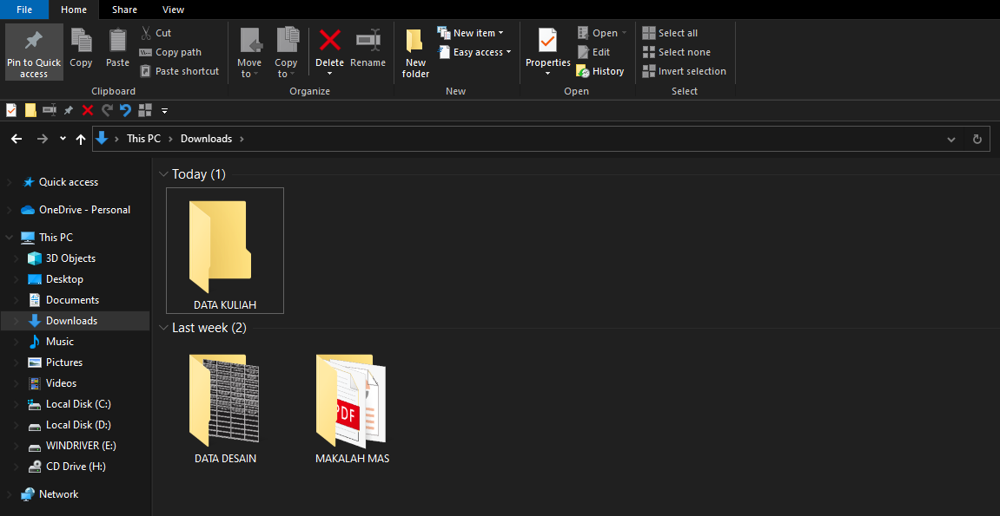
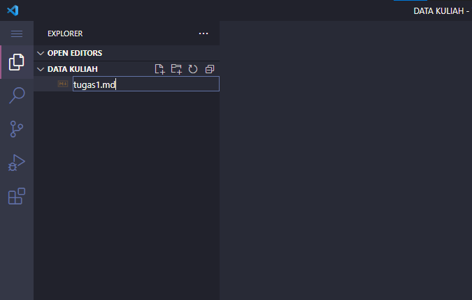

<h1 text align="center">Tugas 2</h1>

Mata Kuliah | Sistem Operasi
--------|--------
Nim | 2110131110003
Nama | Ady Mutalib

<h1 align=center>Komponen Sistem Operasi, Layanan Sistem Operasi, Sistem Call</h1>
 

> # Komponen Sistem Operasi
Sebuah sistem operasi dapat dibagi menjadi beberapa komponen. Secara umum, para pakar sepakat bahwa terdapat sekurangnya empat komponen manajeman utama yaitu: 
1. Manajemen Proses, 
2. Manajemen Memori, 
3. Manajamen Sistem Berkas, dan  
4. Manajemen Masukan/Keluaran.

Selain keempat komponen di atas, Avi Silberschatz, dan kawan-kawan menambahkan beberapa komponen seperti: 
1. Manajemen Penyimpanan Sekunder. 
2. Manajemen Sistem Proteksi. 
3. Manajemen Jaringan. 
4. Command-Interpreter System.

## Contoh Komponen Sistem Operasi yang ada pada laptop saya adalah:
**Manajemen Proses**
- *Proses* adalah sebuah program yang sedang dieksekusi. Sebuah proses membutuhkan beberapa sumber daya untuk menyelesaikan tugasnya.
- *Alokasi sumber daya* tersebut dikelola oleh Sistem Operasi Umpamanya penggunaan CPU, memori, berkas-berkas, dan perangkat-perangkat Masukan/Keluaran. 
- Ketika proses tersebut berhenti dijalankan, sistem operasi akan mendapatkan kembali semua sumber daya yang bisa digunakan kembali. 
- Sistem operasi bertanggung-jawab atas aktivitas-aktivitas yang berkaitan dengan manajemen proses seperti: 
    - Membuat dan menghapus proses pengguna dan sistem proses.
    - Menunda atau melanjutkan proses.
    - Menyediakan mekanisme untuk sinkronisasi proses.
    - Menyediakan mekanisme untuk komunikasi proses.
    - Menyediakan mekanisme untuk penanganan deadlock

Disini saya akan memperlihatkan manajemen proses:

 

*Gambar ini diambil dilaptop saya (Task Manager)*

 

**Penjelasan :**

- Pada gambar diatas memperlihatkan proses manajemen sistem operasi Task Manager.
- Aplikasi yang berjalan ada 4 :
    - Google Chrome
    - Task Manager
    - Visual Stodio Code
    - Windows Exploler
- Penjelasan masing-masing komponen yang digunakan oleh keempat aplikasi tersebut :
    1. Google Chrome
        - CPU yang digunakan 0.1%
        - Memory yang digunakan 752.5MB
        - Disk yang digunakan 0.1MB/s
        - Network 0.1 Mbps
        - GPU yang digunakan 0%
    2. Taks Manager
        - CPU yang digunakan 0.5%
        - Memory yang digunakan 23.9MB
        - Disk yang digunakan 0.1MB/s
        - Network 0 Mbps
        - GPU yang digunakan 0%
    3. Visual Stodio Code
        - CPU yang digunakan 0%
        - Memory yang digunakan 204.8MB
        - Disk yang digunakan 0 MB/s
        - Network 0 Mbps
        - GPU yang digunakan 0%
    4. Windows Exploler
        - CPU yang digunakan 0.1%
        - Memory yang digunakan 26.6MB
        - Disk yang digunakan 0.1 MB/s
        - Network 0 Mbps
        - GPU yang digunakan 0%

 
 

> # Layanan Sistem Operasi
Layanan sistem operasi dirancang untuk membuat pemrograman menjadi lebih mudah. 
- *Pembuatan Program*: Sistem operasi menyediakan berbagai fasilitas yang membantu programer dalam membuat program seperti editor. Walaupun bukan bagian dari sistem operasi, tapi layanan ini diakses melalui sistem operasi. 
- *Eksekusi Program*: Sistem harus bisa me-load program ke memori, dan menjalankan program tersebut. Program harus bisa menghentikan pengeksekusiannya baik secara normal maupun tidak (ada error). 
- *Operasi Masukan/Keluaran*: Program yang sedang dijalankan kadang kala membutuhkan Masukan/Keluaran. Untuk efisiensi dan keamanan, pengguna biasanya tidak bisa mengatur peranti Masukan/Keluaran secara langsung, untuk itulah sistem operasi harus menyediakan mekanisme dalam melakukan operasi Masukan/Keluaran. 
- *Manipulasi Sistem Berkas*: Program harus membaca dan menulis berkas, dan kadang kala juga harus membuat dan menghapus berkas. 
- *Komunikasi*: Kadang kala sebuah proses memerlukan informasi dari proses yang lain. Ada dua cara umum dimana komunikasi dapat dilakukan. Komunikasi dapat terjadi antara proses dalam satu komputer, atau antara proses yang berada dalam komputer yang berbeda, tetapi dihubungkan oleh jaringan komputer. Komunikasi dapat dilakukan dengan share-memory atau message-passing, dimana sejumlah informasi dipindahkan antara proses oleh sistem operasi. 
- *Deteksi Error*: Sistem operasi harus selalu waspada terhadap kemungkinan error. Error dapat terjadi di CPU dan memori perangkat keras, Masukan/Keluaran, dan di dalam program yang dijalankan pengguna. Untuk setiap jenis error sistem operasi harus bisa mengambil langkah yang tepat untuk mempertahankan jalannya proses komputasi. Misalnya dengan menghentikan jalannya program, mencoba kembali melakukan operasi yang dijalankan, atau melaporkan kesalahan yang terjadi agar pengguna dapat mengambil langkah selanjutnya. 

## Contoh layanan sistem operasi yang ada pada laptop saya adalah:

**1. Windows Exploler**

- Cara membuat folder baru
    - Klik kana pada mouse atau Touchpad
    - Maka akan muncul menu
        - 
    - Lalu pilih New
    - Lalu pilih folder
        - 
    - Lalu buat nama foldernya contoh DATA KULIAH
        - 
        - 

 
 

**2. CorelDraw 2020**

- Cara membuat folder baru di COrelDraw 2020
    - Buka aplikasi CoreDraw 2020
    - Maka akan muncul menu
        - 
    - Lalu pilih New Document
    - Lalu buat nama file misal (belajar)
    - Lalu buat jenis warnanya misal (CMYK)
    - Lalu atur ukuran panjang dan tinggi
    - Lalu pilih satuannya misal (milimeter)
    - Lalu atur resulusinya misal (300 : dpi)
        - 
    - Selesai 
        - 

 
 

**3. Visual Stodio Code**

- Cara membuat folder dan file baru di Visual Stodio Code
    - Buka aplikasi Visual Stodio Code
        - 
    - Untuk membuat file misal (markdown/md)
        - Pilih ikon kotak file
        - Lalu buat nama file misal (tugas1.md)
        - 
    - Untuk membuat folder misal (image/img)
        - Pilih ikon kotak folder
        - Lalu buat nama folder misal (img)
        - 
    - Selesai

