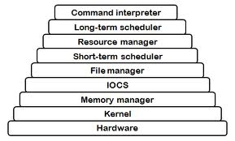
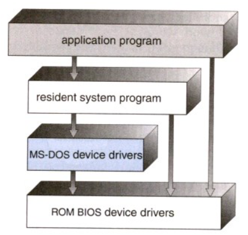
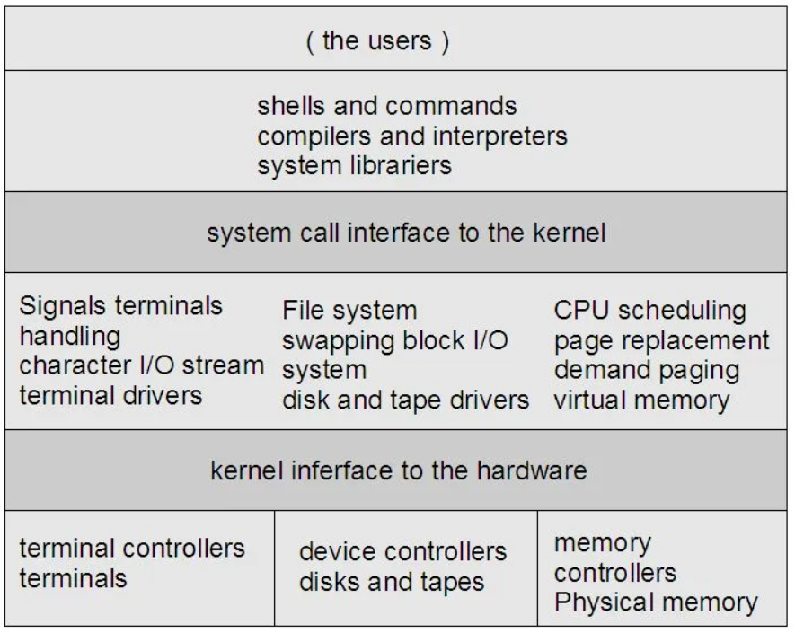
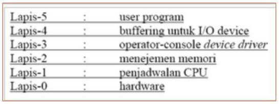
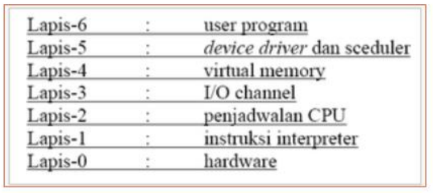
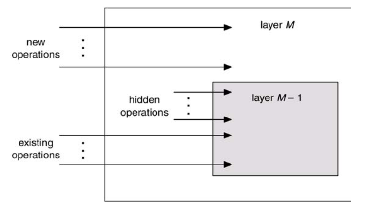
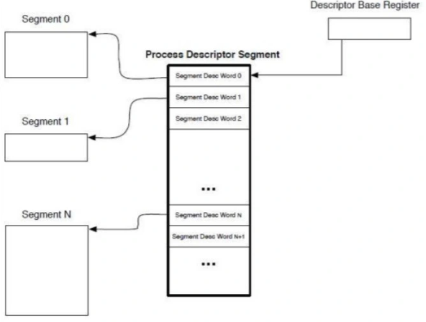
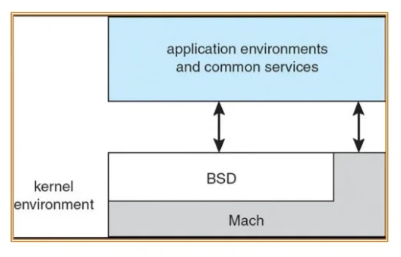
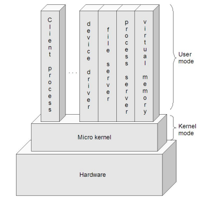

## Nama : Ady Mutalib
## NIM : 2110131110003

# Perbedaan Struktur Sistem Operasi
1. Struktur Sederhana
2. Pendekatan Berlapis
3. Kernel-mikro

# Struktur Sistem Operasi
Suatu sistem operasi modern merupakan suatu sistem yang besar dan kompleks sehingga strukturnya harus dirancang dengan hati-hati dan saksama supaya dapat berfungsi seperti yang diinginkan serta dapat dimodifikasi dengan mudah. Struktur sistem operasi merupakan komponen-komponen sistem operasi yang dihubungkan dan dibentuk di dalam kernel. Ada beberapa struktur sistem operasi dan pernah dicoba, diantaranya sebagai berikut

<p align="center">

Penjelasan dari gambar diatas:

1. <p align="justify"> Command interpreter atau Shell bertugas untuk membaca input berupa perintah dan menyediakan beberapa fungsi standar dan fungsi dasar yang dapat dipanggil oleh aplikasi /program maupun piranti lunak lain.  Contoh: Command prompt pada Windows , XTerm dan konsole pada Linux.

2. <p align="justify"> Long-term scheduler bertugas untuk mengontrol jumlah proses dalam memori. Jika jumlah proses dalam memori stabil, maka tingkat rata-rata penciptaan proses harus sama dengan tingkat rata-rata proses meninggalkan sistem. Secara umum prosesnya dibedakan atas dua macam, yaitu I/O bound dan CPU bound. I/O bound adalah proses yang lebih banyak menghabiskan watunya untuk mengerjakan I/O daripada melakukan komputasi, sebaliknya CPU bound adalah jarang melakukan permintaan I/O dan lebih banyak menghabiskan waktunya untuk melakukan komputasi. Sebagai contoh: Sistem time-sharing seperti UNIX seringkali tidak memiliki long-term scheduler. Stabilitas sistem ini bergantuk pada keterbatasan fisik (seperti jumlah terminal yang ada).

3. <p align="justify"> Resource manager, maksudnya sistem operasi berlaku sebagai penanggung jawab terhadap pengelolaan sumber daya untuk memindahkan, memproses dan menyimpan. Sumber daya yang dimaksud adalah sumber daya fisik dan sumber daya abstrak. Contoh sumber daya fisik yaitu hardware dan sumber daya abstrak contohnya yaitu data dan program.

4. <p align="justify"> Short-term scheduler, digunakan untuk memilih diantara proses-proses yang siap dieksekusi dan salah satunya dialokasikan ke CPU. Short-term scheduler seringkali digunakan untuk memilih proses baru untuk CPU, proses dieksekusi hanya beberapa milidetik sebelum menunggu I/O.

5. File manager

6. IOCS atau Integrated Operational Control System

7. <p align="justify"> Memory manager bertujuan untuk mengelola informasi yang tidak terpakai, mengalokasikan memori ke proses yang memerlukan, mendealokasikan memori dari proses yang sudah selesai dan mengelola swapping atau pagging antara memori utama dan disk.

8. <p align="justify"> Kernel merupakan bagian inti dari sistem operasi yang bertujuan sebagai mediator antara aplikasi komputer dan perangkat keras. Kernel menyediakan pelayanan sistem seperti pengaturan memori untuk proses-proses yang sedang berjalan, pengaturan file-file, I/O terhadap dan dari suatu device.

9. <p align="justify"> Hardware yaitu salah satu komponen komputer yang sifatnya dapat dilihat dan diraba secara langsung atau yang berbentuk nyata, yang berfungsi untuk mendukung proses komputerisasi.

# 1. Struktur Sederhana

<p align="justify"> Struktur sistem operasi di sistem ini tidak terstruktur. Sistem operasi sebagai kumpulan prosedur yang masing-masing dapat saling dipanggil jika dibutuhkan. Setiap prosedur yang ada di dalam sistem ini mempunyai interface yang sudah didefinisikan dengan baik. Dalam hal ini berupa parameter dan hasilnya, serta masing-masing prosedur bebas untuk saling memanggil jika dibutuhkan. Walaupun disebut tidak berstruktur, sebenarnya sistem monilisthic tetap mempunyai struktur walaupun kecil dan mendasar.

<p align="justify">Contoh dari sistem operasi ini adalah MS-DOS dan UNIX. MS-DOS merupakan sistem operasi yang menyediakan fungsional dalam ruang yang sedikit sehingga tidak dibagi menjadi beberapa modul, sedangkan UNIX menggunakan struktur monolitik dimana prosedur dapat saling dipanggil oleh prosedur lain di sistem bila diperlukan dan kernel berisi semua layanan yang disediakan sistem operasi untuk pengguna. Inisialisasi-nya terbatas pada fungsional perangkat keras yang terbagi menjadi dua bagian yaitu kernel dan sistem program. Kernel terbagi menjadi serangkaian interface dan device driver dan menyediakan sistem file, penjadwalan CPU, manajemen memori, dan fungsi-fungsi sistem operasi lainnya melalui system calls.

**Evolusi** :
<p align="justify"> Kebanyakan UNIX sampai saat ini berstruktur monolitik. Meskipun monolitik, yaitu seluruh komponen/subsistem sistem operasi terdapat di satu ruang alamat tetapi secara rancangan adalah berlapis. Rancangan adalah berlapis yaitu secara logik satu komponen/subsistem merupakan lapisan lebih bawah dibanding lainnya dan menyediakan layanan-layanan untuk lapisan-lapisan lebih atas. Komponen-komponen tersebut kemudia dikompilasi dan dikaitkan (di-link) menjadi satu ruang alamat. Untuk mempermudah dalam pengembangan terutama pengujian dan fleksibilitas, kebanyakan UNIX saat ini menggunakan konsep kernel loadable modules,yaitu:

* Bagian-bagian kernel terpenting berada di memori utama secara tetap.
* Bagian-bagian esensi lain berupa modul yang dapat ditambahkan ke
kernel saat diperlukan dan dicabut begitu tidak digunakan lagi di waktu
jalan (run time).

**Contoh** : UNIX berstruktur sederhana, MS-DOS.
1. MS-DOS

<p align="justify"> Arsitektur sistem operasi MS-DOS menggunakan model struktur monolitik yang konstruksinya tidak terstruktur. Dalam arsitektur ini semua komponen sistem operasi tergabung atau bercampur menjadi satu, semua program bagian (fungsi, prosedure atau sub rutin) dapat mengakses program-program lainnya.

<p align="center">

<p align="justify"> Pada sistem operasi MS-DOS, antara aplikasi dan sistem operasi tidak ada pemisahan yang jelas, yang menyebabkan mudahnya program-program virus memodifikasi dan merusak sistem operasi MS-DOS. Program aplikasi memiliki aksea untuk memodifikasi bagian sistem operasi (program resident, device driver MS-DOS maupun device driver BIOS).

2. UNIX
<p align="justify">Begitu pula dengan UNIX, yang pada awalnya juga terbatas oleh hardware yang ada. Sistem ini dapat dibagi menjadi dua bagian, yaitu kernel dan program sistem. Kernel sendiri dapat dibagi menjadi dua bagian, yaitu device driver dan interface, yang kemudian terus berkembang seiring dengan perkembangan UNIX. Berikut ini adalah skema struktur UNIX.

<p align="center">

<p align="justify"> Versi-versi UNIX selanjutnya dirancang agar mampu bekerja dengan hardware yang lebih baik. Begitu pula dengan strukturnya, yang dibuat makin modular.

# 2. Pendekatan Berlapis

<p align="center">

<p align="center">

<p align="justify"> Sistem operasi dibentuk secara hirarki berdasar lapisan-lapisan, dimana lapisan-lapisan bawa memberi layanan lapisan lebih atas. Lapisan yang paling bawah adalah perangkat keras, dan yang paling tinggi adalah userinterface. Sebuah lapisan adalah implementasi dari obyek abstrak yang merupakan enkapsulasi dari data dan operasi yang bisa memanipulasi  data tersebut. Struktur berlapis dimaksudkan untuk mengurangi kompleksitas rancangan dan implementasi sistem operasi. Tiap lapisan mempunyai fungsional dan antarmuka masukan-keluaran antara dua lapisan bersebelahan yang terdefinisi bagus.

Sedangkan menurut Tanenbaum dan Woodhull, sistem terlapis terdiri dari
enam lapisan, yaitu:

    Lapis 5 – The operator
    Berfungsi untuk pemakai operator.

    Lapis 4 – User programs
    Berfungsi untuk aplikasi program pemakai.

    Lapis 3 – I/O management
    Berfungsi untuk menyederhanakan akses I/O pada level atas.

    Lapis 2 -Operator-operator communication
    Berfungsi untuk mengatur komunikasi antar proses.

    Lapis 1 -Memory and drum management
    Berfungsi untuk mengatur alokasi ruang memori atau drum magnetic.
    
    Lapis 0 -Processor allocation and multiprogramming
    Berfungsi untuk mengatur alokasi pemroses dan switching, multi programming dan pengaturan prosessor.

Menurut Stallings, model tingkatan sistem operasi yang mengaplikasikan prinsip ini dapat dilihat pada tabel berikut, yang terdiri dari level-level dibawah ini:

* Level 1

    <p align="justify"> Terdiri dari sirkuit elektronik dimana obyek yang ditangani adalah register memory cell, dan gerbang logika. Operasi pada obyek ini seperti membersihkan register atau membaca lokasi memori.

* Level 2

    Pada level ini adalah set instruksi pada prosesor. Operasinya adalah instruksi bahasa-mesin, seperti menambah, mengurangi, load dan store.

* Level 3

    Tambahan konsep prosedur atau subrutin ditambah operasi call atau return.

* Level 4

    <p align="justify"> Mengenalkan interupsi yang menyebabkan prosesor harus menyimpan perintah yang baru dijalankan dan memanggil rutin penanganan interupsi. Empat level pertama bukan bagian sistem operasi tetapi bagian perangkat keras. Meski pun demikian beberapa elemen sistem operasi mulai tampil pada level-level ini, seperti rutin penanganan interupsi. Pada level 5, kita mulai masuk kebagian sistem operasi dan konsepnya berhubungan dengan multi-programming.

* Level 5

    <p align="justify"> Level ini mengenalkan ide proses dalam mengeksekusi program. Kebutuhankebutuhan dasar pada sistem operasi untuk mendukung proses ganda termasuk kemampuan men-suspend dan me-resume proses. Hal ini membutuhkan register perangkat keras untuk menyimpan agar eksekusi bisa ditukar antara satu proses ke proses lainnya.

* Level 6

    <p align="justify"> Mengatasi penyimpanan sekunder dari komputer. Level ini untuk menjadwalkan operasi dan menanggapi permintaan proses dalam melengkapi suatu proses.

* Level 7

    <p align="justify"> Membuat alamat logik untuk proses. Level ini mengatur alamat virtual ke dalam blok yang bisa dipindahkan antara memori utama dan memori tambahan. Cara-cara yang sering dipakai adalah menggunakan ukuran halaman yang tetap, menggunakan segmen sepanjang variabelnya, dan menggunakan cara keduanya. Ketika blok yang dibutuhkan tidak ada dimemori utama, alamat logis pada level ini meminta transfer dari level 6. Sampai point ini, sistem operasi mengatasi sumber daya dari prosesor tunggal. Mulai level 8, sistem operasi mengatasi obyek eksternal seperti peranti bagian luar, jaringan, dan sisipan komputer kepada jaringan.

* Level 8

    <p align="justify"> Mengatasi komunikasi informasi dan pesan-pesan antar proses. Dimana pada level 5 disediakan mekanisme penanda yang kuno yang memungkinkan untuk sinkronisasi proses, pada level ini mengatasi pembagian informasi yang lebih banyak. Salah satu peranti yang paling sesuai adalah pipe (pipa) yang menerima output suatu proses dan memberi input ke proses lain.

* Level 9

    <p align="justify"> Mendukung penyimpanan jangka panjang yang disebut dengan berkas. Pada level ini, data dari penyimpanan sekunder ditampilkan pada tingkat abstrak, panjang variabel yang terpisah. Hal nini bertentangan tampilan yang berorientasikan perangkat keras dari penyimpanan sekunder.

* Level 10

    Menyediakan akses ke peranti eksternal menggunakan antarmuka standar.

* Level 11

    <p align="justify"> Bertanggung-jawab mempertahankan hubungan antara internal dan eksternal identifier dari sumber daya dan obyek sistem. Eksternal identifier adalah nama yang bisa dimanfaatkan oleh aplikasi atau pengguna. Internal identifier adalah alamat atau indikasi lain yang bisa digunakan oleh level yang lebih rendah untuk meletakkan dan mengontrol obyek.

* Level 12

    <p align="justify"> Menyediakan suatu fasilitator yang penuh tampilan untuk mendukung proses. Hal ini merupakan lanjutan dari yang telah disediakan pada level 5. Pada level 12, semua info yang dibutuhkan untuk managemen proses dengan berurutan disediakan, termasuk alamat virtual di proses, daftar obyek dan proses yang berinteraksi dengan proses tersebut serta batasan interaksi tersebut, parameter yang harus dipenuhi proses saat pembentukan, dan karakteristik lain yang mungkin digunakan sistem operasi untuk Berfungsi untuk mengatur alokasi ruang memori atau drum magnetic.

* Level 13

    <p align="justify"> Menyediakan antarmuka dari sistem operasi dengan pengguna yang dianggap sebagai shell atau dinding karena memisahkan pengguna dengan sistem operasi dan menampilkan sistem operasi dengan sederhana sebagai kumpulan servis atau pelayanan.

Dari sumber diatas dapat kita simpulkan bahwa lapisan sistem operasi
secara umum terdiri atas 4 bagian, yaitu:

1. Perangkat keras

    Lebih berhubungan kepada perancang sistem. Lapisan ini mencakup lapisan 0 dan 1 menurut Tanenbaum, dan level 1 sampai dengan level 4 menurut Stallings.

2. Sistem operasi

    Lebih berhubungan kepada programer. Lapisan ini mencakup lapisan 2 menurut Tanenbaum, dan level 5 sampai dengan level 7 menurut Stallings.

3. Kelengkapan
    
    Lebih berhubungan kepada programer. Lapisan ini mencakup lapisan 3 menurut Tanenbaum, dan level 8 sampai dengan level 11 menurut Stallings.

4. Program aplikasi 
    
    Lebih berhubungan kepada pengguna aplikasi komputer. Lapisan ini mencakup lapisan 4 dan lapisan 5 menurut Tanebaum, dan level 12 dan level 13 menurut Stallings.

<p align="justify">Lapisan n memberi layanan untuk lapisan n+1. Proses-proses di lapisan n dapat meminta layanan lapisan n-1 untuk membangunan layanan bagi lapisan n+1. Lapisan n dapat meminta layanan lapisan n-1. Kebalikan tidak dapat, lapisan n tidak dapat meminta layanan n+1. Masing-masing berjalan di ruang alamat-nya sendiri. Kelanjutan sistem berlapis adalah sistem berstruktur cincin seperti sistem MULTICS. Sistem MULTICS terdiri 64 lapisan cincin dimana satu lapisan berkewenangan berbeda. Lapisan n-1 mempunyai kewenangan lebih dibanding lapisan n. Untuk meminta layanan lapisan n-1, lapisan n melakukan trap. Kemudian, lapisan n-1 mengambil kendali sepenuhnya untuk melayani lapisan n.

**Kelebihan Sistem Berlapis (layered system)** :
* Memiliki rancangan modular, yaitu sistem dibagi menjadi beberapa modul & tiap modul dirancang secara independen.
* Pendekatan berlapis menyederhanakan rancangan, spesifikasi dan implementasi sistem operasi.

**Kekurangan Sistem Berlapis (layered system)** :
* Fungsi-fungsi sistem operasi diberikan ke tiap lapisan secara hati-hati.

**Contoh** : Sistem operasi yang menggunakan pendekatan berlapis adalah THE yang dibuat oleh Djikstra dan mahasiswa-mahasiswanya, serta sistem operasi MULTICS.

1. THE

<p align="center">

<p align="justify"> THE OS adalah sistem operasi komputer yang dirancang oleh tim yang dipimpin oleh Edsger W. Dijkstra , dijelaskan dalam monograf pada 1965-1966 dan diterbitkan pada tahun 1968. Dijkstra tidak pernah menyebutkan sistemnya; “THE” hanyalah singkatan dari “Technische Hogeschool Eindhoven”. Sistem THE terutama merupakan sistem batch yang mendukung multitasking tu tidak dirancang sebagai sistem operasi multi-pengguna Itu jauh seperti SDS 940 , tetapi “rangkaian proses dalam sistem THE statis”.

<p align="justify"> Sistem THE rupanya memperkenalkan bentuk pertama dari memori virtual berbasis software ( Electrologica X8 tidak mendukung manajemen memori berbasis perangkat keras), membebaskan programmer dari dipaksa untuk menggunakan lokasi fisik sebenarnya pada memori drum . Ini dilakukan dengan menggunakan compiler ALGOL yang dimodifikasi (satu-satunya bahasa pemrograman yang didukung oleh sistem Dijkstra) untuk “secara otomatis menghasilkan panggilan ke rutin sistem , yang memastikan informasi yang diminta ada di memori, swapping jika diperlukan”. Paged virtual memory juga digunakan untuk buffering data perangkat I / O, dan untuk sebagian besar kode sistem operasi serta hampir semua kompiler ALGOL 60.

<p align="justify"> Desain sistem multiprograming THE signifikan untuk penggunaan struktur berlapis, di mana lapisan “lebih tinggi” hanya bergantung pada lapisan “lebih rendah” :

    Lapis-5 : user program
    Lapis-4 : buffering untuk I/O device
    Lapis-3 : operator-console device driver
    Lapis-2 : menejemen memori
    Lapis-1 : penjadwalan CPU
    Lapis-0 : hardware

2. MULTICS

<p align="center">

<p align="justify"> Multiplexed Information and Computing System atau biasa disingkat MULTICS adalah Sebuah Sistem Operasi yang digunakan pada komputer-komputer mainframe untuk keperluan server jaringan. Pada tahun tahun 1965, MULTICS merupakan satu–satunya Sistem Operasi dengan fasilitas sistem multi user.

<p align="justify"> Pengembangan MULTICS adalah hasil kerjasama antara Bell Telephone Labs dan MIT. Dua orang staf pengembang perangkat lunak di Bell labs, yakni Ken Thompson dan Dennis Ritchie yang juga pembuat bahasa pemrograman C adalah orang–orang penting dalam proyek MULTICS. Dan software yang pertama kali mereka buat adalah game multi user yang dikenal dengan nama Space Travel. Kemudian berselang beberapa tahun, munculah Unix sebagai pengembangan dari MULTICS.

# 3. Kernel-mikro

Metode struktur ini adalah menghilangkan komponen-komponen yang tidak diperlukan dari kernel dan mengimplementasikannya sebagai sistem dan program-program level user. Hal ini akan menghasilkan kernel yang kecil. Fungsi utama dari jenis ini adalah menyediakan fasilitas komunikasi antara program client dan bermacam pelayanan yang berjalan pada ruang user.

**Kelebihan Kernel Mikro** :
* kemudahan dalam memperluas sistem operasi
* mudah untuk diubah ke bentuk arsitektur baru
* kode yang kecil dan lebih aman

**Kekurangan Kernel Mikro** :
* kinerja akan berkurang selagi bertambahnya fungsi-fungsi yang digunakan.

**Contoh** : sistem operasi yang menggunakan metode ini adalah TRU 64 UNIX,
Mac OS X dan QNX.

* Struktur Mac OS X
<p align="center">


---

<h1 align="center">STRUKTUR SISTEM OPERASI</h1><br>

## 7.1. PENDAHULUAN

<p align="justify">Suatu sistem operasi modern merupakan suatu sistem yang besar dan kompleks sehingga strukturnya harus dirancang dengan hati-hati dan saksama supaya dapat berfungsi seperti yang diinginkan serta dapat dimodifikasi dengan mudah. Struktur sistem operasi merupakan komponen-komponen sistem operasi yang dihubungkan dan dibentuk di dalam kernel. Ada beberapa struktur sistem operasi dan pernah dicoba, diantaranya sebagai berikut, struktur sederhana, struktur berlapis, dan mikro kernel.</p>

## 7.2. STRUKTUR SEDERHANA ATAU MONOLITHIC

<p align="justify">Struktur sistem operasi di sistem ini tidak terstruktur. Sistem operasi sebagai kumpulan prosedur yang masing-masing dapat saling dipanggil jika dibutuhkan. Setiap prosedur yang ada di dalam sistem ini mempunyai <i>interface</i> yang sudah didefinisikan dengan baik. Dalam hal ini berupa parameter dan hasilnya, serta masing-masing prosedur bebas untuk saling memanggil jika dibutuhkan. Walaupun disebut tidak berstruktur, sebenarnya sistem monilisthic tetap mempunyai struktur
walaupun kecil dan mendasar.<br><br>
Contoh dari sistem operasi ini adalah <b>bMS-DOS</b> dan <b>UNIX</b>, dengan ciri khas:</p>

* __MS DOS__ = fokus pada fungsionalitas tertentu dan tidak dapat dibagi dalam beberapa modul.
* __UNIX__ = fokus pada setiap prosedur yang memanggil prosedur lainnya, sehingga menyebabkan tiap prosedur dapat saling berkomunikasi dan kernel berisikan semua layanan yang disediakan oleh sistem ke pengguna.

<p align="justify">Struktur sistem operasi monolitik hanya dapat digunakan pada beberapa perangkat keras saja. Hal ini disebabkan karena sistem operasi monolitik dilengkapi dengan operasi <i>dual mode</i> dan pelayanan <i>System call</i>. Namun, Intel 8088 tidak dapat menggunakan <i>dual mode</i> sehingga tidak akan ada proteksi pada perangkat keras yan digunakan.<br>Secara umum, <i>system call</i> pada sistem operasi monolitik dibuat dengan cara:</p>

* _User program_ melakukan _trap_ pada kernel
* Instruksi akan berpindah dari _user mode_ ke _monitor mode_
* Kontrol akan berpindah ke sistem operasi dan otomatis akan memeriksa setiap parameter dari pemanggilan tersebut
* Sistem operasi akan menuju ke tabel yang berisikan slot -k yang menujukkan _system call k_
* Setelah selesai, kontrol akan dikembalikan ke _user program_

<p align="justify">Walaupun mudah digunakanm struktur monolitik memiliki kekurangan yang cukup berbahaya, diantaranya:</p>

1. Program-program _malware_ dapat dengan mudah dimodifikasi sistem dan merusak keseluruhan sistem operasi yang digunakan
2. Dapat menyebabkan pemborosan jika setiap kernelnya harus menjalankan kernel monolitik yang sangat besar.
3. Jika satu saja kesalahan pemrograman dari salah satu bagian kernel, dapat menyebabka matinya keseluruhan sistem monolitik yang digunakan.

## 7.3. STRUKTUR BERLAPIS

<p align="justify">Sistem operasi berlapis memiliki beberapa lapis yang beragam, mulai dari bagian atas hingga bagian bawah. Masing-masing lapisan ini memiliki fungsi dan tujuannya tersendiri yang saling mendukung satu sama lain. Lapisan paling bawah digunakan untuk perangkat keras, sedangkan lapisan paling atas digunakan untuk <i>user interface.</i><br></p>

<p align="center">
<p align="center">Gambar Struktur Berlapis</p>

<p align="justify">Sistem berlapis banyak digunakan karena dapat mengurangi kompleksitas rancangan dari implementasi sebuah sistem operasi. Setiap lapisan struktur tersebut berasal dari hasil implementasi objek abstrak. Kondisi ini menyebabkan hasil implementasi berasal dari data yang terenkapsul dan operasu yang dapat dimanipulasi. Salah satu contoh struktur sistem berlapis adalah <i>The System</i>.<br></p>

```
Stallings memberi model yang lebih detail, sebagai berikut:
• Lapisan 1. Berisi berbagai sirkuit elektronik, misal register, memory cells, dan logic gate.
• Lapisan 2. Berisi instruksi prosesor, misal instruksi aritmatika, instruksi transfer data, dsb.
• Lapisan 3. Penambahan konsep seperti prosedur/subrutin, maupun fungsi yang me-return nilai tertentu.
• Lapisan 4. Penambahan interrupt.
• Lapisan 5. Program sebagai sekumpulan instruksi yang dijalankan oleh prosesor.
• Lapisan 6. Berhubungan dengan secondary storage device, yaitu membaca/menulis head, track, dan sektor.
• Lapisan 7. Menciptakan alamat logika untuk proses. Mengatur hubungan antara main memory, virtual memory, dan secondary memory.
• Lapisan 8. Program sebagai sekumpulan instruksi yang dijalankan oleh prosesor.
• Lapisan 9. Berhubungan dengan secondary storage device, yaitu membaca/menulis head,track, dan sektor.
• Lapisan 10. Menciptakan alamat logika untuk proses. Mengatur hubungan antara main memory, virtual memory, dan secondary memory.
• Lapisan 11. Program sebagai sekumpulan instruksi yang dijalankan oleh prosesor.
• Lapisan 12. File adalah objek yang memiliki nama dan ukuran. Abstraksi dari lapisan 9.
• Lapisan 13. Menyediakan interface agar bisa berinteraksi dengan pengguna.
```

<p align="justify">Lapisan-lapisan dari 1-4 bukanlah bagian dari sistem operasi dan masih menjadi bagian dari prosesor secara ekslusif.<br>

Lapisan ke-5 hingga ke-7, sistem operasi sudah berhubungan dengan prosesor.<br>

Selanjutnya dari lapisan ke-8 hingga 13, sistem operasi berhubungan dengan media penyimpanan maupun perlatan-peralatan
lain yang ditancapkan, misalnya peralatan jaringan.</p>

## 7.4. MIKRO KERNEL

<p align="justify">Pada pembahasan "Struktur Sederhana", sempat disinggung istilah "kernel". Apakah kernel itu?<br>
Kernel adalah komponen sentral dari sistem operasi. Ia mengatur hal-hal seperti interrupt handler(untuk menyediakan layanan interupsi), process scheduler(membagi-bagi proses dalam prosesor), memory management, I/O, dan sebagainya. Atau dengan kata lain, ia adalah jembatan antara hardware dengan software.
Cara tradisional untuk membangun sistem operasi adalah dengan membuat kernel monolitik, yaitu semua fungsi disediakan oleh kernel, dan ini menjadikan kernel suatu program yang besar dan kompleks.
Cara yang lebih modern, adalah dengan menggunakan kernel mikro. Kernel mikro adalah sistem operasi yang mempermudah komunikasi, antara program klien dengan beragam layanan pada ruang user. Komunikasi yang terjadi antara <i>module user</i> menggunakan <i>passing massage.</i></p>

<p align="center">
<p align="center">Gambar Struktur Kernel Mikro</p>

<p align="justify">Beberapa sistem operasi yang menerapkan mikro kernel adalah:</p>

* __Tru64 UNIX__
* __MacOSX__
* __QNX__

<p align="justify">Beberapa kelebihan kernel mikro:</p>

1. _*Interface*_ yang seragam. Proses tidak lagi dibedakan, baik antara kernel-level maupun userlevel, karena semuanya berkomunikasi via message passing.
2. _*Extensibility*_. Bisa menambahkan fitur-fitur baru tanpa perlu melakukan kompilasi ulang.
3. _*Flexibility*_. Fitur-fitur yang sudah ada bisa dikurangi, atau dimodifikasi sesuai dengan kebutuhan sehingga menjadi lebih efisien. Misalnya tidak semua pengguna membutuhkan security yang sangat ketat, atau kemampuan untuk melakukan distributed computing.
4. _*Portability*_. Pada kernel mikro, semua atau sebagian besar kode yang prosesor-spesifik berada di dalamnya. Jadi, proses porting ke prosesor lain bisa dilakukan dengan relatif sedikit usaha. Pada kelompok desktop misalnya, tampaknya dominasi Intel makin kuat. Tapi, sampai seberapa lama itu bisa bertahan? Karena itulah, portability adalah salah satu isu yang sangat penting.
5. _*Reliability*_. Semakin besar suatu software, maka tentulah semakin sulit untuk menjamin reliability-nya. Desain dengan pendekatan berlapis sangatlah membantu, dan dengan pendekatan kernel mikro bisa lebih lagi. Kernel mikro dapat dites secara ekstensif .Karena dia menggunakan API yang sedikit, maka bisa meningkatkan kualitas code di luar kernel.
6. _*Support for object-oriendted OS*_. Model kernel mikro sangat sesuai untuk mengembangkan sistem operasi yang berbasis object-oriented. Contoh sistem operasi yang menggunakan kernel mikro adalah MacOS X dan QNX.

<p align="justify">Beberapa manfaat yang didapat dari struktur sistem mikro kernel adalah:</p>

* Mudah untuk dikembangkan
* Mudah untuk porting sistem operasi ke arsitektur baru
* Mudah diandalkan
* Hanya menggunakan sedikit kode
* Lebih aman